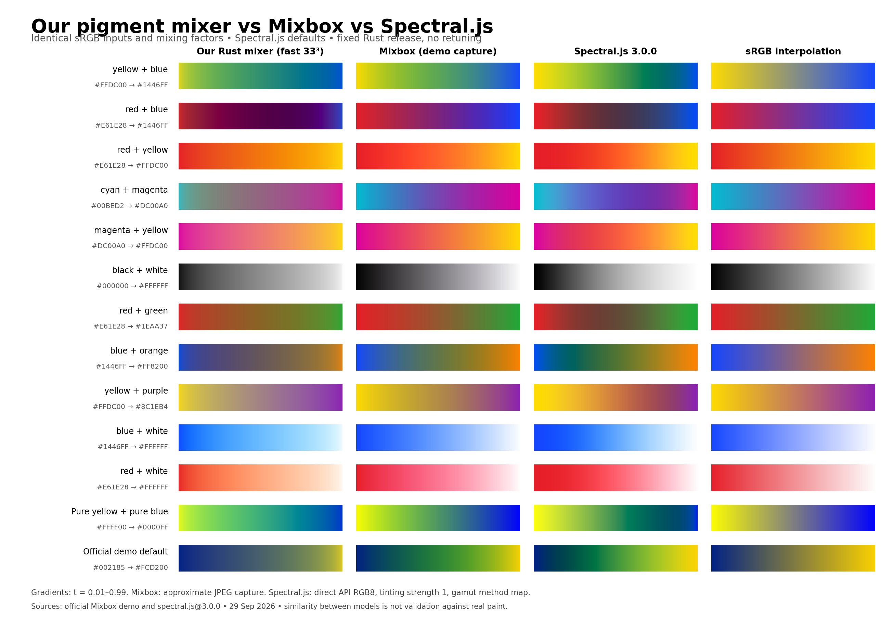

# Our Rust pigment mixer compared with Mixbox and Spectral.js

Comparison date: 29 September 2026. This is a supplement to the frozen pigment-mix v0.1.0 research release, not a revised model or a claim of numerical compatibility.

## Finding

The implementations share the broad idea of pigment-like RGB interpolation, but the current outputs are not a close visual match. Several familiar combinations follow the same broad color family, while tints, complements, and some blue–yellow combinations differ substantially. Mixbox's observed gradients generally retain more chroma in the cyan–magenta and red–blue examples and keep the red–white tint pink. Our implementation produces a muted mauve, a darker purple, and a peach tint respectively.

Most importantly, our original yellow–blue success does not generalize to every plausible yellow and blue. On the official demo's default pair, #002185 → #FCD200, Mixbox's midpoint is approximately (41,128,57), a green; ours is (73,97,107), a muted blue-gray. The reference path gives (66,96,107), so this particular failure persists without the fast encoder LUT. The model, recipe selection, and residual behavior need investigation; increasing LUT resolution alone cannot fix it.



## Spectral.js 3.0.0 comparison

Spectral.js was added using the same 13 pairs and unchanged Rust outputs. It is **closer to the observed Mixbox outputs on average in this set**, but it is not a numerical or visual match in every case. In particular, red–blue becomes muted and dark, and black–white is substantially lighter than Mixbox. This is similarity evidence, not a ranking against measured physical paint.

| Comparison over the same 39 interior samples | Mean ΔE00 | Median ΔE00 | Maximum ΔE00 |
|---|---:|---:|---:|
| Our Rust vs Mixbox captures (approximate) | 13.51 | 11.68 | 29.79 |
| Spectral.js vs Mixbox captures (approximate) | 7.86 | 5.66 | 23.59 |
| Our Rust vs Spectral.js API outputs | 15.63 | 14.53 | 33.62 |

For the official default blue–yellow pair, Spectral.js returns **(61,147,62)** at t=0.5, a green. This is closer to the captured Mixbox green **(41,128,57)** than our blue-gray **(73,97,107)**. For cyan–magenta it yields **(97,69,190)**, retaining the violet behavior absent from our muted result. Red–white yields **(255,95,109)**, a warm pink/red tint rather than our peach. However, red–blue yields **(80,50,67)**, a dark muted mixture, compared with Mixbox's **(123,36,123)**; black–white yields **(166,166,166)** compared with approximately **(124,122,127)** in the demo. These contrary cases are retained.

### Spectral.js measurement method

We installed the official npm package `spectral.js@3.0.0` in this **evaluation harness only**, with package scripts disabled. The version and tarball integrity are pinned in `package-lock.json`. Spectral.js is not added to the Rust crate or used to generate its spectra or LUT. The evaluation calls its documented public API, with tinting strength **1.0 for both inputs** and the default perceptual gamut method **map**:

```javascript
const a = new spectral.Color(inputA);
const b = new spectral.Color(inputB);
const rgb = spectral.mix([a, 1-t], [b, t])
    .toGamut({method: "map"}).sRGB;
```

The returned `sRGB` values in this version are native RGB8 values. We recorded **5,213 outputs** (13 × 401), checked that all channels were finite and bounded, and found zero RGB8 endpoint discrepancy for all 26 endpoints. There was no per-pair parameter tuning. Spectral.js outputs are direct API results, whereas the Mixbox values remain approximate screenshot measurements; the table labels preserve that distinction. The frozen Rust and Mixbox datasets were reused rather than rerun or replaced. No timing comparison among implementations was performed.

The [author's documentation](https://github.com/rvanwijnen/spectral.js/) describes constant-scattering K–M, seven reflectance basis curves, and effective concentrations that depend on squared mixing factor, squared tinting strength, and luminance. Consequently, identical public mixing factors do **not** imply identical inferred physical concentrations across engines. It also describes OKLCh/OKLab gamut mapping and identifies an MIT license. These documented choices help explain why default behavior can differ from our separate K/S palette and linear concentration interpolation. No internal Spectral.js coefficients were copied into our implementation.

| Pair | Spectral.js midpoint RGB8 | ΔE00 vs Mixbox ≈ |
|---|---|---:|
| yellow + blue | (81, 160, 68) | 3.3 |
| red + blue | (80, 50, 67) | 16.5 |
| red + yellow | (252, 89, 36) | 1.6 |
| cyan + magenta | (97, 69, 190) | 4.8 |
| magenta + yellow | (246, 89, 64) | 2.8 |
| black + white | (166, 166, 166) | 15.0 |
| red + green | (99, 72, 55) | 12.9 |
| blue + orange | (80, 116, 52) | 5.7 |
| yellow + purple | (206, 123, 65) | 13.2 |
| blue + white | (95, 165, 255) | 2.9 |
| red + white | (255, 95, 109) | 8.5 |
| extreme + yellow + blue | (57, 143, 84) | 3.8 |
| Official demo default | (61, 147, 62) | 7.3 |

The most useful finding is that an existing permissively licensed spectral implementation avoids several failures of our current synthetic-pigment model. It is a stronger practical comparator for further research, but these few examples do not establish universal superiority or material calibration.

## What was actually tested

We used the official [Mixbox Gradients demo](https://scrtwpns.com/mixbox/examples/gradients) through its two visible color controls. We entered the same twelve pairs used in the existing Rust experiments, plus the demo's default pair. All original cases are shown, including unfavorable ones. Each screenshot retains the demo's Mixbox, RGB, and OKLab columns. Captures and verified input values are retained in `captures/`.

No Mixbox implementation source, coefficients, LUT, SDK package, or binary was imported into the Rust library or evaluation tools. The official web page runs its own implementation in the browser. We compared only displayed results, did not inspect the Show Code panel, and did not fit or retune our model to these outputs. A search result exposed public API-example comments; no implementation logic or coefficients from it were used. The release archive SHA256 is `f40f800f6d0810ae68fe28aa12d225c84ca3258552d1c5ae787a014df7dba610`.

Our fast and reference outputs were recomputed from the unchanged release at 401 interpolation ratios per pair. For numerical comparison, we sampled Mixbox's rendered gradient at t=0.25, 0.50, and 0.75. Each color is the per-channel median across 40 central horizontal pixels, avoiding the bar sides. The 1363×936 JPEG captures place the gradient between y=200 and y=600; the neighboring RGB column provides an independent check of this coordinate-to-ratio mapping. The figure excludes the first and last 1% to avoid endpoint rasterization/compression artifacts.

These are **approximate display measurements**, not exact Mixbox API returns. JPEG encoding, rasterization, 8-bit quantization, the inferred ratio mapping, and browser color handling all contribute uncertainty. The demo does not expose a build identifier in the visible UI; the URL, capture timestamp, screenshots, and input manifest identify what was observed. Results apply to this demo as captured, not to an asserted SDK version.

## Numerical comparison

Across the 13 pairs and three interior ratios (39 samples), the mean difference is **13.5 ΔE2000**, the median **11.7**, and the largest **29.8**. These values describe disagreement between models, not error against measured paint, and this small selected set is not a random-color accuracy survey.

The screenshot RGB control had mean ΔE2000 **0.29**, maximum **0.80**, and maximum absolute channel discrepancy **3.25/255** against analytic encoded-sRGB interpolation. This supports the conclusion that the large observed differences are not explained by capture error. It is a control measurement, not a universal error bound on every captured color.

The following table uses t=0.5. Our RGB8 values are rounded from native floating-point output; Mixbox values are approximate screenshot samples. Differences were calculated before rounding our values.

| Pair | Input A → B | Our midpoint RGB8 | Mixbox midpoint RGB8 ≈ | ΔE00 ≈ |
|---|---|---|---|---:|
| yellow + blue | #ffdc00 → #1446ff | (49, 144, 112) | (93, 165, 88) | 13.5 |
| red + blue | #e61e28 → #1446ff | (88, 0, 71) | (123, 36, 123) | 11.2 |
| red + yellow | #e61e28 → #ffdc00 | (242, 118, 14) | (254, 97, 42) | 9.8 |
| cyan + magenta | #00bed2 → #dc00a0 | (148, 101, 130) | (117, 71, 177) | 19.3 |
| magenta + yellow | #dc00a0 → #ffdc00 | (237, 120, 116) | (239, 104, 75) | 8.8 |
| black + white | #000000 → #ffffff | (141, 141, 141) | (124, 122, 127) | 7.6 |
| red + green | #e61e28 → #1eaa37 | (137, 100, 39) | (146, 88, 48) | 10.1 |
| blue + orange | #1446ff → #ff8200 | (103, 87, 91) | (99, 118, 73) | 29.8 |
| yellow + purple | #ffdc00 → #8c1eb4 | (162, 130, 134) | (178, 139, 70) | 25.0 |
| blue + white | #1446ff → #ffffff | (107, 188, 255) | (108, 161, 254) | 9.1 |
| red + white | #e61e28 → #ffffff | (255, 166, 124) | (252, 119, 148) | 23.2 |
| extreme + yellow + blue | #ffff00 → #0000ff | (60, 174, 124) | (77, 149, 100) | 8.1 |
| Official demo default | #002185 → #fcd200 | (73, 97, 107) | (41, 128, 57) | 29.5 |

## Interpretation by mixture

* **Yellow–blue:** our original bright pair and the pure RGB pair both go through green, as does Mixbox. The hue, brightness, and position of that green along the gradient differ. The official default case is a significant failure of our current model.
* **Red–blue:** both reach purple, but ours becomes much darker and has a relatively abrupt transition near the blue endpoint. This is visible even though the mathematical curve is continuous.
* **Cyan–magenta:** ours loses much more chroma, passing through mauve/gray. The demo passes through a stronger violet.
* **Red–yellow and magenta–yellow:** both engines traverse warm colors, but Mixbox is redder/oranger in the middle and ours is paler for magenta–yellow.
* **White tints:** our red tint shifts to peach and our blue tint toward cyan. Mixbox retains pink and a less cyan blue for these inputs. Neither observation establishes which particular physical paint would be correct: RGB does not identify a unique pigment.
* **Complements:** both often reduce chroma, but the neutral hue can be very different. Blue–orange is our gray/mauve versus Mixbox's olive green; yellow–purple is our mauve versus Mixbox's ochre.

## Why the shared science does not imply matching output

The 2021 Sochorová–Jamriška paper introduces pigment concentrations plus additive residuals and uses Kubelka–Munk optics. Its reported implementation starts from four primary pigments, measured acrylic-paint coefficients, and gamut-oriented surrogate pigments. Our implementation uses eight independently constructed synthetic spectra, heuristic scattering strengths, a regularized inverse, and a linear-RGB residual. The paper also includes a surface-reflection correction absent from our model. Different material assumptions and RGB-to-recipe mappings can therefore produce different mixtures despite the shared optical equation. These are comparisons to the published method; they do not assert that the current demo has every detail of the 2021 implementation.

Source: Šárka Sochorová and Ondřej Jamriška, *Practical Pigment Mixing for Digital Painting*, ACM TOG 40(6), 2021, [DOI](https://doi.org/10.1145/3478513.3480549), [author-hosted paper](https://dcgi.fel.cvut.cz/wp-content/wpallimport-dist/publications/pdf/publications-2021-sochorova-tog-pigments-paper.pdf).

Our near-exact RGB reconstruction is an algebraic endpoint property. It does not establish matching mixture trajectories or real-paint accuracy. Also, the previous report's **40.1 ΔE2000 worst discrepancy compared our fast path against our own reference**, not against Mixbox. It must not be relabeled as a Mixbox comparison.

## Performance and scope

There is no matched performance benchmark against Mixbox in this supplement. Our release measured 1.66 million full RGB mixes/s and 4.42 million cached-latent mixes/s on its recorded host. Browser demo drawing time includes unrelated rendering and UI work, so it would not be a fair comparator. The paper's brush-latency experiments likewise use a different workload and hardware. No speed ranking follows from these data.

This comparison supports a narrower claim than “Mixbox-equivalent”: the Rust release is an independent, reproducible K–M research implementation with some pigment-like behavior. It is not yet a substitute with comparable consistency across these test cases. The observed Mixbox behavior is a useful external comparator, not physical ground truth or a calibration dataset for copying its implementation.

## Next experiments suggested by the failures

1. Expand blue–yellow tests across dark, bright, warm, and cool shades. Keep the new default-demo failure as a held-out regression example.
2. Diagnose the reference recipes and residual contributions for blue-gray, peach, and mauve failures before changing the fast approximation.
3. Fit independently sourced, redistributable measured K/S or mixture data, particularly white tints; evaluate against held-out physical samples.
4. Evaluate inverse regularization and gamut treatment against hue/chroma trajectory stability. Use the same fixed test set to expose regressions, and a separate holdout to avoid optimizing only examples.

## Reproduction

Extract the original `pigment-mix.zip` beside this comparison folder. Install Rust, Node.js with npm, and Python 3.11+ with the packages in `requirements.txt`. Then run:

```bash
python3 tools/run_probe.py ../pigment-mix
npm ci --ignore-scripts --no-audit --no-fund
python3 tools/run_spectral.py
python3 tools/analyze.py
python3 tools/write_report.py
```

`CARGO` and `RUSTC` can name alternate executables. Reanalysis uses the archived captures, so the numerical evidence remains reproducible even if the live demo changes. Recapturing requires visiting the cited official demo, entering each pair from `captures/manifest.json`, verifying the color wells, and capturing the viewport at the documented dimensions. Do not reuse the pixel coordinates for a different viewport without recalibrating against the RGB column. Neither this workflow nor the original engine requires installing Mixbox. Spectral.js is an evaluation-only npm dependency. The recorded CSVs allow figure/report regeneration without reinstalling it; `node_modules/` is excluded from the delivered archive. Node and package provenance are recorded in `results/spectral_environment.json`.

The original project's licensing remains unchanged. Original comparison scripts are provided under MIT; captures are attributed third-party evaluation evidence and are not engine assets or presented as our original artwork. No blanket license to the third-party UI is asserted. Mixbox's software licensing is described in its [official documentation](https://scrtwpns.com/mixbox/docs/).

Spectral.js attribution: MIT © 2025 Ronald van Wijnen. The package license is preserved in `SPECTRAL-LICENSE`. Its implementation is not bundled in this supplement.
