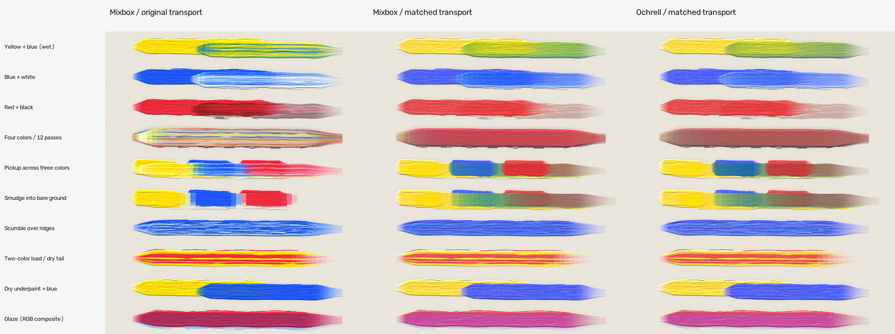
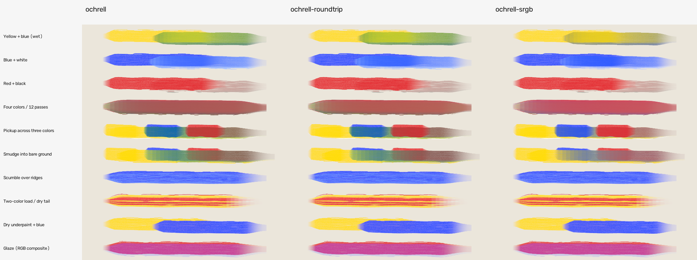
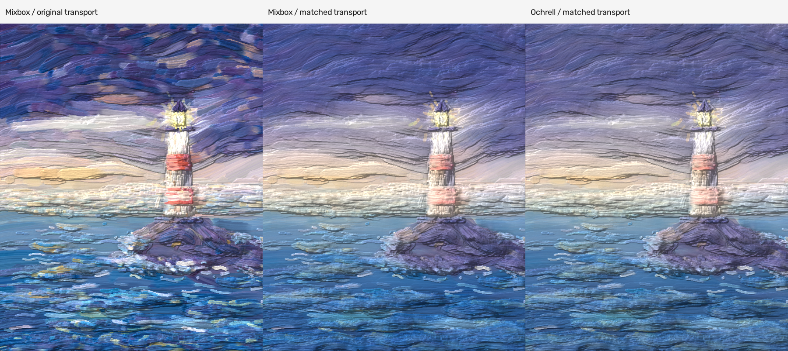
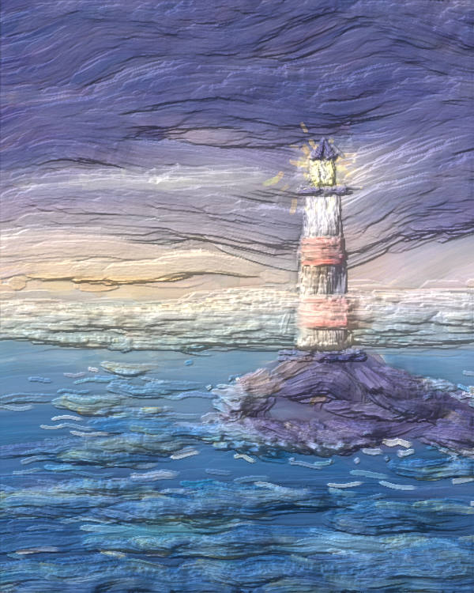

# Oil-paint integration: measured results

Generated by `python tools/integration_report.py` from `results/integration/`.
These are synthetic-model and implementation measurements, not real-paint accuracy.

## Conditions

Windows x64, Intel Core Ultra 7 258V, 8 cores, rustc 1.91.1 MSVC, Python 3.12.11.
Native mixing is one thread, release, codegen-units=1, LTO off. Both cached
mixer kernels are compiled in the same comparison executable. Fixed seed
20260930; seven native repetitions after warmup, 500,000 operations each;
4,096 source colors. OpenCV lighting uses one thread in brush benchmarks.
Python package versions, source hashes, inputs and raw repetitions are retained.
Shared-host scheduling and CPU frequency cause timing variation; these are not
cross-platform guarantees. No explicit SIMD, GPU or browser work was added.

## Native mixing

| Operation | Mixbox ns | Ochrell ns | Ochrell / Mixbox |
|---|---:|---:|---:|
| Preserved state interpolation | 4.70 | 36.22 | 7.71x |
| Decode to sRGB | 18.76 | 183.07 | 9.76x |
| Cached mix + decode | 39.64 | 222.65 | 5.62x |

Ochrell encode: 209.85 ns. Full RGB-in pair mixing: 698.86 ns.
The renderer has no native Mixbox encoder, so there is no claimed native full-RGB
comparison. Mixbox states are prepared through its existing NumPy encoder in a
temporary file. No LUT, source or coefficients are exported into Ochrell.

## Actual Python adapters

Median microseconds per color, including validation, allocations, NumPy or ctypes.
Full mixing includes two encodes and one decode. This measures the available
integration paths, not just algorithm cost; small batches mainly measure Python.

| Batch | Operation | Mixbox us/color | Ochrell us/color |
|---:|---|---:|---:|
| 1 | encode | 268.715 | 26.879 |
| 1 | decode | 34.585 | 40.968 |
| 1 | full_rgb_mix | 615.226 | 94.225 |
| 64 | encode | 4.656 | 0.578 |
| 64 | decode | 0.644 | 0.878 |
| 64 | full_rgb_mix | 11.389 | 2.613 |
| 1024 | encode | 0.717 | 0.302 |
| 1024 | decode | 0.096 | 0.430 |
| 1024 | full_rgb_mix | 1.643 | 1.907 |
| 4096 | encode | 0.635 | 0.379 |
| 4096 | decode | 0.064 | 0.527 |
| 4096 | full_rgb_mix | 1.388 | 1.562 |

## Brush replay and surface rendering

Identical authored RGB inputs, paths, brush parameters and seeds exercise
yellow/blue, white, black, 12-pass four-color buildup, pickup, smudge, scumble,
marbling, dry tails, dry underpaint and the RGB glaze approximation.
The original Mixbox renderer uses alpha as mixture weight and a seven-float
state. The matched Mixbox control pads that state to 85 floats and uses the
same paint-amount transport and coverage compositing as Ochrell. Thus the
matched control isolates mixer behavior/cost within this integration, while
the original shows the existing renderer's actual lighter memory/workload.

| Width | Method | Paint ms | Lighting ms | Canvas MB |
|---:|---|---:|---:|---:|
| 320 | mixbox | 31.8 | 24.4 | 6.71 |
| 320 | mixbox-material | 76.2 | 24.4 | 43.92 |
| 320 | ochrell | 111.6 | 25.8 | 43.92 |
| 600 | mixbox | 94.9 | 121.3 | 23.60 |
| 600 | mixbox-material | 237.9 | 101.8 | 154.42 |
| 600 | ochrell | 349.3 | 109.0 | 154.42 |

Painting includes Python stroke validation/dispatch and native rasterization;
it excludes stroke encoding, allocation, layer blur/drying, lighting and file IO.
Those phases have separate raw timing fields. These are offline brush workloads,
not evidence of a 60 Hz interactive application. Native timing is measured below
the FFI boundary in the separate mixing table.

The unlit comparison is `results/integration/mixbox/mixbox-comparison-unlit.png`.
Height, amount, coverage and wetness agree in matched-control tests. All repeated
brush images are deterministic on this host. Differences between mixer images
are similarity observations, not accuracy rankings.

## Keeping material history

| Width | Persistent paint ms | RGB-roundtrip paint ms | Mean / P95 / max display difference (DE2000) |
|---:|---:|---:|---|
| 320 | 106.9 | 187.8 | 0.958 / 4.251 / 10.994 |
| 600 | 454.8 | 650.7 | 0.976 / 4.271 / 13.620 |

The roundtrip control reconstructs material at canvas updates and brush
pickup/replenishment. It can preserve a displayed color immediately yet change
its future tint or pickup behavior. Errors need not grow monotonically: the
256-step color error can be lower than 64 steps, yet a subsequent white addition
again reveals the lost material. Persistent state preserves weighted grouping.

## Reference and candidate storage errors

2,048 deterministic samples per main case; 128 samples for the 4,096-step tiny
pickup test. Reference is the existing 81-band f64 synthetic model. Table cells
are mean / maximum DE2000. f16 quantization is applied on every state update.

| Case | f32 (340 B) | f16 all (170 B) | f16 optics + f32 residual (176 B) | RGB roundtrip |
|---|---|---|---|---|
| reconstruction | 1.3824e-06 / 6.7916e-05 | 0.0015286 / 0.012989 | 0.0015279 / 0.012967 | 1.6854e-06 / 6.7857e-05 |
| mixture | 0.0038026 / 0.081393 | 0.004957 / 0.077499 | 0.0049565 / 0.07751 | 0.0038026 / 0.081397 |
| white_tint | 0.0023523 / 0.025955 | 0.0033342 / 0.025399 | 0.0033345 / 0.025435 | 1.2697 / 10.044 |
| black_addition | 0.0040138 / 0.051228 | 0.0056593 / 0.046535 | 0.005657 / 0.046587 | 0.21655 / 1.2205 |
| four_colors | 0.0052675 / 0.048597 | 0.0063064 / 0.049866 | 0.0063057 / 0.049864 | 1.0216 / 12.829 |
| grouping_self_error | 2.5761e-07 / 1.2723e-05 | 0.0023747 / 0.017478 | 0.0023748 / 0.017457 | 1.0214 / 12.829 |
| repeated_64 | 0.0053979 / 0.054022 | 0.012957 / 0.091063 | 0.012956 / 0.091236 | 1.1559 / 9.4422 |
| repeated_256 | 0.0054253 / 0.031268 | 0.017178 / 0.11315 | 0.017178 / 0.11339 | 0.48794 / 4.4779 |
| repeated_then_white | 0.0031914 / 0.021925 | 0.010329 / 0.056158 | 0.010328 / 0.056231 | 1.6719 / 10.108 |
| tiny_pickup_4096 | 0.0043317 / 0.041889 | 10.863 / 41.759 | 10.855 / 41.746 | 2.0537 / 20.881 |

Naive f16 is **rejected for iterative storage**. Ordinary mixtures look close,
but a 0.0001 pickup fraction can disappear below its quantization step. Preserving
the residual in f32 does not rescue the lost K/S updates. These unfavorable
results are retained. No compressed state is enabled in the renderer.

## State access and memory

| Isolated operation | Median ns/state | Logical throughput GB/s |
|---|---:|---:|
| mix_hot | 42.99 | 0.00 (not applicable) |
| decode_hot | 202.33 | 0.00 (not applicable) |
| rgb_roundtrip | 454.56 | 0.00 (not applicable) |
| read_sequential | 16.81 | 20.22 |
| read_scattered | 46.38 | 7.33 |
| update_sequential | 51.88 | 13.11 |
| update_scattered | 129.38 | 5.26 |
| copy_stream | 17.02 | 39.96 |

Sequential/scattered tests use 262,144 states (89.13 MB), fixed index patterns,
seven repetitions after warmup. Read/write throughput counts logical bytes,
not hardware-counter DRAM traffic; it must not be read as a bus measurement.
Scatter is measurably more expensive. Cache brush and palette states, batch at
stroke boundaries, and visit canvas rows coherently. Avoid an RGB-keyed cache
for material history: equal RGB does not identify equal future mixtures.

| Canvas | Latent MB | Total resident canvas planes MB |
|---|---:|---:|
| 600x750 | 153.00 | 167.85 |
| 1920x1080 | 705.02 | 773.45 |
| 2400x3000 | 2448.00 | 2685.60 |
| 3840x2160 | 2820.10 | 3093.81 |

The latent is verified at 340 bytes; the actual canvas is 373 bytes/pixel.
These are decimal MB and exclude planner proxies, temporary lighting arrays,
stroke buffers and snapshot compression. A 2400x3000 canvas alone costs 2.686 GB.
The original seven-float Mixbox renderer uses 57 bytes/pixel. The padded matched
control intentionally does not represent Mixbox's minimum memory needs.

Fresh-process measurements at 600x690 (Windows working set, decimal MB):

| Method | Imported/encoded baseline | Peak painting | Peak painting + lighting |
|---|---:|---:|---:|
| mixbox | 65.4 | 89.2 | 147.6 |
| mixbox-material | 65.6 | 219.5 | 277.9 |
| ochrell | 60.6 | 215.1 | 273.7 |

## Validation and real scene

A second comparison replays the real scene's 13,988 strokes at 600 pixels for 3 repetitions. It decodes the authored source loads once to a shared RGB corpus, then re-encodes them for every method and regenerates authoring streaks. Geometry, seeds, brush settings and layer schedule are identical; planning is excluded.

| Scene method | Paint seconds (median) | Lighting seconds (median) |
|---|---:|---:|
| mixbox | 4.546 | 0.127 |
| mixbox-material | 14.773 | 0.132 |
| ochrell | 18.033 | 0.117 |

All 25 core Rust tests, 4 native bridge tests, 7 Python integration tests, 17 Ochrell surface/planner gates and 36 existing Mixbox harness gates pass. The optional native comparator passes the same 4 bridge/math tests. Complete scene replay matches RGB and height bit-for-bit; split snapshot/resume and batched/single-stroke replay are exact in integration tests.

`storm_v3.py`: 13,988 strokes, all 15 layers, 320-pixel planner and 600x750 output. Total 80.80 s; plan including snapshots 62.92 s; snapshot writing 37.61 s; output replay 15.37 s; final lighting 0.13 s.
The real-scene CLI timing is a single run and includes layer preparation in replay;
use the repeated brush measurements for timing comparisons. Full run metadata is retained.

The earlier RGB-baseline smudge color gate and pre-fix Windows memory-probe
failure are retained, not deleted. The Windows memory query was repaired; the
RGB color gate is an existing baseline limitation, not an Ochrell regression.

## Next step and limits

The next highest-value step is **lossless storage and IO for large canvases**:
measure active tiles and preserve full f32 accumulators there, with independently
verified lossless cold storage / snapshot streaming. Sparse allocation only saves
memory when significant canvas regions remain untouched; a fully painted scene
still needs a large material working set. Do not substitute naive f16.

After that, profile the complete raster path (including checked state import and
coverage gamma conversion) before considering batched decoding or SIMD. Native
Mixbox remains much cheaper, so a speed-parity claim would be unsupported.

This integration still uses a single exposed material, non-conserving pickup
and heuristic depletion. Glaze is RGB compositing; height affects the renderer's
surface, not Ochrell reflectance. No commercial paint calibration, physical
glazing, production GPU implementation or measured browser performance is claimed.

See [integration/setup/reproduction](integration.md), [implementation plan](integration-plan.md),
and `results/integration/mixbox/summary.json` for comparator scope and licensing.
