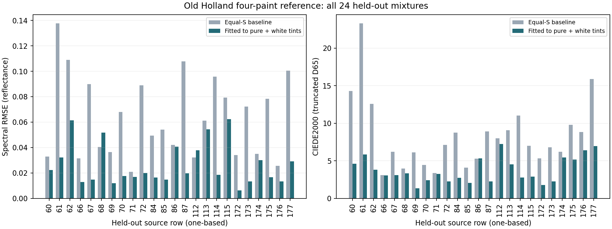

# Old Holland Four: first measured-reference result

The requested study is complete: 21 designated calibration samples were used to
fit the optical model, then the frozen model was evaluated on the 24 held-out
mixtures. Fitting relative mixing strengths improved mean held-out color error
by **54.4%**, from **8.31 to 3.79 CIEDE2000**, but the candidate **failed four of
the five predeclared quality-screen criteria**. It remains a research candidate.
No runtime palette, production LUT or default change was made.

The [reuse audit](measured-oils-reuse.md) could not establish explicit terms for
redistributing the separately hosted archive or fitted coefficients/LUTs.
The institutional paper copy is indexed with CC BY 4.0; its applicability to the
archive is unresolved. No author was contacted. Raw data, fitted coefficients and
measurement plots remain in ignored local research output.

## Model and experiment integrity

The [frozen plan](measured-oils-plan.md) and [configuration](../config/measured-oils-v1.json)
were written before fitting. Archive and member hashes match the earlier audit.
The [partition manifest](../results/measured-oils-v1/partition.json) identifies
each one-based source row. The fit interface receives only the 21 selected rows:
four singles, five yellow/white, six red/white and six blue/white tints.

Pure reflectances determine K/S. Three relative scattering curves were fitted
in log space against white tints; white scattering fixes the scale at every
wavelength. The resulting K/S values are **fitted effective mass-based
coefficients**, not direct measurements of absolute absorption or scattering.
The homogeneous, infinitely thick K-M assumption is explicit.

Three predetermined starts all converged to effectively the same objective:
0.000446215447465–0.000446215447466, in 11–13 function/Jacobian evaluations.
The S=1 start was selected using the lowest fitting objective, before evaluation.
No parameter reached its safety bound. Relative scattering ranged from about
0.0607 to 1.0118 (white gauge =1). The three optimizer runs took approximately
0.49 seconds in total on this host; this excludes interpreter startup, audit,
evaluation and plots and is not a performance guarantee.

Frozen local model SHA-256, verified unchanged after evaluation:
`11f40f621328b52b158326e849ce3f40823941dbbbc04e75ea724dd0bbdb0175`.
The fit and evaluation implementation hashes match in the retained summary.
No settings or coefficients were revised after inspecting the holdout.

All evaluation uses the **31 measured bands, 400–700 nm at 10 nm**. No missing
tails were invented and no 81-band runtime package was manufactured. Color errors
use CIE 1931 2-degree / D65, trapezoidal integration restricted to that interval,
and the matching truncated white for Lab. Thus these are **truncated-range
CIEDE2000 values**, not full-visible color measurements. XYZ and Lab were not
clipped or gamut-mapped before scoring. They are also a different metric from
the synthetic LUT's earlier OKLab ×100 approximation errors.

## Fit and held-out errors

Spectral RMSE below is the mean of individual samples' 31-band RMSE, with
reflectance on a 0–1 scale; 0.0265 corresponds to 2.65 reflectance percentage points.

| Set | Count | Mean spectral RMSE | Mean DE00 | Median DE00 | P95 DE00 | Worst DE00 |
|---|---:|---:|---:|---:|---:|---:|
| Calibration, including pure constraints | 21 | 0.01688 | 1.488 | 1.336 | 3.734 | 5.903 |
| Calibration tints only | 17 | 0.02086 | 1.838 | 1.637 | 4.168 | 5.903 |
| Held-out mixtures, fitted model | 24 | 0.02649 | 3.789 | 3.179 | 6.897 | 7.224 |
| Held-out mixtures, equal-S baseline | 24 | 0.06345 | 8.312 | 7.077 | 15.637 | 23.274 |

The four pure colors are hard constraints and reproduce by construction. Their
zero errors are not predictive validation; the tint-only row avoids hiding that.
Held-out mean spectral RMSE improved by 58.3%. Color error improved in 23 of 24
held-out cases and spectral RMSE in 22 of 24; no case was removed.



| Predeclared held-out screen | Limit | Actual | Result |
|---|---:|---:|---|
| Mean spectral RMSE | 0.020 | 0.02649 | Fail |
| P95 spectral RMSE | 0.050 | 0.06035 | Fail |
| Mean DE00 | 3.0 | 3.789 | Fail |
| P95 DE00 | 6.0 | 6.897 | Fail |
| Maximum DE00 | 10.0 | 7.224 | Pass |

These thresholds were engineering screening choices, not instrument uncertainty
estimates or universal perceptual criteria. The worst held-out spectral RMSE is
0.06242 and the largest single-band absolute error is 0.15347. A small average
color error alone would not establish spectral fidelity.

## Where predictions still fail

Y = Scheveningen Yellow Lemon, R = Scarlet Lake extra, B = Cobalt Blue,
W = Mixed White (the study's zinc/titanium mixture).

| Held-out family | Count | Mean spectral RMSE | Mean DE00 | Worst DE00 |
|---|---:|---:|---:|---:|
| Y+R | 5 | 0.01981 | 3.145 | 5.328 |
| Y+B | 1 | 0.02227 | 4.612 | 4.612 |
| R+B | 2 | 0.04608 | 5.881 | 7.224 |
| Y+R+W | 6 | 0.02311 | 2.572 | 3.335 |
| Y+B+W | 2 | 0.04685 | 4.816 | 5.829 |
| R+B+W | 2 | 0.04046 | 2.847 | 2.912 |
| Y+R+B | 3 | 0.01664 | 4.551 | 6.421 |
| Y+R+B+W | 3 | 0.01968 | 4.806 | 6.981 |

The five worst color predictions are source rows 112 (R+B, 7.224), 177
(Y+R+B+W, 6.981), 176 (Y+R+B, 6.421), 61 (Y+B+W, 5.829) and 174
(Y+R+B, 5.450). Row 176 illustrates that a fairly small spectral RMSE (0.01337)
can still give appreciable color error in a dark mixture.

Calibration already shows difficulty with blue/white tints: source row 32 has
DE00 5.903. The independent starts agree and none hit bounds, so there is no
observed failure to converge explaining these errors. The result motivates
examining model assumptions and calibration consistency. It does **not** identify
the cause: optical thickness, substrate, surface effects, preparation variation,
mass recording and pure-spectrum noise are possible contributors that these
measurements do not separate. We did not fit them after seeing the holdout.

The next research step should diagnose the blue/white calibration within the
training data and predeclare a revised model if warranted. If the 24 exposed
holdouts influence that revision, they become development evidence; a new
independent holdout or new physical swatches is needed for its final validation.
Higher LUT resolution cannot fix errors already present in the direct model.

An additional **post-evaluation diagnostic** found a structural limitation of
this fixed-pure model. At each wavelength, a positive K-M mixture's K/S is an
S-weighted average of the ingredient ratios. Its predicted reflectance must
therefore stay between the reflectances of its active pure ingredients. Three
of 17 calibration tints and 11 of 24 holdouts fall outside that envelope by more
than 0.001 reflectance at one or more bands. The largest excess is 0.0779
(7.79 percentage points), source row 86 at 700 nm. This is not a newly fitted
correction or an acceptance threshold; the diagnostic is retained in the
verification JSON.

Consequently, changing relative scattering alone cannot reproduce every band
of those swatches while retaining the four pure spectra exactly. This does not
isolate a physical cause or disprove all K-M models: variable optical thickness,
preparation/measurement differences and the interpretation of apparent pure
reflectances could matter. It gives a concrete reason to investigate those
assumptions before spending effort on a larger LUT. The 0.001 diagnostic cutoff
is not an estimate of measurement noise.

## Verification and reproduction

Five data-free tests passed: analytic Jacobian against central differences,
recovery of known optical strengths from synthetic tints, independent scalar K-M
and scale invariance, invalid inputs, and colorimetry/known CIEDE2000 values.
The color-difference reference is the first supplementary pair from
[Sharma, Wu and Dalal](https://hajim.rochester.edu/ece/sites/gsharma/ciede2000/).
Independent scalar K-M evaluation of all 45 real recipes agreed with the vector
implementation to 2.84e-15 maximum absolute reflectance difference. This checks
implementation agreement, separately from the measured-paint prediction errors.

The reproducible code and non-reconstructive numerical reports are retained;
the archive, coefficients and full spectra are not bundled. In PowerShell:

```powershell
uv venv target/measured-oils/venv --python 3.12
uv pip install --python target/measured-oils/venv/Scripts/python.exe -r requirements.txt
New-Item -ItemType Directory -Force target/measured-oils/source | Out-Null
Invoke-WebRequest https://www.azadehasadi.net/publication_files/spectralDatasets.zip -OutFile target/measured-oils/source/spectralDatasets.zip
target/measured-oils/venv/Scripts/python.exe -m unittest discover -s tools -p test_measured_oils.py -v
target/measured-oils/venv/Scripts/python.exe tools/measured_oils.py audit
target/measured-oils/venv/Scripts/python.exe tools/measured_oils.py fit
target/measured-oils/venv/Scripts/python.exe tools/measured_oils.py evaluate
target/measured-oils/venv/Scripts/python.exe tools/check_measured_oils.py
```

The fitter refuses to overwrite an existing frozen model. For an intentional
repeat, pass the same fresh `--out target/measured-oils/repeat` to all three
commands. Source changes are rejected by checksums. Timings in the model metadata
can change its complete file hash between repeats even if coefficients agree.

Tracked evidence: [summary](../results/measured-oils-v1/summary.json),
[per-sample error table](../results/measured-oils-v1/errors.csv),
[partition](../results/measured-oils-v1/partition.json),
[wavelength bias/errors](../results/measured-oils-v1/wavelength-errors.csv),
[independent verification](../results/measured-oils-v1/verification.json).
Local-only diagnostic plots and model: `target/measured-oils/v1/`.
The existing Rust implementation, synthetic palette, paper experiments and
renderer were not changed by this measured-reference study.
