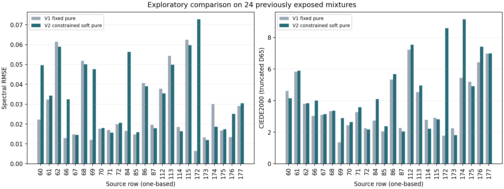

# Calibration diagnosis and one constrained revision

**Decision: retain v1 as the research baseline and reject this v2 revision.**
The revision improves its calibration tints modestly, but worsens mean color
error on the 24 exposed mixtures from 3.789 to 4.428 DE00 and exceeds the
predeclared pure-color drift limit. No additional revision was tried or tuned
after this result. No runtime, paper, renderer or default change was made.

The original study was committed first as `e109f3f`. Its methodology, independent
holdout result and coefficient artifact remain intact. The corrected reuse note
records uncertainty without asserting that author permission is legally required.

## 1. Diagnose the 21 calibration samples

Only the four pure samples and 17 white tints entered this diagnosis. A bounded
per-paint, per-wavelength scalar fit removed both smoothing and the weak amplitude
prior while retaining the measured pure spectra and the same scattering bounds.
It checked 513 log-S grid values, refined every sampled local minimum, and
included the original solution and both endpoints. The 24 exposed mixtures were
not used to fit, score or choose this diagnostic.

| Calibration result | V1 | Unsmoothed diagnostic |
|---|---:|---:|
| Mean squared spectral residual over 21x31 values | 0.0004457636 | 0.0004457521 |
| Mean tint spectral RMSE, 17 rows | 0.02085708 | 0.02085682 |
| Mean tint DE00 | 1.837790 | 1.837617 |
| Worst tint DE00 | 5.903329 | 5.903093 |

Removing regularization eliminates only **0.00258% of calibration squared
spectral error**. Numerical smoothing is therefore not the important limitation
in this experiment. Blue/white remains the weakest series:

| Tint family | Count | V1 mean spectral RMSE | V1 mean DE00 | V1 worst DE00 |
|---|---:|---:|---:|---:|
| Yellow + white | 5 | 0.006390 | 0.422 | 0.872 |
| Red + white | 6 | 0.023818 | 1.736 | 2.163 |
| Blue + white | 6 | 0.029952 | 3.119 | 5.903 |

Three tints leave the measured pure-ingredient envelope by more than 0.001
reflectance: source rows 6, 19 and 37. Five adjacent comparisons in the full
pure-to-white tint sequences reverse the expected per-wavelength monotonic
direction by more than 0.001: rows 1→6, 5→4, 1→19, 1→37 and 35→34. The largest
reversal is 0.0107 reflectance. These cutoffs are diagnostic choices, not measured
noise estimates. This does not identify a bad row or prove a physical cause;
all 21 observations were retained.

## 2. Freeze and fit one constrained revision

The [plan](measured-oils-revision-plan.md) and [configuration](../config/measured-oils-v2.json)
were fixed after the calibration diagnosis and before fitting the real data.
The only model change was allowing small, smooth departures from the four pure
measurements: five cubic spline controls per paint, 20 additional parameters.
Each correction was bounded to 0.02 absolute reflectance, tightened to maintain
positive interior values, and penalized toward zero. The same 93 log-scattering
parameters, all 21 calibration rows, wavelength grid and physical assumptions
were retained. No per-mixture correction or row removal was introduced.

All three prescribed starts converged with no active parameter bounds. Their
objectives agreed to approximately 8e-16; the S=0.1 start had the lowest
calibration objective and was selected before evaluating the other mixtures.
The three runs used 19–24 function evaluations and about 1.65 seconds total on
this host. Those times exclude startup and reporting.

Frozen v2 model SHA-256:
`17ee8c7041fe34dcfda3485cf41b217fb2d57b19a08c99660ab931db4e524d75`.
The model's exact bytes and the implementation/configuration/plan hashes were
checked before and after evaluation. This is a constrained fitted model, not a
claim that the measured pure spectra were wrong.

## 3. Calibration tradeoff

| Metric | V1 | V2 |
|---|---:|---:|
| Mean tint spectral RMSE | 0.02086 | 0.01933 |
| Mean tint DE00 | 1.838 | 1.713 |
| Worst tint DE00 | 5.903 | 5.068 |
| Mean pure-paint DE00 | approximately 0 | 0.786 |
| Worst pure-paint DE00 | approximately 0 | **2.210** |

Tint RMSE improved by 7.34%, while the fitted pure colors moved away from their
observations. The predeclared maximum pure-color DE00 of 1.0 **failed**:

| Paint | Maximum spectral shift (reflectance points) | Pure-color DE00 |
|---|---:|---:|
| Yellow | 0.000727 | 0.020 |
| Red | 0.004781 | 0.666 |
| Blue | 0.010225 | **2.210** |
| White | 0.014156 | 0.249 |

Every spectral shift remained below the 0.02 hard cap. That cap alone does not
guarantee a small perceptual error, particularly for a dark or saturated paint.
The pure-color screen was evaluated after fitting; it was never relaxed.

## 4. Honest evaluation on the 24 exposed mixtures

These are the same 24 mixtures that were independent holdouts for v1. Their
earlier results helped motivate this revision, so **this comparison is exploratory
development evidence, not a fresh independent validation**. Their spectra did
not enter the v2 optimizer or selection among its three starts.

Both models use the same 31-band, 400–700 nm truncated D65/2-degree calculation,
unclipped XYZ/Lab and CIEDE2000. Spectral RMSE is the average of per-mixture
31-band RMSE values, on a 0–1 reflectance scale.

| Metric on exposed mixtures | V1 | V2 |
|---|---:|---:|
| Mean spectral RMSE | 0.02649 | **0.03371** |
| P95 spectral RMSE | 0.06035 | 0.05956 |
| Maximum spectral RMSE | 0.06242 | **0.07270** |
| Mean DE00 | 3.789 | **4.428** |
| Median DE00 | 3.179 | **3.911** |
| P95 DE00 | 6.897 | **8.429** |
| Maximum DE00 | 7.224 | **9.144** |

Mean color error worsened by **16.9%**, and mean spectral RMSE by **27.3%**.
Seven of 24 colors improved and 17 worsened. Spectral RMSE improved in 12 cases,
but the size of the regressions outweighed those gains. Four of the original five
quality-screen thresholds still fail; only maximum DE00 <=10 passes.



| Mixture family | Count | V1 mean DE00 | V2 mean DE00 |
|---|---:|---:|---:|
| Yellow + red | 5 | 3.145 | 4.048 |
| Yellow + blue | 1 | 4.612 | 4.140 |
| Red + blue | 2 | 5.881 | 6.252 |
| Yellow + red + white | 6 | 2.572 | 2.626 |
| Yellow + blue + white | 2 | 4.816 | 4.859 |
| Red + blue + white | 2 | 2.847 | 2.523 |
| Yellow + red + blue | 3 | 4.551 | **8.384** |
| All four | 3 | 4.806 | 4.569 |

The largest color regression is row 172 (yellow/red/blue): 1.781→8.585 DE00.
Row 174 rises from 5.450→9.144. No failing row was excluded from the report.

## Interpretation and next boundary

This experiment supports rejecting **this specific** pure-anchor relaxation.
It does not show that every joint optical fit, every K-M variant or every
measured palette must fail. Better calibration fit alone was insufficient.

The inferred mixing strengths are sensitive to the pure-spectrum assumptions.
For example, yellow's scattering relative to white at 700 nm changes to about
0.0172 times the v1 value, despite yellow's fitted pure color changing by only
0.020 DE00. White's per-wavelength gauge is unchanged between models. This is a
change in inferred effective parameters, not a measured physical change. It helps
explain why a fit that looks slightly better on white tints can behave very
differently when chromatic paints are combined.

Keep v1 as the comparison baseline. The evidence favors checking preparation /
opacity assumptions and obtaining calibration information that directly constrains
chromatic interactions, rather than treating a better white-tint score as enough.
Any model selected using these 24 mixtures needs genuinely new evaluation data
for an independent accuracy claim. No further candidate was fitted in this task.

## Verification and reproduction

Four new data-free tests passed: reduction to v1 with zero correction, analytic
Jacobians including all 20 pure controls, spline/control-bound guarantees, and
recovery from noiseless synthetic tints without pure drift. Independent scalar
K-M evaluation from saved K/S agrees with the v2 vector implementation to
**1.81e-15** maximum absolute reflectance difference across all 45 recipes.
V1 color errors recomputed by the comparison match the committed baseline.

With the existing research environment and v1 coefficient artifact:

```powershell
target/measured-oils/venv/Scripts/python.exe tools/diagnose_oil_calibration.py
target/measured-oils/venv/Scripts/python.exe -m unittest discover -s tools -p test_measured_oils_revision.py -v
target/measured-oils/venv/Scripts/python.exe tools/measured_oils_revision.py prepare
target/measured-oils/venv/Scripts/python.exe tools/measured_oils_revision.py fit
target/measured-oils/venv/Scripts/python.exe tools/measured_oils_revision.py evaluate
```

The fitter refuses to overwrite a frozen v2 artifact. Use the same fresh
`--out target/measured-oils/v2-repeat` for all three phases to repeat deliberately.
V1 can be regenerated with its existing script; v2 checks its source/configuration/
implementation and partition, and records the actual baseline artifact hash.
Timings can alter whole-file hashes across repeats without changing coefficients.

Saved evidence: [calibration diagnosis](../results/measured-oils-calibration/summary.json),
[calibration errors](../results/measured-oils-calibration/errors.csv),
[revision comparison](../results/measured-oils-v2/summary.json),
[per-row errors](../results/measured-oils-v2/errors.csv), and
[partition](../results/measured-oils-v2/partition.json).
Coefficient artifacts remain local under `target/measured-oils/`.
