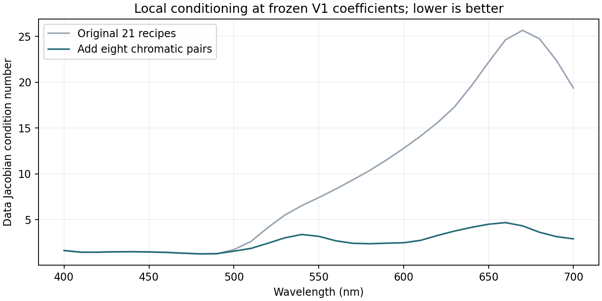
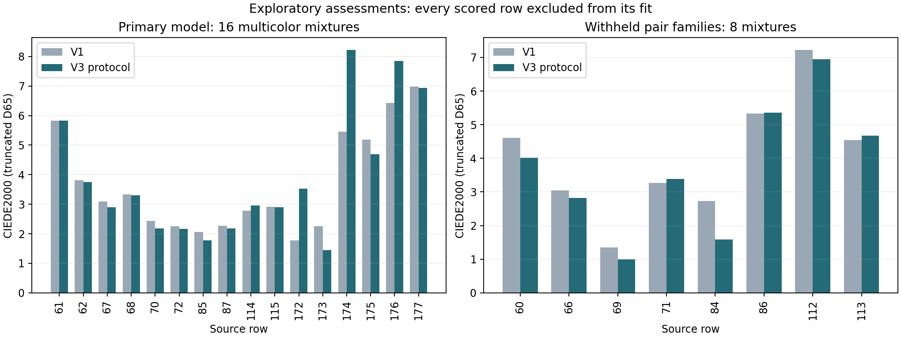

# Chromatic-pair calibration: stronger constraints, mixed prediction results

**Decision: retain v1 as the research baseline.** Adding chromatic-pair
calibration improved local parameter conditioning and modestly improved
withheld-pair color prediction. It did not improve the primary multicolor
assessment: mean DE00 rose from 3.677 to 3.915 and worst DE00 from 6.981 to
8.222 on the **same 16 mixtures**. V3 is not promoted to a runtime palette.
All new assessments are exploratory because these samples were previously exposed.

This experiment follows the rejected soft-pure revision. It adds calibration
information while keeping v1's 93-parameter fixed-pure K-M model, bounds,
regularization, three starts and optimizer unchanged. No optical correction,
extra parameter or per-mixture adjustment was introduced. The
[plan](measured-oils-v3-plan.md) and [configuration](../config/measured-oils-v3.json)
were frozen before any v3 fit. No settings changed after evaluation.

## 1. Why test additional pair calibration?

The prior investigation showed that removing smoothing barely changed tint
errors. Small allowed pure-spectrum shifts then produced large changes in
inferred mixing strength and worse predictions. The next question was whether
white tints alone constrain the chromatic interactions sufficiently for this
model. Adding measured chromatic pairs is a direct test with no extra model freedom.

The data-only Jacobian at the frozen v1 parameters quantifies local changes in
reflectance when the three log-scattering values change. Its per-wavelength
condition number decreased after adding the eight pair recipes:

| Diagnostic | Original 21 recipes | With eight pairs, 29 recipes |
|---|---:|---:|
| Median condition number | 7.41 | 2.43 |
| Maximum condition number | 25.66 | 4.68 |
| Condition number at 700 nm | 19.37 | 2.91 |
| Smallest singular value at 700 nm | 0.00878 | 0.07183 |

These values use the known recipe coordinates and v1's coefficients, with no
new measured target values in the derivative calculation. Lower condition numbers
indicate less disparity in local parameter sensitivity under the assumed model.
They are not estimates of measurement uncertainty or evidence that the assumed
physical model is correct.



## 2. Fit before evaluation

One primary model used 29 samples: the original 21 and all eight chromatic pairs.
Its assessment set comprised the other 16 three-/four-paint mixtures. Three
validation refits withheld a complete pair family from those 29 rows:

| Fit | Calibration rows | Assessment rows |
|---|---:|---:|
| Primary | 29 | 16 multicolor mixtures |
| Withhold yellow/red family | 24 | 5 yellow/red mixtures |
| Withhold yellow/blue family | 28 | 1 yellow/blue mixture |
| Withhold red/blue family | 27 | 2 red/blue mixtures |

Every model was frozen before any new assessment. A withheld pair family never
entered its fold's fitting arrays; no three-/four-paint observation entered any
of the four fits. These are repeated fits of the same declared model/protocol,
not a search for the best-performing optical model or validation fold.

All 12 optimizer starts converged in 9–12 evaluations, none at a parameter bound.
Starts were selected by calibration objective alone. The complete frozen model
bundle SHA-256 is
`c309be06c553012e41ef49900b0597e8b98bf4437567ae55ad463ea661eb33a9`.
The four pure spectra remain exact within floating-point arithmetic, maximum
absolute discrepancy 1.12e-16. Calibration on 29 rows improves mean spectral RMSE
from 0.01959 to 0.01795 and mean DE00 from 2.184 to 2.098. Those are calibration
scores; the following tables show predictions excluded from fitting.

## 3. Primary result: exactly the same 16 multicolor mixtures

All DE00 values use the same v1 convention: 400–700 nm, 31 samples, truncated
D65/2-degree XYZ/Lab, with no clipping or gamut mapping before scoring. Spectral
errors use 0–1 reflectance. These comparisons do not claim full-visible accuracy.

| Metric | V1, trained on 21 | V3 primary, trained on 29 |
|---|---:|---:|
| Mean spectral RMSE | 0.02639 | **0.02849** |
| P95 spectral RMSE | 0.06167 | 0.06070 |
| Mean DE00 | 3.677 | **3.915** |
| Median DE00 | 3.003 | **3.137** |
| P95 DE00 | 6.561 | **7.942** |
| Worst DE00 | 6.981 | **8.222** |

Eleven colors improve and five worsen, but several larger regressions outweigh
the smaller improvements. Only four of 16 spectral RMSE values improve. The
three chromatic paints combined without white are the clearest problem:

| Multicolor family | Count | V1 mean DE00 | V3 mean DE00 |
|---|---:|---:|---:|
| Red + blue + white | 2 | 2.847 | 2.928 |
| Yellow + blue + white | 2 | 4.816 | 4.791 |
| Yellow + red + white | 6 | 2.572 | 2.422 |
| Yellow + red + blue | 3 | 4.551 | **6.530** |
| All four | 3 | 4.806 | 4.359 |

Rows 174, 172 and 176 worsen by 2.772, 1.739 and 1.427 DE00 respectively. The
original five numerical screen limits remain unchanged: four fail on the primary
16-row assessment; only maximum DE00 <=10 passes. No failing row was removed.

## 4. Withheld pair families

The same spectral model gains a modest color improvement when predicting a
chromatic pair family from white tints and the other two chromatic pair families:

| Withheld family | Count | V1 mean DE00 | V3 fold mean DE00 |
|---|---:|---:|---:|
| Yellow/red | 5 | 3.145 | 2.830 |
| Yellow/blue | 1 | 4.612 | 4.011 |
| Red/blue | 2 | 5.881 | 5.814 |
| Pooled eight rows | 8 | 4.012 | 3.723 |
| Equal-weight mean of three families | 3 families | 4.546 | 4.218 |

Five of eight colors improve. However, pooled spectral RMSE worsens from
0.02668 to 0.03359; only one of eight spectra improves by that metric. Better
color agreement here does not establish better spectral agreement. One
yellow/blue recipe cannot establish behavior over its whole mixing trajectory.



For completeness, combining the 16 primary predictions and the eight fold
predictions gives mean DE00 3.851 versus v1's 3.789 on all 24 rows. This is a
**cross-fitted protocol diagnostic**, not the performance of one deployable
palette artifact. Each scored row was excluded from its particular fit, but
the dataset has influenced the study design. This is not new independent evidence.

## Interpretation and next research boundary

This test separates parameter conditioning from predictive adequacy. The added
recipes constrain local parameter directions better, but that alone does not
produce better multicolor predictions. Missing chromatic-pair calibration is
therefore insufficient as the sole fix for this model on these samples.

Together with the monotonicity and pure-envelope violations already recorded,
the result favors examining assumptions about the measured swatches and apparent
pure spectra. It does not establish whether substrate, opacity, surface response,
preparation variation, or another effect is responsible. No such cause was fitted
or measured in this experiment. The current archive does not supply the backing
and thickness information needed to distinguish those possibilities directly.

The next useful evidence would separate those effects: repeated pure and mixed
swatches, controlled application thickness, and measurements over known light
and dark backings, with source formulations and mass recipes recorded. That is
a proposed follow-up measurement design, not an action performed here. It would
also provide genuinely new validation cases. A finite-layer or surface model
fitted to assumed backing data must be labelled as such; it cannot silently turn
unknown inputs into measurements.

No further candidate was fitted after the v3 comparison. V1 remains the research
baseline, the rejected v2/v3 results remain available, and the synthetic runtime
palette, paper implementation and renderer are unchanged.

## Reproduce and verify

Using the existing research environment and original v1 artifact:

```powershell
target/measured-oils/venv/Scripts/python.exe -m unittest discover -s tools -p test_measured_oils_chromatic.py -v
target/measured-oils/venv/Scripts/python.exe tools/measured_oils_chromatic.py prepare
target/measured-oils/venv/Scripts/python.exe tools/measured_oils_chromatic.py fit
target/measured-oils/venv/Scripts/python.exe tools/measured_oils_chromatic.py evaluate
```

Use the same fresh `--out target/measured-oils/v3-repeat` for all three phases
to repeat without overwriting the frozen models. Three data-free tests passed:
whole-family exclusion, multichromatic forward/fitting Jacobians, and local
information plus independent scalar decoding. Independent scalar K-M evaluation
of the saved fits agrees within 2.84e-15 absolute reflectance. Recomputed v1
scores reproduce the recorded baseline. Frozen model/plan/config/source hashes
and the split manifests were verified. Both generated figures were inspected.

Evidence: [full summary](../results/measured-oils-v3/summary.json),
[per-row errors](../results/measured-oils-v3/errors.csv),
[row manifests](../results/measured-oils-v3/partition.json),
[sensitivity values](../results/measured-oils-v3/sensitivity.csv).
Raw source data and coefficient artifacts remain under ignored local research
output. Their storage arrangement does not assert a legal permission requirement.
