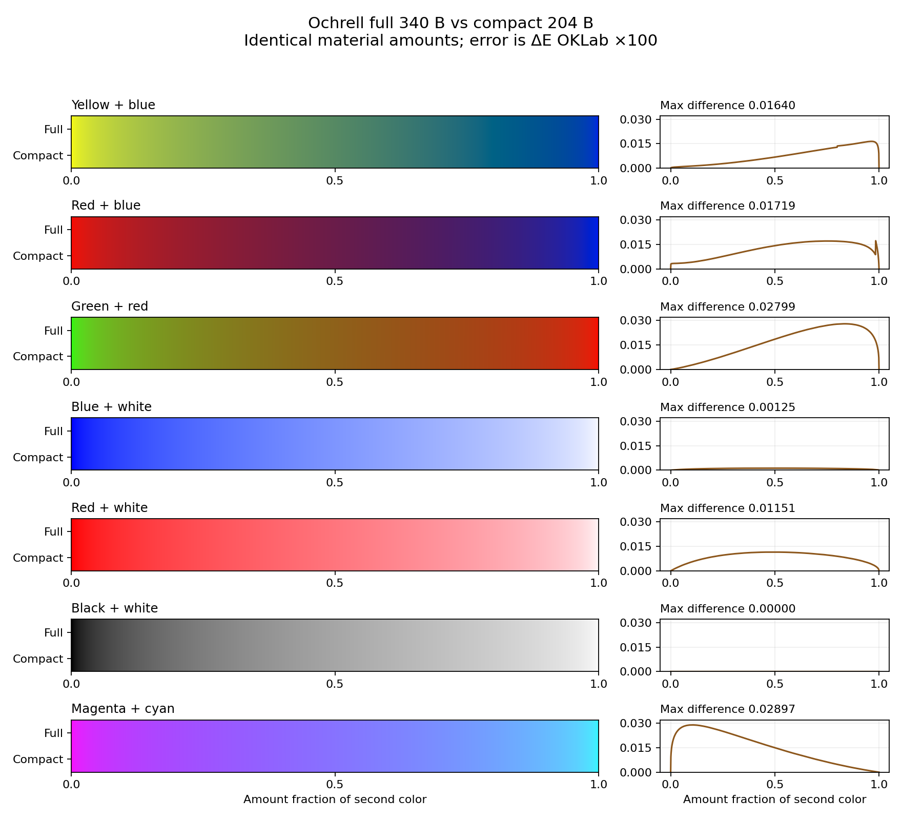

# Round 2: opt-in compact material storage

Starting checkpoint: `9937ec4`. This round adds `ochrell::compact::CompactLatent`,
a **204-byte** alternative to the full **340-byte** latent: 40% less material
memory, with small measured future-mixing differences. It is slower to mix and
decode. The root API, full state, fitted optical coefficients, 81-band reference
and renderer remain unchanged. Nothing here measures real-paint accuracy.

The [predeclared plan](optimization-round2-plan.md) separates representation
selection from implementation verification. Raw evidence, failed candidates,
environment and source hashes are in `results/optimization/round2/`.

## Representation and API

The format stores 24 f32 absorption samples, 24 f32 scattering samples and three
f32 linear-RGB residual channels. Fixed wavelength indices are
`0, 5, 6, ..., 25, 27, 40` on the 380–780 nm, 10 nm full grid. Missing bands
use linear interpolation with nonnegative weights; K remains nonnegative and
S remains positive. Checked imports reject negative K, nonpositive S and
nonfinite components. Convex interpolation has a rare f64 fallback for f32
overflow/underflow at imported coefficient extremes.

Packing samples full K/S and recalculates the residual as
`full_linear_rgb - expanded_compact_optical_rgb`. This preserves the immediate
color, but cannot recover discarded material. Future mixture errors therefore
matter more than source reconstruction alone. It does not decode to sRGB and
re-encode a fresh spectrum. Interpolation and weighted mixing preserve stored
f32 material directly; there is no f16 quantization after each brush update.

```rust
use ochrell::{compact::{CompactLatent, FORMAT_ID}, Color};

let yellow = CompactLatent::encode(Color::srgb8(255, 220, 0));
let blue = CompactLatent::encode(Color::srgb8(20, 70, 255));
let material = CompactLatent::weighted(&[(yellow, 2.0), (blue, 3.0)]).unwrap();
let display_color = material.decode();
let payload = material.to_le_bytes(); // 204 bytes: K, then S, then residual
let format = FORMAT_ID;              // store/check separately with the payload
let restored = CompactLatent::try_from_le_bytes(payload).unwrap();
assert_eq!(display_color, restored.decode());
```

`try_from_full` packs an existing `Latent`; `to_full` expands its approximation.
The latter cannot restore the original spectrum. `interpolate` clamps the amount
fraction to [0,1], treats NaN as zero and returns exact endpoint states.
`weighted` rejects invalid weights and accumulates normalized weights in f64.
Grouped mixing requires outer weights to carry each group's total amount.
Keep paint amount, coverage/alpha and renderer height/lighting separate.

The portable payload identifier is
`ochrell-v0.2-compact24-linear-ks-residual-v1`. The 204-byte array has **no embedded
header**. Hosts must store/check the identifier, exact payload length and model
version, then use checked loading. Do not serialize Rust struct memory, reinterpret
the old renderer format or truncate full arrays. Bytes preserve an already-lossy
compact state exactly. Arbitrary imported spectra are accepted when valid, but
the empirical color-error budgets apply only to the tested model-derived domain.
Changing model coefficients requires reevaluating the knots and versioning the
format; they are not freely interchangeable with another spectral grid.

## Selection and rejected alternatives

Training used 8,192 seeded random colors plus 264 corner/gray controls. The
selection set used 2,048 random colors plus those controls; holdout used 8,192
new random colors plus controls. Random families include ordinary sRGB,
dark-biased colors, near-white colors and saturated cube faces. Seeds are
20260930 (training), 314159 (selection), 1907 (holdout). Shared canonical controls
are deliberately repeated, while the random holdout was not used in fitting.

Adaptive knots were greedily added to reduce K/S interpolation error, normalized
per coefficient and weighted by the absolute RGB integration weights. The
selection objective uses Ochrell's own optical material, not comparator output.
PCA used standardized K/S states from the same training corpus. All candidates
retain f32 residuals and get the same immediate-color correction.

The limits declared before selection were mean <=0.01, P95 <=0.05 and max <=0.20
**ΔE OKLab ×100** per future-mixing case; source and self-grouping maxima <=0.002;
positive optics without clipping; state size <=256 bytes, preferably <=192.
These are engineering budgets against a model, not universal visibility thresholds.

| Candidate | Bytes | Largest selection error | Decision |
|---|---:|---:|---|
| Uniform 11 / 16 / 21 knots | 100 / 140 / 180 | 8.767 / 4.542 / 2.084 | Reject |
| Adaptive 11 / 16 / 21 knots | 100 / 140 / 180 | 2.029 / 0.708 / 0.147 | Reject; the 21-knot average/tail gates fail |
| Adaptive 22 knots | 188 | 0.0842 | Reject; average gate fails |
| Adaptive 23 knots | 196 | 0.0753 | Reject; canonical mean 0.01738, P95 0.05420 |
| **Adaptive 24 knots** | **204** | **0.02897** | **Smallest tested passing candidate** |
| Adaptive 26 / 28 / 30 knots | 220 / 236 / 252 | 0.01760 / 0.00159 / 0.00017 | Pass, larger |
| Adaptive 31 knots | 260 | 0.00010 | Outside size budget |
| PCA 8 / 12 / 16 / 24 / 32 dimensions | 44 / 60 / 76 / 108 / 140 | 22.915 / 11.236 / 2.742 / 0.890 / 0.421 | Reject; invalid optics and error |
| Full 41-knot control | 340 | 0 | Numerical control; outside compact budget |

Uniform 22, 23, 24, 26, 28, 30 and 31 knots also fail; every candidate's full
metrics and error arrays are retained. PCA clipping is measured only as a
failure control, not accepted material: it requires thousands of negative-K or
nonpositive-S reconstructions to be repaired. Its invalid counts include
repeated evaluation calls, not unique source colors. The earlier naive-f16
failure remains in the [integration report](integration-results.md).

`screening-initial.json` preserves the first screen, before explicit canonical
ramps and the neighboring 22/23-knot trials. The final 26-candidate screen is
`screening.json`; `selection.json` freezes 24 knots before the independent
holdout. This is a search over the listed representations, not proof of a
globally optimal 204-byte format.

## Actual Rust holdout

The public Rust API was checked on **58,751 records**, separately from NumPy
screening. Each ramp has 1,001 amount fractions. Long chains include 144 starts
from random colors, corners and grayscale. The 256-step case uses t=0.03; the
4,096-step tiny case uses t=0.0001. Repacking expands to full K/S, packs again and
serializes/reloads at every update. Reference errors are separately retained
in the raw CSV and JSON; they are not measured-paint accuracy.

| Case | Mean vs full | P95 vs full | Max vs full |
|---|---:|---:|---:|
| Source reconstruction | 2.79e-11 | 0 | 9.04e-8 |
| Random mixture | 0.00295 | 0.01101 | 0.02735 |
| Mixture + 70% white | 0.00358 | 0.01173 | 0.01700 |
| Mixture + 10% black | 0.00297 | 0.01056 | 0.02519 |
| Three colors, grouped amounts | 0.00463 | 0.01249 | 0.02455 |
| Canonical trajectories | 0.00860 | 0.02655 | **0.02897** |
| 256 repeated updates | 0.00014 | 0.00075 | 0.00240 |
| 4,096 tiny updates | 0.00353 | 0.01037 | 0.01399 |
| Tiny updates, then 50% white | 0.00430 | 0.01233 | 0.01644 |
| Self-grouping | 5.29e-7 | 2.58e-6 | 1.07e-5 |
| 512 expand/repack cycles | 6.24e-11 | 1.35e-10 | 4.58e-9 |

Repeated-update metrics with per-step repacking are identical to the native
compact chain in this run. This avoids the observed tiny-update freeze from
naive f16 storage. The worst compact/reference difference is 0.06718, including
the full fast/reference discretization difference. No arbitrary future sequence
or imported spectrum is guaranteed by these sampled checks.



The strips show actual Rust colors at identical amount fractions. The error
curves reveal differences that the image's RGB/display quantization may hide.
No brush transport, coverage, lighting or renderer setting varies between them.

## Memory and performance

Verified with `size_of`: full 340 bytes, compact 204 bytes. Dense material-only
storage is below; these values exclude RGB, coverage, paint amount, height,
wetness, working buffers, allocator overhead and extra layers.

| Canvas | Full MiB | Compact MiB |
|---|---:|---:|
| 1024 × 1024 | 340 | 204 |
| 2048 × 2048 | 1,360 | 816 |
| 3840 × 2160 | 2,689.45 | 1,613.67 |
| 4096 × 4096 | 5,440 | 3,264 |

Performance conditions: Intel Core Ultra 7 258V, Windows 11, rustc 1.91.1 MSVC,
release, one codegen unit, LTO off, no custom RUSTFLAGS, CPU affinity 0. Each of
two runs discards one warmup, rotates operation order and records nine timed
repetitions of one million operations. State updates/read tests use 262,144
entries (85 MiB full, 51 MiB compact). Allocations, file IO and corpus encoding
are outside update/read timing; display conversion is included in decode.
These are core microbenchmarks with no rendering, lighting or FFI.

Timing tables and the final verification environment are generated in
`rust-summary.json` and `rust-environment.json`. The interactive host has
uncontrolled scheduling and clock frequency; raw minima/maxima are retained.
Large variation prevents a precise general speedup claim. Compact decode and
mix/decode remain slower, while copying compact states moves fewer bytes.

| Operation | Full ns: median [min, max] | Compact ns: median [min, max] |
|---|---:|---:|
| Encode from RGB | 372 [181, 1041] | 1298 [612, 3941] |
| Cached interpolation | 103 [44, 364] | 173 [84, 518] |
| Decode including display conversion | 335 [146, 1240] | 790 [274, 2009] |
| Cached interpolation + decode | 408 [140, 942] | 908 [311, 2039] |
| Streaming state update | 110 [60, 317] | 199 [76, 371] |
| Streaming state read/copy | 41.30 [16.16, 176.65] | 22.22 [11.27, 63.11] |

Full-to-compact packing costs 852 ns [346, 2133]; expansion to full costs 388 ns
[181, 1034]. The read loops' effective payload rates are about 8.23 and 9.18 GB/s
respectively, including loop and copy cost. These are not hardware measurements
of DRAM bandwidth. The first pinned run, retained under `confirmation-initial/`,
was faster in absolute terms but showed the same tradeoff: full/compact
mix-decode medians 205/445 ns, read/copy 19.96/12.99 ns. Neither run demonstrates
an end-to-end renderer speedup. Do not compare their absolute timings with
historical Mixbox or integration timings taken under different conditions.

The first implementation used runtime segment search and per-component guarded
mixing. A compile-time expansion map and separate fast arithmetic/validation
reduced overhead in an unpinned preliminary trial, preserving every numerical
CSV byte. Both timings and the original source are retained. This is not an
isolated proof of the optimization's speedup; the representation's memory/CPU
tradeoff is the result that matters here.

Use full states for hot brush tips and material that is repeatedly decoded.
Compact states are an optional cold-storage choice. Expand a tile once, update
it in full precision and repack when evicting it if the host adopts this policy;
cache size and lifetime still need renderer workload measurements. Avoid packing
on every interaction simply to save temporary stack space. Even compact dense
4K storage remains large; sparse tiles or bounded caches may matter more than
another small per-state reduction. This round implements no renderer cache.

## Reproduce and validate

From the Ochrell directory, with Rust and Python 3.12 (PowerShell):

```powershell
cargo test --release --offline
cargo run --release --offline --example basic
uv venv target/compact-venv
uv pip install --python target/compact-venv/Scripts/python.exe -r requirements-compact.txt
target/compact-venv/Scripts/python.exe tools/report_compact.py --run --cpu 0
```

That writes fresh Rust data, metrics, timings and the figure under
`target/compact-verification`; it also regenerates deterministic corpora under
`target/compact`. Standard `python -m venv` and `python -m pip` work too. On POSIX
use `bin/python`. Omit `--cpu` on systems without affinity support. These scripts
assume Cargo's default `target` layout. `--out` and `--data` choose other artifact
and corpus directories; neither modifies library code.

To repeat the full candidate search, after exporting corpora with the command
above (allow several minutes):

```powershell
target/compact-venv/Scripts/python.exe tools/compact_state.py --out target/compact-screen
target/compact-venv/Scripts/python.exe tools/compact_state.py --out target/compact-screen --holdout --only adaptive24
```

A fresh output directory refits the knot order and PCA; an existing directory
checks fitting provenance before reuse. NumPy/BLAS implementations may differ
slightly. Runtime knots are frozen explicitly in Rust, and final acceptance
uses actual Rust outputs. To replot retained evidence without rerunning timers:

```powershell
target/compact-venv/Scripts/python.exe tools/report_compact.py --out results/optimization/round2
```

A fresh refit into a separate directory reproduced all fitting arrays and the
24-knot selection metrics exactly on this host (`reproduction-check.json`).

The Rust suite includes reconstruction, canonical mixtures/tints, grouping,
4,096 tiny updates with round trips, exact serialization, invalid imports and
positive finite optics at f32 extremes. Source/data attribution and the
generated coefficients are unchanged; the original paper remains frozen.
All 31 tests (including two documentation examples) pass locally on Rust 1.91.1
and the declared minimum Rust 1.75.0. CI now checks the minimum version and
documentation examples as well. The standard basic example remains unchanged.
The compile-time interpolation map is a constant initializer, preserving the
minimum compiler requirement: floating-point arithmetic inside `const fn`
was only stabilized in [Rust 1.82](https://blog.rust-lang.org/2024/10/17/Rust-1.82.0/).

## Next climb

Measure a direct compact decoder that avoids constructing and revalidating an
intermediate full latent, against the same numerical gates and timing controls.
Keep it only if the complete mix/decode workload improves. This has a clearer
measured target than introducing GPU/WASM or accepting a smaller representation
with failed tint/repeated-update behavior. Renderer transport, cache integration
and appearance changes stay in their own workstream.
