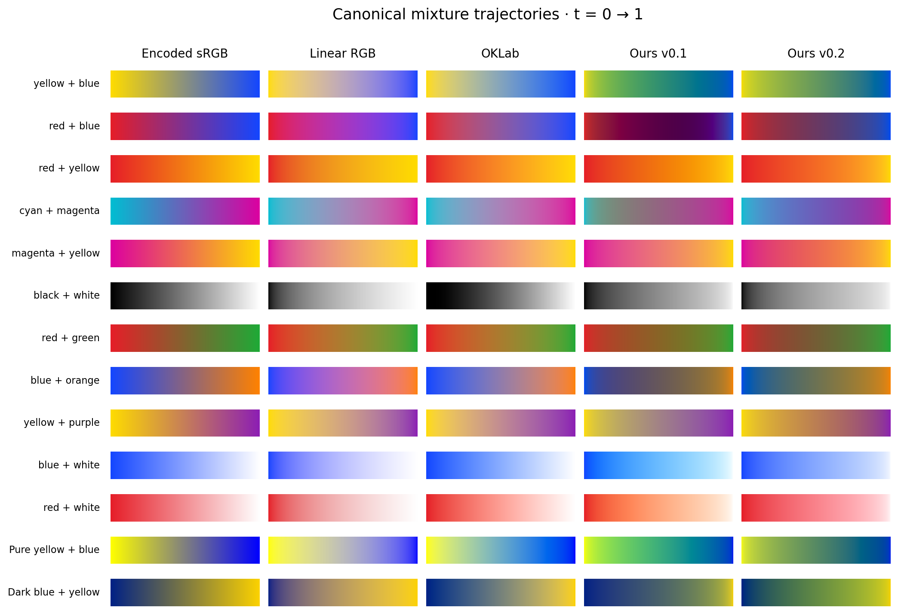

# Mathematical revision: what changed and what it achieved

Version 0.2 replaces the ambiguous finite-palette inverse with smooth spectral reconstruction and an explicit absorption/scattering strength prior. It uses no new paint measurements and no coefficients or fitting targets from another engine.

| Pair | v0.1 sRGB8 | v0.2 sRGB8 |
| --- | --- | --- |
| yellow + blue | (49, 144, 112) | (101, 152, 94) |
| red + blue | (88, 0, 71) | (106, 57, 98) |
| red + yellow | (242, 118, 14) | (244, 106, 37) |
| cyan + magenta | (148, 101, 130) | (109, 93, 186) |
| magenta + yellow | (237, 120, 116) | (236, 105, 83) |
| black + white | (141, 141, 141) | (166, 166, 166) |
| red + green | (137, 100, 39) | (116, 93, 53) |
| blue + orange | (103, 87, 91) | (108, 114, 83) |
| yellow + purple | (162, 130, 134) | (187, 126, 84) |
| blue + white | (107, 188, 255) | (135, 169, 255) |
| red + white | (255, 166, 124) | (250, 131, 139) |
| extreme + yellow + blue | (60, 174, 124) | (86, 138, 100) |
| official + default | (73, 97, 107) | (99, 138, 68) |

## Measured changes

| Reconstruction | Mean | Median | P95 | P99 | Max |
| --- | --- | --- | --- | --- | --- |
| v0.2 corrected | 1.27e-06 | 4.91e-07 | 4.84e-06 | 7.45e-06 | 1.79e-05 |
| v0.2 raw | 0.072 | 0.0341 | 0.272 | 0.517 | 0.85 |
| v0.1 raw | 11.5 | 9.2 | 28.6 | 35.7 | 42.1 |

Raw mean error falls from 11.5 to 0.072 ΔE2000. Held-out green-dominant frequency rises from 38.4% to 80.8%. Tint hue P95 falls from 35.6° to 10.4° on 957 common eligible colors. These are model diagnostics, not physical paint measurements.

| Operation | Median ns | Million/s |
| --- | --- | --- |
| sRGB | 15.6 | 64 |
| linear RGB | 148 | 6.75 |
| OKLab | 272 | 3.67 |
| v0.1 RGB | 572 | 1.75 |
| v0.2 RGB | 719 | 1.39 |
| v0.2 cached | 229 | 4.37 |
| v0.2 reference | 1.87e+03 | 0.534 |
| v0.1 cached | 182 | 5.5 |

## Tradeoffs and remaining failures

The full RGB and cached operations are slower than v0.1, and cached state grows from 44 to 340 bytes. Some saturated red/blue mixtures are more muted. Not every blue/yellow color family result is green. The P99 random-trajectory statistic does not uniformly improve. Near black, the finite-step OKLab distance remains large, though endpoint refinement confirms continuity. White strength is a chosen prior, not calibrated titanium white.

## Mixbox and Spectral.js

Mixbox sample mean distance falls from 13.5 to 6.92 ΔE2000; all-curve Spectral.js distance falls from 13.1 to 6.49. We selected our model before inspecting these comparisons. Mixbox values are JPEG samples at three t values; the screenshot control has roughly 0.29 mean ΔE uncertainty. Similarity does not establish which engine is closest to real paint.

See the main paper, `docs/math.md`, `docs/coefficients.md`, `docs/revision-decisions.md` and raw `results/revision` data. Run `python3 tools/reproduce.py` to regenerate. The old implementation is available as `ochrell::legacy`.
