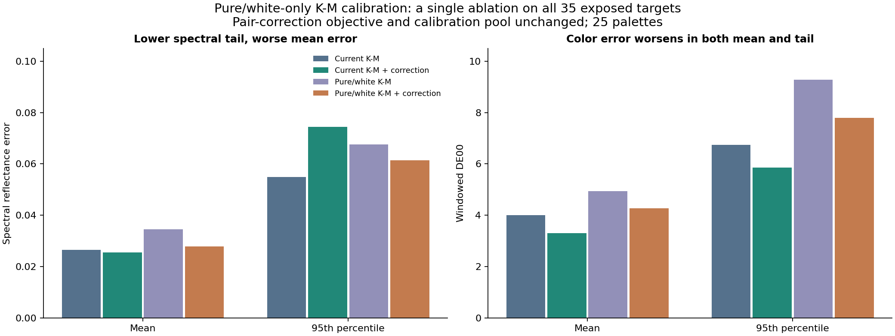
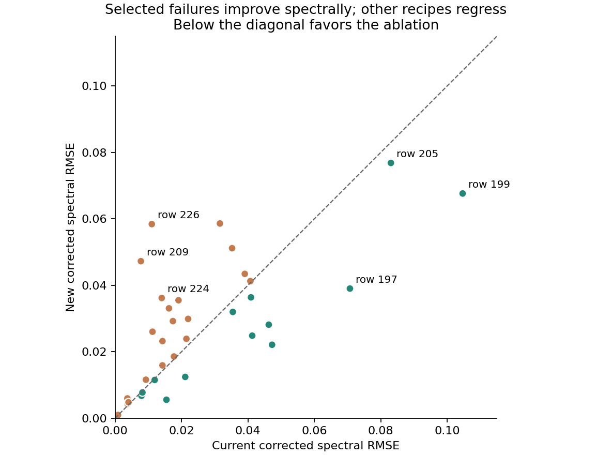

# Pure/white base calibration fails the overall comparison

**Reject this ablation as a replacement for the current method.** Across the
same 35 targets, the new corrected model has **9.17% higher mean spectral RMSE**
and **29.31% higher mean windowed DE00** than the current corrected model.
Spectral error improves on 13 rows but worsens on 22; color improves on 10 and
worsens on 25. Equal weighting across palettes gives the same conclusion.

The three selected failures do improve spectrally, and p95/max spectral errors
fall. However, all three selected cases worsen in color error, and useful
predictions elsewhere are lost. This experiment does not support removing all
chromatic binaries from K-M calibration as a general fix.



## The single change

The [plan](PLAN.md) was saved before fitting/scoring. This follows the user's
approved calibration ablation from the [failure diagnosis](../oil_failure_cases/REPORT.md).
The original 25-palette / 35-target cohort, source rows, white gauge, native
400-700 nm spectra, objectives, priors, parameter bounds, initializations and
stopping rules are unchanged.

K-M now sees only pure paints and white tints: 20-27 samples per palette.
After its coefficients are frozen, the empirical controls still see the same
full 25-39-row pure/binary calibration pool as before. All pair controls, including
white pairs, are refitted on that pool. No new basis, attenuation, extra parameter,
recipe exception or target-informed sample deletion is introduced. Neither stage
sees any ternary target.

The second stage reuses the original features, residual and Jacobian with the
exact original optimizer settings. Given each of the 25 archived K-M bases, the
extracted stage reproduces its original pair coefficients **exactly**. Thus the
comparison does not confound the new calibration split with a changed correction
optimizer. Stage two leaves its new base coefficients byte-identical.

The mean-error normalization also remains unchanged. Reducing the first-stage
sample count changes its weighting relative to the fixed priors; this is part of
the declared intervention. The experiment is not an isolation of individual bad
binary observations while holding every statistical weight constant.

## Full-cohort results

| Method | Mean RMSE | Median RMSE | p95 RMSE | Max RMSE | Mean windowed DE00 |
| --- | --- | --- | --- | --- | --- |
| Current K-M | 0.026552 | 0.021861 | 0.054923 | 0.104356 | 3.9962 |
| Current K-M + correction | 0.025535 | 0.017423 | 0.074424 | 0.104666 | 3.3008 |
| Pure/white K-M | 0.034487 | 0.033537 | 0.067516 | 0.076640 | 4.9345 |
| Pure/white K-M + correction | 0.027876 | 0.026040 | 0.061328 | 0.076848 | 4.2682 |

| Comparison | Mean RMSE change | Spectral better / worse | Mean DE00 change | Color better / worse |
| --- | --- | --- | --- | --- |
| New corrected vs current corrected | +9.17% | 13 / 22 | +29.31% | 10 / 25 |
| New base vs current base | +29.88% | 11 / 24 | +23.48% | 12 / 23 |
| New corrected vs its own base | -19.17% | 25 / 10 | -13.50% | 28 / 7 |
| New corrected vs current plain K-M | +4.98% | 17 / 18 | +6.81% | 14 / 21 |

Positive percentage change means higher error. The original all-binary-base
empirical model remains best in mean spectral and color error among these four
models. The new base alone is 29.88% worse spectrally than the original K-M base.
The existing pair correction repairs part of that loss (19.17% improvement over
its new base), but does not recover the original performance.

For the new corrected model, spectral p95 improves by 17.60% relative to
the original correction, and maximum RMSE falls from 0.104666 to 0.076848. Those
tail improvements are retained as a tradeoff, not used to override the prespecified
mean-error result. Mean and p95 color errors both worsen.

DE00 uses the established D65/2-degree 400-700 nm window and matching white.
It is not full-visible colorimetry and is not numerically pooled with Grillini's
different spectral window. These are descriptive scores on exposed observations,
not an independent quality certification.

## Equal weighting across 25 palettes

| Method | Equal-palette mean RMSE | Equal-palette mean DE00 |
| --- | --- | --- |
| Current K-M | 0.023665 | 4.2429 |
| Current K-M + correction | 0.022195 | 3.4034 |
| Pure/white K-M | 0.033395 | 5.2017 |
| Pure/white K-M + correction | 0.025274 | 4.5480 |

With equal palette weights, the corrected ablation is **13.87% worse in spectral
RMSE** and **33.63% worse in DE00** than the current correction. Ten palettes improve
and fifteen worsen spectrally; seven improve and eighteen worsen in color.
The failure therefore does not depend on giving extra weight to palettes with
more target recipes. Shared calibration swatches still prevent interpreting
these palettes as independent statistical replicates.

## The selected failures are not enough to choose the method

| Row | Current base RMSE | New base RMSE | Current corrected RMSE | New corrected RMSE | Current / new corrected DE00 |
| --- | --- | --- | --- | --- | --- |
| 197 | 0.069509 | 0.037630 | 0.070723 | 0.039034 | 5.238 / 6.130 |
| 199 | 0.104356 | 0.067725 | 0.104666 | 0.067649 | 5.310 / 7.624 |
| 205 | 0.036898 | 0.045608 | 0.083059 | 0.076848 | 7.146 / 8.188 |

For rows 197/199, removing chromatic binaries from base calibration substantially
reduces spectral error, consistent with the previous diagnosis that calibration
context affected the optical balance. But their color errors rise, and the
remaining spectral errors are still material. Row 205's new K-M base worsens;
its refitted correction makes the final spectral error somewhat less bad than
before, while color also worsens.

This supports a limited conclusion: the calibration split affects these cases.
It does not establish that pure/white calibration produces more faithful optical
parameters, fixes the incompatible binary observations, or improves paint mixtures
generally.



The five largest new spectral regressions are:

| Row | Paints | Current corrected RMSE | New corrected RMSE | Current / new DE00 |
| --- | --- | --- | --- | --- |
| 226 | Cadmium Yellow; Ultramarine Blue; Viridian Green | 0.011070 | 0.058434 | 1.022 / 6.553 |
| 209 | Cadmium Yellow; Scarlet Lake; Ultramarine Blue | 0.007786 | 0.047274 | 1.611 / 7.071 |
| 228 | Cadmium Yellow; Ultramarine Blue; Viridian Green | 0.031582 | 0.058619 | 1.793 / 2.513 |
| 224 | Cadmium Yellow; Cobalt Blue; Viridian Green | 0.014060 | 0.036190 | 3.548 / 7.286 |
| 193 | Lemon Yellow; Scarlet Lake; Ultramarine Blue | 0.016235 | 0.033081 | 3.402 / 4.095 |

Rows 226 and 209 were reasonably predicted by the current correction and become
much worse. Their loss outweighs benefits elsewhere in the prespecified mean.
No failing row or palette was dropped, and no settings were revised after seeing
these outcomes. Detailed per-row values remain in [errors.csv](errors.csv).

## All palette results

Columns refer to the original paints: 1 Lemon Yellow, 2 Cadmium Yellow,
3 Scarlet Lake, 4 Alizarine Lake, 5 Cobalt Blue, 6 Ultramarine Blue, 7 Viridian
Green; Mixed White is always coordinate four. Every target row remains outside
both calibration stages.

| Paint columns | Targets | Base / pair fit rows | Current corrected RMSE | New corrected RMSE |
| --- | --- | --- | --- | --- |
| 1-2-3 | 264 | 20 / 28 | 0.022004 | 0.029898 |
| 1-3-4 | 168,169,170 | 24 / 32 | 0.044957 | 0.025043 |
| 1-3-6 | 191,193,195 | 22 / 39 | 0.016542 | 0.030605 |
| 1-3-7 | 197,199 | 22 / 33 | 0.087695 | 0.053341 |
| 1-4-5 | 178 | 24 / 27 | 0.039072 | 0.043454 |
| 1-4-6 | 188 | 25 / 34 | 0.007970 | 0.006753 |
| 1-4-7 | 180 | 25 / 28 | 0.004093 | 0.005087 |
| 1-5-7 | 184,186 | 22 / 25 | 0.029338 | 0.027488 |
| 1-6-7 | 201,203 | 23 / 32 | 0.015212 | 0.012016 |
| 2-3-4 | 205 | 24 / 30 | 0.083059 | 0.076848 |
| 2-3-5 | 207 | 21 / 27 | 0.035464 | 0.031998 |
| 2-3-6 | 209 | 22 / 33 | 0.007786 | 0.047274 |
| 2-3-7 | 211 | 22 / 31 | 0.011276 | 0.026040 |
| 2-4-5 | 213 | 24 / 29 | 0.021491 | 0.023911 |
| 2-4-6 | 215 | 25 / 32 | 0.008247 | 0.007752 |
| 2-4-7 | 218,220,222 | 25 / 30 | 0.031138 | 0.040564 |
| 2-5-7 | 224 | 22 / 27 | 0.014060 | 0.036190 |
| 2-6-7 | 226,228 | 23 / 30 | 0.021326 | 0.058527 |
| 3-4-5 | 230 | 25 / 30 | 0.015485 | 0.005562 |
| 3-4-6 | 232 | 26 / 38 | 0.003786 | 0.004322 |
| 3-4-7 | 234 | 26 / 34 | 0.011940 | 0.011517 |
| 3-5-7 | 236 | 23 / 31 | 0.003712 | 0.005963 |
| 3-6-7 | 238 | 24 / 39 | 0.004058 | 0.004803 |
| 4-5-7 | 240 | 26 / 29 | 0.014282 | 0.015911 |
| 4-6-7 | 242 | 27 / 34 | 0.000892 | 0.000980 |

[palette-results.csv](palette-results.csv) includes both base models, corrected
models, native-window color errors and full paint names. [calibration.csv](calibration.csv)
separates pure, white-tint and chromatic-binary training records and marks which
rows enter the new base fit; none is counted as an assessment observation.

## Verification

- All 25 new fits succeeded. All 75 K-M starts converged in
  8-13 evaluations with no active bounds.
- All 25 correction fits converged in
  8-9 evaluations, with 0-4 active bound controls.
- Repeating all 25 complete fits after perturbing excluded targets changed no
  base or pair coefficient.
- Perturbing chromatic binary calibration targets and repeating only stage one
  also changed no base coefficient. The new base genuinely uses the anchors only.
- Reusing each archived base reproduces its original pair controls with maximum
  difference 0; original target scores replay within
  0.
- Independent scalar decoding agrees within 4.33e-15 for K-M
  and 5.17e-15 for the correction. Pure endpoints agree
  within 1.67e-16. Available and 517 additional recipes per palette
  have finite predictions strictly within (0,1).
- Exact partitions, complete target coverage, unchanged upstream hashes and both
  frozen-bundle identities passed. These checks establish execution correctness,
  not physical accuracy.

New frozen bundle SHA-256:

`79587feaad8787e96b0e3c483a11232c30c98f1d2da8a3faffd49a57e35b0f0c`

It is retained under ignored `target/measured-oils/anchor-base/frozen-models.json`.
The original bundle remains unchanged at
`ddc0e552df366ed4c0e00bdfeb581ca03f48f3ab1f71501808bc2ec778b94fbb`.
Provenance, coefficients' optimizer records and all comparisons are recorded in
[summary.json](summary.json), with verification evidence in
[verification.json](verification.json).

## Decision

Keep the original all-binary-base calibration as the research baseline. The data
do not support the broad claim that chromatic binaries should be withheld from
the optical fit: even where some observations violate the ideal opaque model,
they also provide information that pure/white tints alone do not replace.
The empirical stage helps the weaker new base, but its fixed capacity does not
fully compensate for the lost calibration information.

The original model's tail failures and physical-model contradictions remain.
This negative result does not validate the old model as physically correct; it
rejects this one proposed global remedy. Any future change should retain useful
chromatic evidence and explicitly account for uncertain model compatibility,
rather than selecting exceptions or another global split from these same errors.
No further revision is selected or fitted in this experiment.

The study is exploratory because all 35 targets were previously scored and three
failures motivated the hypothesis. No new physical measurements or independent
dataset were added. Production code, renderer, paper implementation and defaults
are unchanged.

## Reproduction

Use the existing checksum-verified Old Holland source and scientific Python
environment. Run phases in order:

```powershell
.\target\measured-oils\venv\Scripts\python.exe experiments/oil_anchor_base/run.py prepare
.\target\measured-oils\venv\Scripts\python.exe experiments/oil_anchor_base/run.py fit
.\target\measured-oils\venv\Scripts\python.exe experiments/oil_anchor_base/run.py verify
.\target\measured-oils\venv\Scripts\python.exe experiments/oil_anchor_base/run.py evaluate
.\target\measured-oils\venv\Scripts\python.exe experiments/oil_anchor_base/report.py
```

Preparation and fitting refuse frozen-output overwrite. For a fresh run, supply
one new `--out` directory under target/ consistently to every run phase. The
report script reads saved results only. Original experiment files and coefficients
are never overwritten.
