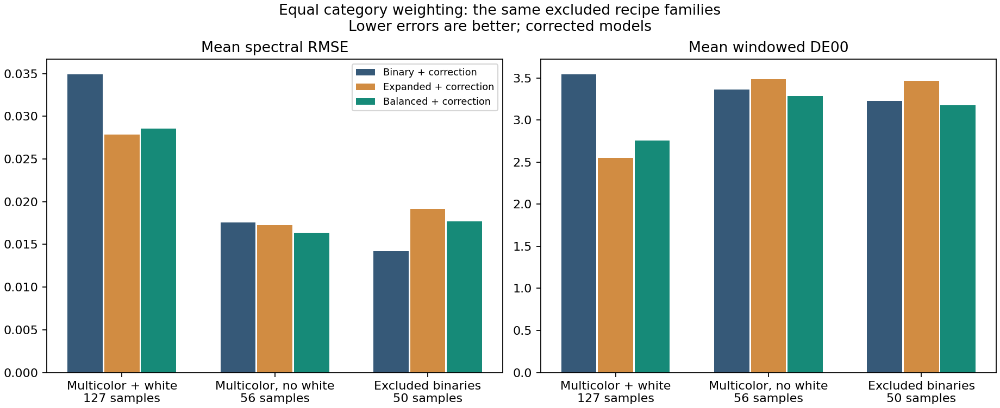
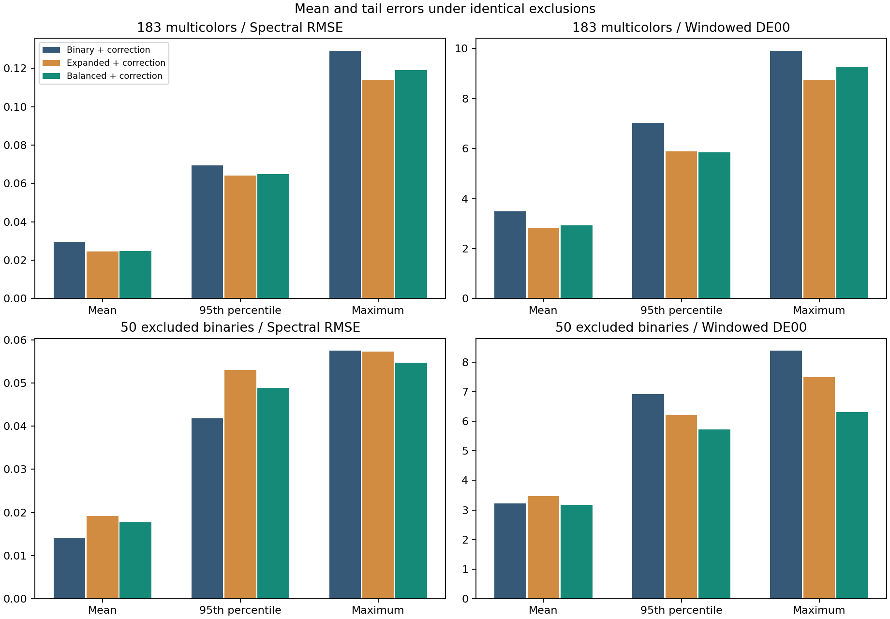
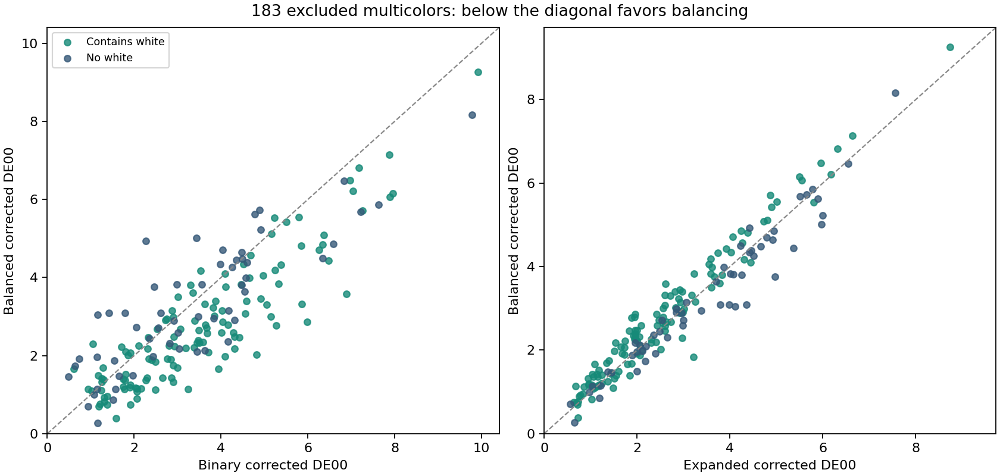

# Balanced calibration recovers color means, with a remaining binary spectral cost

**The predefined rule succeeds as a color-error compromise.** It recovers the
binary and no-white multicolor mean-color regressions while retaining most of
the multicolor gains. Binary spectral accuracy remains worse than the original
binary-calibrated baseline, and the unweighted expanded fit still has the best
primary mean color score. This supports a candidate for painting trials, rather
than a claim that one calibration is best on every criterion.

The balanced model changes mean multicolor color error by **-16.28%**
against binary calibration and **+3.01%** against unweighted
expanded calibration. It retains **86.94% of the expanded model's
mean color improvement** over the binary baseline, and **95.96%
of its mean spectral improvement**. Negative changes mean lower error.

For excluded binaries, mean spectral error changes
-7.39%
against expanded calibration and
+25.05%
against the binary baseline. Mean color changes are respectively
-8.39% and
-1.68%.
For no-white multicolors, the corresponding mean color changes are
-5.70% and
-2.26%.
The full means, tails and regressions below determine the tradeoff.



## Exact experiment

The [plan](PLAN.md), fitter and tests were frozen before 107 candidate fits.
The [partition](partition.json) records every permitted row and weight. Reuse
the earlier 51 binary and 107 expanded fits, verified by their frozen hashes,
with identical 107 complete chromatic-ratio exclusions. All members of a family,
including its binary parent and white additions, are excluded together.
The 8 pure and 45 white-tint anchors remain available. Other ratios using the
same paints remain in training. Assessment is on 183 multicolors and 50 binaries;
the anchors are not scored as predictive validation.

The candidate uses each expanded training pool (282-285 rows) with equal total
weight for four nonpure categories. For n training rows, m nonpure rows and n_g
training rows in category g, each nonpure row receives m/(4 n_g); pures retain 1.
The original data residual denominator sqrt(n * 31) and all priors are unchanged.
Thus total row weight stays n, preserving data weight relative to regularization.
Weights are computed independently within each training pool from recipes alone.

| Category | Training rows across folds | Per-row weight across folds |
| --- | --- | --- |
| chromatic binary | 49-50 | 1.370000-1.413265 |
| white tint | 45-45 | 1.522222-1.538889 |
| multicolor no white | 55-56 | 1.227679-1.259091 |
| multicolor with white | 124-127 | 0.545276-0.552419 |

Both fitting stages use these weights. The model remains the same measured-pure
K-M base (217 parameters, white S=1, three original starts) followed by 112
possible bounded pair controls. Prediction equations, pure endpoints, bounds,
priors and stopping rules are unchanged. No sweep or new term was introduced.

## Primary: 183 excluded multicolors

| Method | Mean RMSE | Median RMSE | p95 RMSE | Max RMSE | Mean DE00 | Median DE00 | p95 DE00 | Max DE00 |
| --- | --- | --- | --- | --- | --- | --- | --- | --- |
| Binary K-M | 0.031316 | 0.028414 | 0.066248 | 0.125246 | 4.4455 | 4.2362 | 8.4265 | 11.6696 |
| Binary + correction | 0.029613 | 0.022165 | 0.069404 | 0.129179 | 3.4874 | 3.3493 | 7.0357 | 9.9098 |
| Expanded K-M | 0.028867 | 0.024825 | 0.059901 | 0.117881 | 3.7202 | 3.4578 | 6.9901 | 10.7636 |
| Expanded + correction | 0.024625 | 0.017093 | 0.064250 | 0.114094 | 2.8344 | 2.5575 | 5.8897 | 8.7423 |
| Balanced K-M | 0.029134 | 0.025088 | 0.061376 | 0.119903 | 3.8834 | 3.6378 | 7.3775 | 11.2163 |
| Balanced + correction | 0.024827 | 0.017010 | 0.064981 | 0.119012 | 2.9197 | 2.6471 | 5.8445 | 9.2652 |

Spectral RMSE is the mean per-recipe reflectance RMSE over the 31 measured bands.
Color is the unchanged D65/2-degree, 400-700 nm windowed DE00, with a matching
truncated white and no display gamut mapping. These are not full-visible-spectrum
color errors. All six methods use the same excluded rows.



Equal weight over the 99 families containing multicolor assessments gives:

| Method | Family-mean RMSE | Family-mean DE00 |
| --- | --- | --- |
| Binary K-M | 0.031163 | 4.2963 |
| Binary + correction | 0.029589 | 3.3437 |
| Expanded K-M | 0.028470 | 3.6100 |
| Expanded + correction | 0.023631 | 2.6649 |
| Balanced K-M | 0.028749 | 3.7408 |
| Balanced + correction | 0.023839 | 2.7370 |

Fold training sets overlap. Family means are descriptive checks on sample-count
imbalance, not independent experimental replicates or significance tests.

## Recipe subgroups and secondary binaries

| Assessment | Rows | Binary RMSE | Expanded RMSE | Balanced RMSE | Binary DE00 | Expanded DE00 | Balanced DE00 |
| --- | --- | --- | --- | --- | --- | --- | --- |
| multicolor183 | 183 | 0.029613 | 0.024625 | 0.024827 | 3.4874 | 2.8344 | 2.9197 |
| binary50 | 50 | 0.014168 | 0.019131 | 0.017717 | 3.2267 | 3.4631 | 3.1725 |
| all233 | 233 | 0.026299 | 0.023446 | 0.023301 | 3.4315 | 2.9693 | 2.9739 |
| multicolor no white | 56 | 0.017586 | 0.017242 | 0.016379 | 3.3603 | 3.4828 | 3.2842 |
| multicolor with white | 127 | 0.034916 | 0.027881 | 0.028552 | 3.5435 | 2.5485 | 2.7590 |
| 3 paints | 101 | 0.030275 | 0.026754 | 0.026461 | 3.0285 | 2.5930 | 2.5820 |
| 4 paints | 53 | 0.027275 | 0.021113 | 0.021675 | 3.6706 | 2.9597 | 3.1055 |
| 5 paints | 18 | 0.032012 | 0.024514 | 0.025357 | 4.8767 | 3.5839 | 3.8854 |
| 6 paints | 6 | 0.021764 | 0.013155 | 0.015053 | 4.3541 | 2.9802 | 3.2453 |
| 7 paints | 5 | 0.041813 | 0.033018 | 0.035042 | 4.7737 | 3.5081 | 3.9046 |

All columns above include pair correction. Ingredient counts include white.
The 50-binary tail comparison is:

| Method | Mean RMSE | Median RMSE | p95 RMSE | Max RMSE | Mean DE00 | Median DE00 | p95 DE00 | Max DE00 |
| --- | --- | --- | --- | --- | --- | --- | --- | --- |
| Binary + correction | 0.014168 | 0.010637 | 0.041831 | 0.057507 | 3.2267 | 2.9678 | 6.9163 | 8.3904 |
| Expanded + correction | 0.019131 | 0.016510 | 0.053011 | 0.057325 | 3.4631 | 3.4343 | 6.2172 | 7.4913 |
| Balanced + correction | 0.017717 | 0.013761 | 0.048878 | 0.054687 | 3.1725 | 3.2993 | 5.7341 | 6.3129 |

The no-white multicolor tail comparison is:

| Method | Mean RMSE | Median RMSE | p95 RMSE | Max RMSE | Mean DE00 | Median DE00 | p95 DE00 | Max DE00 |
| --- | --- | --- | --- | --- | --- | --- | --- | --- |
| Binary + correction | 0.017586 | 0.012075 | 0.045891 | 0.079562 | 3.3603 | 3.2318 | 6.9260 | 9.7836 |
| Expanded + correction | 0.017242 | 0.013359 | 0.044546 | 0.058027 | 3.4828 | 3.5423 | 5.9729 | 7.5628 |
| Balanced + correction | 0.016379 | 0.012257 | 0.044943 | 0.061502 | 3.2842 | 3.0646 | 5.7609 | 8.1682 |

Balanced corrected model versus each comparator (negative is better):

| Assessment | Reference | Mean RMSE change | RMSE better/worse | Mean DE00 change | DE00 better/worse |
| --- | --- | --- | --- | --- | --- |
| multicolor183 | binary | -16.16% | 125/58 | -16.28% | 132/51 |
| multicolor183 | expanded | +0.82% | 86/97 | +3.01% | 74/109 |
| binary50 | binary | +25.05% | 19/31 | -1.68% | 21/29 |
| binary50 | expanded | -7.39% | 36/14 | -8.39% | 34/16 |
| multicolor no white | binary | -6.86% | 29/27 | -2.26% | 31/25 |
| multicolor no white | expanded | -5.00% | 38/18 | -5.70% | 37/19 |
| multicolor with white | binary | -18.23% | 96/31 | -22.14% | 101/26 |
| multicolor with white | expanded | +2.41% | 48/79 | +8.26% | 37/90 |
| all233 | binary | -11.40% | 144/89 | -13.33% | 153/80 |
| all233 | expanded | -0.62% | 122/111 | +0.16% | 108/125 |

[errors.csv](errors.csv) contains all 233 assessed rows; [families.csv](families.csv)
contains all 107 families. [summary.json](summary.json) retains all six methods,
all metrics and subgroups, including the base-only comparisons and corrections.



The six largest multicolor color-error increases against each comparator are:

| Reference | Source row | Family | White fraction | Reference DE00 | Balanced DE00 | Reference RMSE | Balanced RMSE |
| --- | --- | --- | --- | --- | --- | --- | --- |
| binary | 180 | ratio-180 | 0.000 | 2.2745 | 4.9297 | 0.003370 | 0.009511 |
| binary | 232 | ratio-232 | 0.000 | 1.1634 | 3.0440 | 0.002864 | 0.009315 |
| binary | 276 | ratio-276 | 0.000 | 1.4175 | 3.0877 | 0.003341 | 0.013109 |
| binary | 274 | ratio-274 | 0.000 | 3.4292 | 5.0073 | 0.008295 | 0.016335 |
| binary | 285 | ratio-285 | 0.000 | 1.7910 | 3.0930 | 0.003502 | 0.009179 |
| binary | 234 | ratio-234 | 0.000 | 2.4583 | 3.7571 | 0.006134 | 0.018964 |
| expanded | 272 | ratio-271 | 0.500 | 2.6096 | 3.5828 | 0.018281 | 0.017010 |
| expanded | 247 | ratio-246 | 0.500 | 1.9580 | 2.8624 | 0.008335 | 0.009972 |
| expanded | 249 | ratio-248 | 0.500 | 1.8797 | 2.7712 | 0.008041 | 0.011121 |
| expanded | 189 | ratio-188 | 0.500 | 4.8700 | 5.7146 | 0.011872 | 0.014198 |
| expanded | 95 | ratio-092 | 0.950 | 1.9435 | 2.7857 | 0.031836 | 0.034283 |
| expanded | 79 | ratio-078 | 0.500 | 2.5947 | 3.3176 | 0.017432 | 0.017430 |

## Verification

- Three protocol tests check identical exclusions, per-fold category weights,
  total objective scale, unchanged prior rows, both analytic Jacobians against
  finite differences, and selected-data fitting interfaces.
- With uniform weights, the new fitter reproduces a frozen expanded model's
  q, K, S, log-scattering and pair controls exactly. All archived comparator
  aggregates and per-row scores are reproduced exactly. See [preflight.json](preflight.json).
- All 107 candidates succeeded. 321/321
  base starts converged, using 8-11
  evaluations with 0-0
  active bounds. Corrections used 9-10
  evaluations and 0-1 active bounds.
- Every candidate was refitted after replacing excluded spectra. All fitted
  optical and pair coefficients were exactly unchanged.
- Scalar decoding agrees within 3.33e-16; pure endpoints
  within 1.67e-16. All recorded and 257 extra dense recipes
  per model produce finite reflectance strictly in (0,1).
- An independent CSV audit checks 21160 statistics,
  including every subgroup and family aggregate, macro mean and comparison count.
  See [score-audit.json](score-audit.json) and [verification.json](verification.json).
- All source, previous fitter, comparator and existing local runtime package
  hashes remain unchanged. No failed family or difficult row was dropped.

Frozen candidate bundle under ignored
`target/measured-oils/balanced-calibration/frozen-models.json`, SHA-256:

`ac6da195439d36271390390fae95356e2a668010b61c4d0108ccb75239103a06`

## Evidence and product boundary

Relative to binary-only calibration, the corrected balanced model has lower mean
color error in each of the three assessed recipe categories: excluded binaries,
multicolors without white, and multicolors with white. It also improves no-white
multicolor mean spectral error. Relative to unweighted expanded calibration,
it improves binary and no-white means at the cost of white-containing mixtures.
Across all 233 assessed rows, its mean color score is nearly unchanged (+0.16%)
and mean spectral RMSE is slightly lower (-0.62%) than expanded calibration.

Recovery of a mean is not recovery of every sample: 29/50 binary color errors
and 31/50 binary spectral errors remain worse than the original binary baseline.
Binary p95/max color errors improve over both comparators, but binary spectral
p95 still exceeds the original baseline. Primary multicolor p95 color improves
slightly over expanded calibration (5.8897 to 5.8445), while its worst color error
rises (8.7423 to 9.2652), as do its spectral p95 and maximum. No-white worst color
and spectral errors also rise relative to expanded calibration, despite better
means. These are material residual tradeoffs, not a universal accuracy gain.

For the next product comparison, the balanced procedure is a reasonable
candidate: it preserves most multicolor gains, recovers mean color on the
previously harmed categories and improves binary color tails without adding
runtime work. Keep the unweighted expanded result as the reference for the
lowest multicolor mean. This study does not identify optimal weights or justify
choosing different procedures after inspecting individual target errors.

This is one predeclared candidate motivated by previous results on the same
source. It assesses transfer to excluded recipe ratios; it is development
evidence, not a pristine final test or independent-batch validation. No new
physical measurements or measured eight-ingredient recipe were added.

Balancing changes the compromise the model is asked to make. A change in excluded
errors supports a calibration choice within this experiment; it does not prove
that sample imbalance alone caused the previous errors or remove structural
limits of the optical model. Error-dependent tuning was not performed here.

These results pool 107 fitted candidates. They do not describe one deployable
palette; a final all-data fit would be a separate artifact. Existing packages,
library code, renderer and defaults remain unchanged.

## Reproduction

Use a fresh ignored --out directory for a repeat. Checkpoints carry the full
partition hash. The report reads the tracked numerical outputs after evaluation.

```powershell
.\target\measured-oils\venv\Scripts\python.exe -m unittest discover -s experiments/oil_balanced_calibration -p test_protocol.py -v
.\target\measured-oils\venv\Scripts\python.exe experiments/oil_balanced_calibration/run.py prepare
.\target\measured-oils\venv\Scripts\python.exe experiments/oil_balanced_calibration/run.py fit --workers 4
.\target\measured-oils\venv\Scripts\python.exe experiments/oil_balanced_calibration/run.py verify --workers 4
.\target\measured-oils\venv\Scripts\python.exe experiments/oil_balanced_calibration/run.py evaluate
.\target\measured-oils\venv\Scripts\python.exe experiments/oil_balanced_calibration/report.py
```

Original measurements and fitted coefficients stay local under ignored target/.
Original scripts, hashes and numerical reports are retained in the repository.
