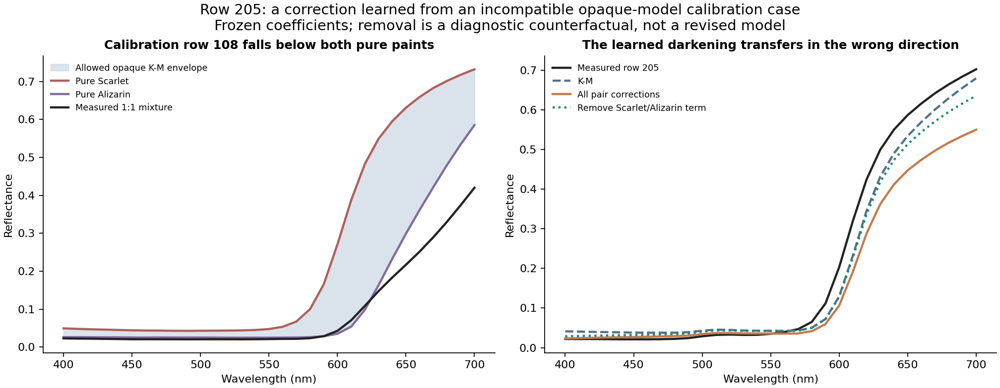
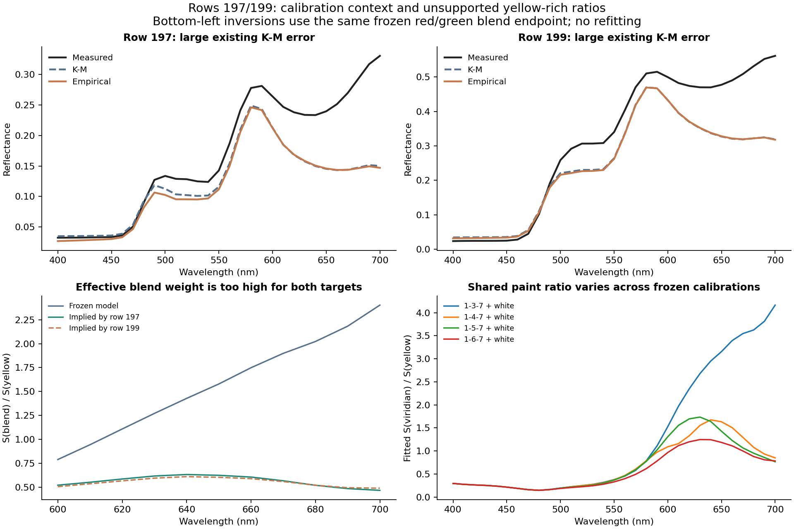

# Two different failure mechanisms in the frozen oil models

**Row 205 carries a binary darkening correction into a ternary that needs
brightening. Rows 197/199 already have an overly dark K-M prediction caused by
the fitted optical balance of a red/green blend against yellow.** The evidence
points to calibration/model compatibility and missing ratio coverage, rather
than a common attenuation problem or an optimizer that failed to converge.

These are selected, previously exposed failures. No model was fitted, coefficient
changed, source row relabeled or implementation promoted. The diagnosis uses the
exact frozen bundle from the [35-row study](../oil_ternary_transfer/REPORT.md).
Physical causes such as film thickness or sample preparation remain unresolved.

## The three targets and their white additions

| Source row | Role | K-M RMSE | Empirical RMSE | Correction RMS |
| --- | --- | --- | --- | --- |
| 205 | Previously scored target | 0.036898 | 0.083059 | 0.053946 |
| 206 | 50% white addition; diagnostic | 0.034807 | 0.039538 | 0.022388 |
| 197 | Previously scored target | 0.069509 | 0.070723 | 0.005637 |
| 198 | 50% white addition; diagnostic | 0.033301 | 0.035317 | 0.008636 |
| 199 | Previously scored target | 0.104356 | 0.104666 | 0.002272 |
| 200 | 50% white addition; diagnostic | 0.029151 | 0.028785 | 0.005746 |

Rows 206,198,200 preserve the respective chromatic ratios and add 50% Mixed White.
They were never fitted in these palette models and are shown here only as
neighboring diagnostic observations, not a newly selected validation benchmark.
Whitening reduces the large K-M residuals of 197/199 but does not eliminate them.
It does not prove why their unwhitened counterparts fail.

## Row 205: the strongest pair correction compensates for a model impossibility

Row 205 contains Cadmium Yellow / Scarlet Lake / Alizarine Lake in a 1:2:1 mass
ratio. K-M mean RMSE is 0.036898; the full empirical correction raises it to
0.083059. In 600-700 nm, the target needs a mean reflectance increase of
0.0540, but the correction produces
-0.0834. Its overall reflectance
displacement is misaligned with the residual (projection alpha -0.451).

The dominant harmful term belongs to Scarlet/Alizarin. Its 1:1 calibration sample,
row 108, is **darker than either measured pure paint** at 630-700 nm. At 700 nm:

| Observation | Reflectance |
|---|---:|
| Pure Scarlet Lake | 0.7324 |
| Pure Alizarine Lake | 0.5853 |
| Measured 1:1 mixture, row 108 | **0.4201** |

For the assumed opaque K-M model, `q=(1-R)^2/(2R)` and
`q_mix=sum(c_i*S_i*q_i)/sum(c_i*S_i)`. Positive scattering makes q_mix a weighted
average of constituent q values. Because the reflectance conversion is monotone,
R_mix must lie between the minimum and maximum constituent pure reflectances.
No choice of positive scattering with these fixed pure endpoints can reach 0.4201
when both endpoints are at least 0.5853.

Across the 31 bands, this constraint alone puts a **0.060811 RMSE
lower bound** on fitting row 108 with fixed-pure opaque K-M. Its actual K-M error
is 0.073553. The empirical correction reduces that calibration error to 0.008388
by learning strong darkening. That is useful for this observed binary sample,
but its residual correction is not a physical pair property guaranteed to transfer
when Cadmium Yellow is added.



Exact Shapley allocations over all active-term subsets account for the nonlinear
reflectance decoder. Negative MSE reduction means harm. These are numerical
attributions inside the frozen model, not percentages of a physical cause.

| Pair | Weight | MSE reduction attributed to pair | RMSE with only this pair | RMSE with this pair removed |
| --- | --- | --- | --- | --- |
| Cadmium Yellow / Scarlet Lake | 0.50 | -0.001668 | 0.048853 | 0.067733 |
| Cadmium Yellow / Alizarine Lake | 0.25 | +0.000257 | 0.034426 | 0.085065 |
| Scarlet Lake / Alizarine Lake | 0.50 | -0.004126 | 0.069901 | 0.046586 |

Removing the Scarlet/Alizarin term reduces row 205's error to 0.046586 but still
does not beat K-M. Cadmium/Scarlet also harms the target; its required 1:2 internal
ratio is outside that pair's calibrated 1:1 and 9:1 ratios. The correction's
spectral curve has no ratio-dependent shape beyond the symmetric `4*c_i*c_j`
amplitude. Thus there is both an opaque-model compatibility problem in calibration
and an uncovered directional ratio. There is no evidence that simply deleting
one pair globally would preserve the improvements elsewhere.

The envelope contradiction does **not** prove incorrect measurement or paint
chemistry. Pure paintouts that are not optically opaque, different film conditions,
measurement effects or an inadequate homogeneous model could break the assumptions.
It establishes that this fixed-pure opaque model cannot exactly fit that calibration
observation. No source correction is inferred from this alone.

## Rows 197/199: the K-M base assigns excessive influence to a dark blend

Both recipes contain Lemon Yellow, Scarlet Lake and Viridian Green. Their raw
recorded proportions are 16:3:1 and 76:3:1. The Scarlet:Viridian ratio is therefore
the same 3:1, while yellow changes from 80% to 95%. The frozen K-M errors are
0.069509 and 0.104356; their corrections have RMS only 0.005637 and 0.002272.
Suppressing those corrections cannot repair the much larger baseline residuals.

The red region (600-700 nm) accounts for 94.6% and 87.8%
of the respective K-M squared errors. The measured spectra are substantially
brighter than K-M there. At 700 nm row 199 measures 0.5612, while K-M predicts
0.3188 and the empirical correction changes it only slightly.

### A useful consistency check using the shared 3:1 blend

Calibration row 138 measures the same 3:1 Scarlet/Viridian blend without yellow.
Treating that blend as an effective ingredient gives
`S_D=.75*S_Scarlet+.25*S_Viridian`. For a known yellow fraction y and endpoint
ratios q_Y and q_D, each measured ternary algebraically implies

`S_D/S_Y = y*(q_Y-q_target) / ((1-y)*(q_target-q_D))`.

This is an inversion of an observation, not a refit or replacement coefficient.
Using the **frozen model's** row-138 endpoint keeps its existing q values fixed:

| Wavelength | Frozen blend/yellow S | Implied by row 197 | Implied by row 199 |
| --- | --- | --- | --- |
| 600 | 0.789 | 0.521 | 0.505 |
| 650 | 1.579 | 0.624 | 0.603 |
| 700 | 2.403 | 0.467 | 0.489 |

Across 600-700 nm, the ratios computed separately from the two targets agree within
4.69% relative to their mean. The existing model uses approximately
1.5-5.2 times that optical ratio, weighting the dark blend too strongly to reproduce
either target with its frozen endpoints. Using the **measured** row-138 spectrum
instead also produces closely agreeing target-inferred ratios (maximum difference
7.12% over this interval). Both endpoint choices show the same qualitative
discrepancy; it is not confined to using the predicted blend spectrum.

This makes the two target residuals a coherent pattern worth investigating. It
does not prove the inferred ratio is the true material scattering ratio, and no
inferred ratio is inserted into a prediction model in this diagnosis.



### Calibration coverage and dependence on other paints

The pair-ratio coverage is:

| Target | Pair | Target ratio | Calibration ratios | Inside measured range? |
| --- | --- | --- | --- | --- |
| 205 | Cadmium Yellow / Scarlet Lake | 0.5:1 | 1,9 | No |
| 205 | Cadmium Yellow / Alizarine Lake | 1:1 | 1,9 | Yes |
| 205 | Scarlet Lake / Alizarine Lake | 2:1 | 1,9 | Yes |
| 197 | Lemon Yellow / Scarlet Lake | 5.333:1 | 1,3,0.333333333333,9,0.111111111111 | Yes |
| 197 | Lemon Yellow / Viridian Green | 16:1 | 1 | No |
| 197 | Scarlet Lake / Viridian Green | 3:1 | 1,9,0.111111111111,3,0.333333333333 | Yes |
| 199 | Lemon Yellow / Scarlet Lake | 25.33:1 | 1,3,0.333333333333,9,0.111111111111 | No |
| 199 | Lemon Yellow / Viridian Green | 76:1 | 1 | No |
| 199 | Scarlet Lake / Viridian Green | 3:1 | 1,9,0.111111111111,3,0.333333333333 | Yes |

Yellow/Viridian has only a 1:1 binary calibration sample, whereas the two targets
require internal ratios of 16:1 and 76:1. Row 199's Yellow/Scarlet ratio of
25.33:1 also extends beyond its maximum calibrated ratio of 9:1. The red/green
3:1 ratio itself is observed. White-tint data constrain each pigment too, but
they do not directly measure these yellow-rich chromatic interactions.

Four already-frozen palette fits contain Yellow and Viridian with the same pure
and white-tint data and the same Y/G=1:1 observation. Their fitted Y/G optical
ratios nevertheless depend strongly on the other chromatic paint and its binary
calibration data. At 700 nm:

| Frozen palette columns (+ white) | Fitted Viridian/Yellow S at 700 nm | Predicted R: Y/G=1:1 | Predicted R: Y/G=16:1 | Predicted R: Y/G=76:1 |
| --- | --- | --- | --- | --- |
| 1-3-7 | 4.165 | 0.0390 | 0.1256 | 0.3087 |
| 1-4-7 | 0.850 | 0.0647 | 0.3134 | 0.5592 |
| 1-5-7 | 0.765 | 0.0681 | 0.3298 | 0.5744 |
| 1-6-7 | 0.783 | 0.0674 | 0.3261 | 0.5711 |

The last two columns are **unmeasured binary predictions**, not measurements of
rows 197/199 (which also contain Scarlet). The measured 1:1 reflectance is 0.0654,
and the Scarlet-containing fit predicts 0.0390. That moderate calibration residual
coincides with large disagreement in the yellow-rich extrapolation. This quantifies
dependence on calibration context; it is not an uncertainty interval and does
not authorize choosing another palette's coefficients to improve these targets.

The pure-envelope lower bounds for the three targets themselves are small:

| Row | Opaque-model RMSE lower bound | Actual frozen K-M RMSE |
| --- | --- | --- |
| 205 | 0.002318 | 0.036898 |
| 197 | 0.000770 | 0.069509 |
| 199 | 0.004881 | 0.104356 |

Their small blue-region envelope violations cannot explain the large red-region
errors in 197/199. The decisive issue there is the fitted relative optical balance
and how it transfers beyond observed chromatic ratios, not an unavoidable red-band
pure-endpoint bound.

## This is not explained by optimizer failure

Both selected palettes have converged three-start K-M runs with objective values
agreeing within 3.3e-15. Their calibration-data Jacobians have full rank
93 and condition numbers 6.71 and 8.73 in the fitted log-scattering coordinates.
Including the priors leaves them similar. There is no evidence here of a numerical
singularity or failed local convergence that a routine optimizer restart would fix.

These are local derivatives with fixed measured pure endpoints and this objective.
They do not quantify physical identifiability, measurement uncertainty, global
uniqueness or model misspecification. A numerically well-determined compromise can
still be wrong for a new composition, especially when observed binaries already
violate the assumed opaque model.

## Source checks and unresolved physical metadata

The original ZIP and member hashes match the earlier study. A second plain-text
reader reproduces the source values and recipe normalization exactly; the selected
row numbers and neighboring white additions are consistent. No parser shift or
local source mutation was found. The recorded integer portions are ratios; do not
assume they are actual grams or derive a weighing error from them.

The [source paper](https://pure.mpg.de/rest/items/item_3285223_1/component/file_3285224/content)
describes weighed tube paints mixed with a knife, applied to Arches oil paper,
dried for several weeks and measured with a specular-excluded X-Rite Color i7.
It does not provide per-swatch optical thickness, a black/white backing pair,
an oil-paper reflectance spectrum, replicate uncertainty or batch IDs sufficient
to resolve these cases. The supplied watercolor substrate spectrum is not an
oil-paper backing measurement and must not be substituted.

Consequently, finite-film effects, different preparation conditions or remaining
source metadata issues are hypotheses, not established explanations. These data
show a contradiction with one optical assumption and a repeatable extrapolation
failure; they do not select a unique replacement physical model.

## Recommended next controlled test

Before adding another correction term, test one calibration ablation: fit the
K-M base from pure/white-tint anchors only, then freeze it and fit the existing
empirical pair controls using the same full binary calibration pool. Keep all
objectives, priors, bounds and assessment rows unchanged. Compare against the
current all-binary K-M calibration on the full 35-row cohort, not only these
three selected failures.

This would test whether forcing an opaque base to compromise across incompatible
chromatic binaries is a major driver of the errors. It is a diagnostic proposal,
not a fix already demonstrated: some white tints also violate the model, and
removing binary constraints may lose useful calibration. The 35 targets are now
exposed, so any resulting improvement must remain explicitly exploratory.
No ablation or model revision was run during this diagnosis.

## Files and reproduction

[observations.csv](observations.csv) distinguishes the three selected targets from
their white-addition diagnostics. [pair-contributions.csv](pair-contributions.csv)
records exact allocations and component removals. Other evidence includes
[coverage.csv](coverage.csv), [binary-consistency.csv](binary-consistency.csv),
[opaque-envelope.csv](opaque-envelope.csv), [blend-ratios.csv](blend-ratios.csv),
[shared-binary.csv](shared-binary.csv), [effective-weights.csv](effective-weights.csv)
and [spectral-regions.csv](spectral-regions.csv).

The [summary](summary.json) retains provenance, raw recipe records and local
Jacobian diagnostics. Source-derived spectral curves remain under ignored
`target/measured-oils/failure-cases/spectra.npz`. Saved target metrics reproduce
within 1.42e-14; independent scalar decoding agrees within
1.1e-15, component recombination within 2.22e-16,
and MSE allocations within 5.42e-20. The positive-scattering
envelope is verified on every available recipe in the two palettes. All source,
method and frozen-model hashes remain unchanged; fitting entry points are disabled.

```powershell
.\target\measured-oils\venv\Scripts\python.exe experiments/oil_failure_cases/diagnose.py
.\target\measured-oils\venv\Scripts\python.exe experiments/oil_failure_cases/report.py
```

This post-selection diagnosis does not change the broader study's scores or
establish independent accuracy. Runtime, renderer, paper implementation and
defaults are untouched.
