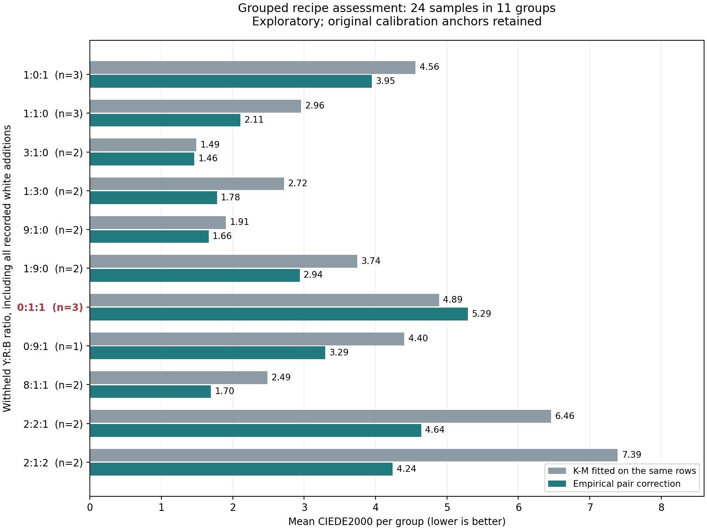

# Chromatic-ratio families held out together

**The empirical improvement mostly survives the stricter split, with a persistent
red/blue weakness.** Mean multicolor color error is
2.893 DE00 versus
3.932 for K-M fitted on the same rows, a
26.4% reduction. Eighteen of 24 assessed colors improve, five worsen and
one ties. Ten of 11 group means improve; the red/blue 1:1 group gets worse.
This is exploratory evidence from previously exposed data, not fresh validation.
No runtime, renderer, paper model or default was changed.

## What was held out

The [plan](PLAN.md) and all fitting code/settings were frozen before fitting.
The four pure samples and 17 single-paint white tints remain calibration anchors.
The other 24 recipes form 11 groups according to their Y:R:B ratio after removing
white. Each group includes the chromatic parent, where present, and all its
recorded white additions. No member of a scored group enters that fold's fit.
These are recipe groups, not a claim about shared physical preparation batches.

To isolate the effect of excluding related recipes, the training pool remains
the previous 29 rows. Each fold removes its group from that pool. Eight folds
therefore fit 28 rows. The three Y:R:B groups already had no training member and
share the same 29-row fit, giving nine unique fits for eleven folds. Other
multicolor assessment samples are never added to training. This is not generic
leave-one-group-out training on all remaining 45 samples; nor is it exclusion of
an entire paint pair such as every yellow/red ratio.

Both methods share the same fitted K-M base in each fold. The empirical model's
24 possible correction controls, objective, bounds and priors are unchanged.
When withholding the only yellow/blue parent, those four interaction controls
remain zero; the other paint-pair controls still operate in its white additions.
Pure and single-chromatic tint generalization is outside this test's scope.

## Results on identical samples

DE00 uses the existing truncated D65 / CIE 1931 2-degree pipeline without RGB
clipping. Spectral RMSE is measured on reflectance 0-1 over 31 bands. P95 is a
sample quantile, not a confidence bound. V1 is the unchanged 21-row reference;
the fold-specific K-M model is the direct matched-training comparator.

| Set | Model | Mean DE00 | P95 DE00 | Max DE00 | Mean RMSE | P95 RMSE |
| --- | --- | --- | --- | --- | --- | --- |
| 16 multicolor | Fold K-M | 3.932 | 7.942 | 8.222 | 0.02865 | 0.06064 |
| 16 multicolor | Empirical | 2.893 | 5.007 | 6.853 | 0.02523 | 0.06223 |
| 16 multicolor | V1 (21-row reference) | 3.677 | 6.561 | 6.981 | 0.02639 | 0.06167 |
| 8 chromatic pairs | Fold K-M | 3.889 | 7.585 | 8.814 | 0.02587 | 0.04378 |
| 8 chromatic pairs | Empirical | 3.487 | 7.782 | 9.561 | 0.02339 | 0.03749 |
| 8 chromatic pairs | V1 (21-row reference) | 4.012 | 6.560 | 7.224 | 0.02668 | 0.04954 |
| All 24 | Fold K-M | 3.917 | 8.166 | 8.814 | 0.02772 | 0.05915 |
| All 24 | Empirical | 3.091 | 6.497 | 9.561 | 0.02462 | 0.06042 |
| All 24 | V1 (21-row reference) | 3.789 | 6.897 | 7.224 | 0.02649 | 0.06035 |

For the same 16 multicolor samples, the earlier parent-available empirical score
was 2.782; excluding each related parent
raises it to 2.893. K-M changes from
3.915 to 3.932.
The empirical model improves 13/16 multicolor colors and 12/16 spectral RMSEs.
The six recipes in the three Y:R:B groups are unchanged controls because their
training set was already unrelated to their own ratio group. The ten white-added
chromatic-pair recipes are the multicolor cases whose training actually changes.

Across all 24 recipes, empirical mean DE00 is 3.091 versus K-M's 3.917, and mean
spectral RMSE is 0.02462 versus 0.02772. Giving every ratio group equal weight
instead of every sample produces mean DE00 3.005 versus 3.910. Thus the benefit
does not depend only on larger groups receiving more weight.

## Group results and regressions

| Y:R:B ratio | Withheld source rows | Fit rows | K-M mean DE00 | Empirical mean DE00 | Change |
| --- | --- | --- | --- | --- | --- |
| 1:0:1 | 60, 61, 62 | 28 | 4.561 | 3.950 | improves |
| 1:1:0 | 66, 67, 68 | 28 | 2.960 | 2.108 | improves |
| 3:1:0 | 69, 70 | 28 | 1.490 | 1.462 | improves |
| 1:3:0 | 71, 72 | 28 | 2.719 | 1.779 | improves |
| 9:1:0 | 84, 85 | 28 | 1.906 | 1.663 | improves |
| 1:9:0 | 86, 87 | 28 | 3.743 | 2.937 | improves |
| 0:1:1 | 112, 114, 115 | 28 | 4.890 | 5.291 | worsens |
| 0:9:1 | 113 | 28 | 4.403 | 3.295 | improves |
| 8:1:1 | 172, 173 | 29 | 2.486 | 1.695 | improves |
| 2:2:1 | 174, 175 | 29 | 6.457 | 4.639 | improves |
| 2:1:2 | 176, 177 | 29 | 7.391 | 4.241 | improves |



Every color regression against the fold's K-M base is retained:

| Source row | Mixture | K-M DE00 | Empirical DE00 | Increase |
| --- | --- | --- | --- | --- |
| 68 | Y+R+W | 3.306 | 3.344 | +0.038 |
| 69 | Y+R | 0.850 | 1.581 | +0.731 |
| 112 | R+B | 8.814 | 9.561 | +0.748 |
| 114 | R+B+W | 2.962 | 3.198 | +0.236 |
| 115 | R+B+W | 2.894 | 3.115 | +0.220 |

The red/blue 1:1 group is the weakest result: its parent reaches DE00 9.561 and
both white additions also worsen. That fold has only the 9:1 red/blue parent
available for learning that pair's correction. This is a plausible sparse-ratio
limitation, not proof of its cause. The model also worsens the yellow/red 3:1
parent despite improving that group's average.

The 16-row empirical color scores pass the original mean/p95/max color screens,
but both spectral screens still fail. Spectral p95 is 0.06223 versus K-M's
0.06064, so mean improvement hides worse spectral tails. Across all 24 rows, the
empirical mean DE00 3.091 and p95 6.497 also exceed the original color limits
of 3 and 6; only the maximum-color limit of 10 passes among the five screens.
No threshold was changed or interpreted as measurement uncertainty.

## Verification and provenance

- Four new protocol tests pass: group membership/coverage, white and amount
  invariance, training-only arrays, and zero activation for an absent pair.
- Before fitting, 48 archived baseline
  statistics were reproduced within 1.7e-14.
- All 27 K-M starts and nine empirical fits converge without active bounds.
  K-M takes 9-12 evaluations
  per start; every correction takes eight. Total recorded optimizer time is
  1.442 seconds, excluding startup/checks and unrelated to renderer speed.
- Independent scalar decoding agrees within
  2.8e-15 reflectance; pure endpoints drift by at
  most 1.1e-16. Every fitted model predicts finite bounded
  reflectance on all 45 recorded recipes.
- Actual refits after perturbing every non-training spectrum leave all fitted
  K-M and empirical coefficients exactly unchanged for all nine unique splits.
- The prepared manifest hashes source data, settings, implementation, plan,
  colorimetry and previous artifacts. All fits were saved before scoring, and
  evaluation/verification leave the coefficient bundle unchanged.

Frozen local coefficient bundle SHA-256:
`2a36ae1e2fd030bc2aacd14a77870a0ee8d93563e7ec83e369ab2ff295e28cd7`.

The full [summary](summary.json), [per-row errors](errors.csv),
[baseline check](baseline-check.json) and [verification](verification.json) are
retained. Coefficients remain under ignored `target/measured-oils/grouped-ratios`.
Pooled scores combine fold-specific models and are not one deployable palette.
Overlapping folds and the small, reused dataset do not justify an independent
confidence claim. No model parameters were changed after assessment.

## Decision

Continue treating the empirical correction as a promising experimental appearance
predictor. The benefit persists when chromatic parents and their white additions
are withheld together, but broad accuracy and generalization across preparation
conditions remain unestablished. Red/blue ratio coverage is the clearest next
measurement priority. Before another model change, inspect that trajectory and
obtain additional ratios or independent data rather than tuning to the same
red/blue failures. Keep the current runtime/default and paper implementation.

Follow-up: the [frozen red/blue diagnosis](../oil_red_blue/REPORT.md) distinguishes
the pair correction from white-tint effects. The user selected existing public
measurements, leading to a [source audit](../oil_public_data/REPORT.md) and a
[separate external test](../oil_external/REPORT.md). Their findings do not modify
the frozen scores above.

## Reproduction

From the repository root, using the existing scientific Python environment:

```powershell
& target/measured-oils/venv/Scripts/python.exe -m unittest discover -s experiments/oil_grouped -p test_protocol.py -v
& target/measured-oils/venv/Scripts/python.exe experiments/oil_grouped/run.py prepare --out target/measured-oils/grouped-ratios-repeat
& target/measured-oils/venv/Scripts/python.exe experiments/oil_grouped/run.py fit --out target/measured-oils/grouped-ratios-repeat
& target/measured-oils/venv/Scripts/python.exe experiments/oil_grouped/run.py verify --out target/measured-oils/grouped-ratios-repeat
& target/measured-oils/venv/Scripts/python.exe experiments/oil_grouped/run.py evaluate --out target/measured-oils/grouped-ratios-repeat
& target/measured-oils/venv/Scripts/python.exe experiments/oil_grouped/report.py
```

Use a fresh output directory; frozen coefficients are never overwritten. Evaluate
and verify also refresh this directory's derived reports, while retaining the
original fitted bundle in its separate output directory. Recipe grouping depends
on the documented source; see the plan for the complete fixed protocol.
