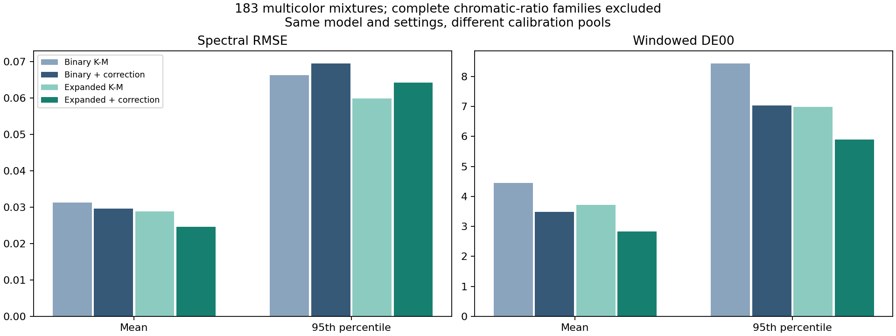
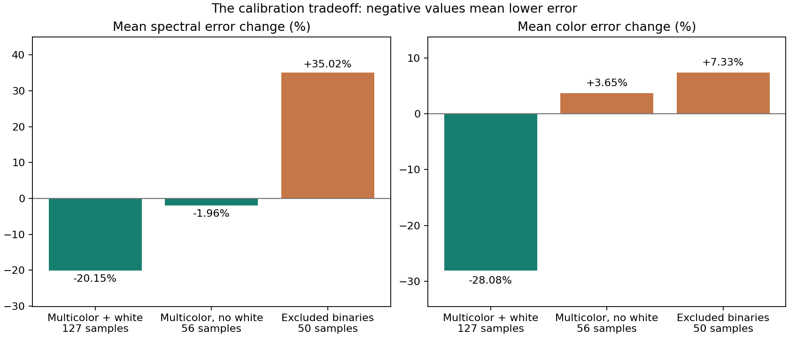
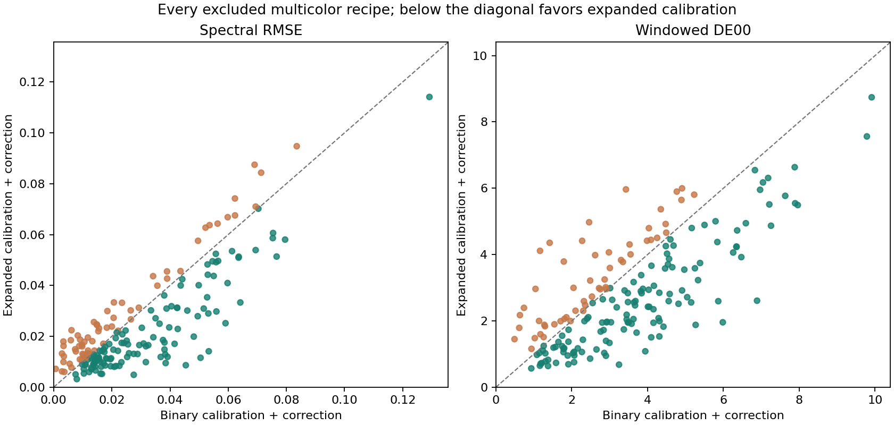

# Multicolor calibration improves the primary result but hurts excluded binaries

The same eight-paint model, fitted with additional multicolor measurements,
has **18.73% lower mean windowed color error** and
**16.84% lower mean spectral RMSE** on the same
**183 multicolor samples**, each predicted with its complete recipe family excluded.
Color improves on 130, worsens on 53
and ties on 0; spectra improve on 119
and worsen on 64.

The gains concentrate in white-containing mixtures. On the 50 excluded binary
samples, mean spectral error rises **35.02%**
and mean color error rises **7.33%**.
On the 56 multicolor samples without white, mean color error rises
**3.65%**. This is a useful
improvement with a material calibration tradeoff, not a universal upgrade.



## What was compared

The [plan](PLAN.md) and [complete partitions](partition.json) were frozen before
fitting. A family has one normalized seven-paint chromatic ratio, regardless of
total amount or white addition. All its recorded members are excluded together,
including its binary parent where present. Other ratios using those pigments
remain available. This is recipe-family exclusion, not unseen-pigment or batch
validation.

The 53 pure/white-tint anchors remain available throughout. The 233 remaining
rows form 107 families; 99 families contain the 183 primary multicolor targets,
and 50 binary parent rows provide a secondary assessment.

- Binary-only fits use 102-103 pure/binary observations after excluding the family.
- Expanded fits use 282-285 observations after excluding the same family, adding
  multicolor measurements to both optical-base and pair-control fitting.

Both reuse the exact unified-eight fitter: 217 log-scattering parameters, measured
pure K/S, white S=1, three starts and the original priors/bounds/stopping rules;
then 112 possible bounded pair controls, with unsupported controls inactive.
No new term, weighting rule, attenuation or tuned setting was introduced.
The mean-error normalization remains fixed, so the expanded data distribution
can change the compromise among recipe types. No sample was excluded based on
its error. All 158 distinct fits (51 binary and 107 expanded) were frozen before
scoring; identical binary training pools are reused without making duplicate fits.

## Primary assessment: the same 183 multicolor samples

| Method | Mean RMSE | Median RMSE | p95 RMSE | Maximum RMSE | Mean DE00 | p95 DE00 | Maximum DE00 |
| --- | --- | --- | --- | --- | --- | --- | --- |
| Binary K-M | 0.031316 | 0.028414 | 0.066248 | 0.125246 | 4.4455 | 8.4265 | 11.6696 |
| Binary + correction | 0.029613 | 0.022165 | 0.069404 | 0.129179 | 3.4874 | 7.0357 | 9.9098 |
| Expanded K-M | 0.028867 | 0.024825 | 0.059901 | 0.117881 | 3.7202 | 6.9901 | 10.7636 |
| Expanded + correction | 0.024625 | 0.017093 | 0.064250 | 0.114094 | 2.8344 | 5.8897 | 8.7423 |

Lower is better. Spectral RMSE is the mean per-recipe reflectance RMSE over the
31 measured bands. Color error uses the unchanged 400-700 nm D65/2-degree
XYZ/Lab calculation and matching truncated white, without display gamut mapping.

For the corrected model, p95 spectral error changes **-7.43%** and
p95 color error **-16.29%**. Maximum color error changes from
9.9098 to 8.7423; maximum
spectral RMSE changes from 0.129179 to
0.114094. These tails and individual regressions
remain part of the result even when means improve.

Equal weighting over the 99 multicolor families gives binary/expanded mean DE00
3.3437/2.6649
(-20.30%), and RMSE
0.029589/0.023631
(-20.14%). Fold training sets overlap heavily; these are descriptive
comparisons, not independent replicates or a significance test.

The packaged unified model's earlier mean DE00 of 3.461 came from a less strict
split where relevant binary parents could remain in training. The fair comparator
here is the newly refitted binary-only column above, not that historical number.

## Recipe groups and secondary binary assessment

| Assessment | Rows | Binary corrected RMSE | Expanded corrected RMSE | Binary corrected DE00 | Expanded corrected DE00 | Color error change |
| --- | --- | --- | --- | --- | --- | --- |
| multicolor183 | 183 | 0.029613 | 0.024625 | 3.4874 | 2.8344 | -18.73% |
| binary50 | 50 | 0.014168 | 0.019131 | 3.2267 | 3.4631 | +7.33% |
| all233 | 233 | 0.026299 | 0.023446 | 3.4315 | 2.9693 | -13.47% |
| multicolor no white | 56 | 0.017586 | 0.017242 | 3.3603 | 3.4828 | +3.65% |
| multicolor with white | 127 | 0.034916 | 0.027881 | 3.5435 | 2.5485 | -28.08% |
| 3 paints | 101 | 0.030275 | 0.026754 | 3.0285 | 2.5930 | -14.38% |
| 4 paints | 53 | 0.027275 | 0.021113 | 3.6706 | 2.9597 | -19.37% |
| 5 paints | 18 | 0.032012 | 0.024514 | 4.8767 | 3.5839 | -26.51% |
| 6 paints | 6 | 0.021764 | 0.013155 | 4.3541 | 2.9802 | -31.55% |
| 7 paints | 5 | 0.041813 | 0.033018 | 4.7737 | 3.5081 | -26.51% |

The ingredient-count groups refer to total ingredients including white; white
subgroups contain only the primary multicolor rows. [families.csv](families.csv)
lists every ratio family and [errors.csv](errors.csv) retains every assessed row.
Anchor rows are not scored as predictive validation.



White-containing multicolor recipes account for 127 of the 183 primary rows:
their mean color error falls 28.08%.
The 50 binary parents are a secondary assessment, but their regression matters
for ordinary two-paint mixing: 33 of 50 worsen
in color and 33 worsen spectrally. More
calibration coverage has not removed the model's compromise across recipe types.

The binary tail results are mixed as well: spectral p95 rises from
0.041831 to
0.053011, while color p95 falls
from 6.9163 to
6.2172 and worst color error
falls from 8.3904 to
7.4913. Thus the binary mean
regression does not imply every binary tail measure worsens.



The six largest increases in multicolor color error are:

| Row | Excluded family | Ingredients | Binary DE00 | Expanded DE00 | Binary RMSE | Expanded RMSE |
| --- | --- | --- | --- | --- | --- | --- |
| 232 | ratio-232 | 3 | 1.1634 | 4.1130 | 0.002864 | 0.013239 |
| 276 | ratio-276 | 4 | 1.4175 | 4.3549 | 0.003341 | 0.017962 |
| 274 | ratio-274 | 4 | 3.4292 | 5.9647 | 0.008295 | 0.020340 |
| 234 | ratio-234 | 3 | 2.4583 | 4.9744 | 0.006134 | 0.022407 |
| 180 | ratio-180 | 3 | 2.2745 | 4.4145 | 0.003370 | 0.009926 |
| 285 | ratio-285 | 5 | 1.7910 | 3.7897 | 0.003502 | 0.012155 |

## Verification

- Before these fits, the archived unified model's K/S, q, log-scattering and pair
  coefficients were reproduced exactly, along with all 32 archived assessment
  statistics. See [baseline-check.json](baseline-check.json).
- Three protocol tests pass for family invariance, complete coverage/anchor
  retention and ensuring only selected rows reach the fitter.
- All 158 fits succeeded. 474/474 K-M
  starts converged; base evaluations ranged 8-12, with
  0-0 active bounds. Correction fits used
  9-12 evaluations, with 0-2 active bounds.
- All 158 distinct pools were refitted after changing excluded
  spectra. Every optical and pair coefficient remained exactly unchanged.
- Independent scalar decoding agrees within 4.44e-16;
  pure endpoints agree within 1.67e-16. All recorded and
  257 additional dense recipes per model stay finite and strictly bounded.
- Source, method, protocol, partition and original package hashes remain intact.
  Complete-cohort coverage passed; no failed fit or difficult row was dropped.

See [verification.json](verification.json) for optimizer and numerical records.
The frozen local coefficient bundle is under
`target/measured-oils/multicolor-calibration/frozen-models.json`, SHA-256:

`c80814e3a14e7379c399104a0fdcc4acee69f0e44e100b3c875c0cd01d3ee595`

## Interpretation and product boundary

The paired comparison establishes useful headroom from multicolor calibration within these recipe exclusions. The gains are predictive, rather than scores on the newly fitted rows. However, the fixed fitting procedure trades away binary accuracy, and its mean color benefit is concentrated in white-containing mixtures. This supports further work on the calibration compromise, not automatic replacement of the current package.

The source dataset is appropriate evidence for this question. Earlier scores and
method choices make it development evidence rather than a pristine final test;
using one source dataset alone does not invalidate the exclusion experiment.
There are no new physical measurements, independent batches or eight-ingredient
measurements in this study.

These scores pool models fitted with different families excluded. They are not
the scores of a single deployable palette. The existing runtime packages and
defaults are preserved. A final fit using an adopted calibration procedure would
be a separate artifact, and its training error must not be substituted for these
excluded-family results. This turn makes no change to renderer or library code.

## Reproduction

Use a fresh ignored `--out` directory for a repeat. Fit checkpoints allow an
interrupted run to resume; they are tied to the complete partition hash.

```powershell
.\target\measured-oils\venv\Scripts\python.exe -m unittest discover -s experiments/oil_multicolor_calibration -p test_protocol.py -v
.\target\measured-oils\venv\Scripts\python.exe experiments/oil_multicolor_calibration/run.py prepare
.\target\measured-oils\venv\Scripts\python.exe experiments/oil_multicolor_calibration/run.py fit --workers 4
.\target\measured-oils\venv\Scripts\python.exe experiments/oil_multicolor_calibration/run.py verify --workers 4
.\target\measured-oils\venv\Scripts\python.exe experiments/oil_multicolor_calibration/run.py evaluate
.\target\measured-oils\venv\Scripts\python.exe experiments/oil_multicolor_calibration/report.py
```

No settings were changed after assessment. Original measurements and fitted
coefficients remain local under ignored target/; original scripts, hashes and
numerical reports are retained in the repository.
