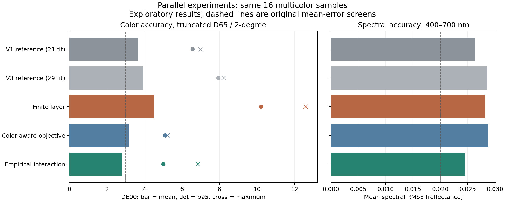

# Three independent experimental directions

Three **GPT-6.1 Sol** agents completed separate experiments from `16de957`.
Their plans were declared before fitting and their artifacts frozen before
assessment. The coordinator reviewed the equations, checked split/source hashes,
and independently recalculated every candidate's assessment statistics from
saved coefficients. No runtime, renderer or paper implementation was changed.

**Most promising next research direction: bounded empirical spectral
interactions.** It gives the best mean color and spectral errors on the same
16 multicolor cases while preserving pure endpoints. It remains an experimental
forward model: some spectral tails worsen, unseen pairs receive no learned
correction, and there is no new independent validation.

## Common comparison

All candidates use the four selected Old Holland tube paints, normalized recorded
mass proportions and the 31 measured 400–700 nm bands. The main models train on
29 rows and assess the same 16 three-/four-paint mixtures. Three additional
whole-pair-family exclusions assess eight pairs absent from their particular
training fits. No assessment target enters the corresponding optimizer.

These samples were exposed in previous studies. Every new score is exploratory.
V3 is the closest control because it uses the same 29 training rows. V1 remains
a historical reference fitted to 21; both are rescored on identical assessment
rows here. Color error is truncated-D65/2-degree CIEDE2000, with unclipped XYZ/Lab.
Spectral RMSE is the mean of per-recipe 31-band RMSE, reflectance on a 0–1 scale.

| Model | Primary parameters | Mean DE00, 16 cases | P95 DE00 | Worst DE00 | Mean spectral RMSE | Mean DE00, eight excluded pairs |
|---|---:|---:|---:|---:|---:|---:|
| V1 reference | 93 | 3.677 | 6.561 | 6.981 | 0.02639 | 4.012 |
| V3 reference | 93 | 3.915 | 7.942 | 8.222 | 0.02849 | 3.723 |
| Finite layer | 94 | 4.530 | 10.212 | 12.587 | 0.02816 | 4.014 |
| Color-aware objective | 93 | 3.163 | 5.109 | **5.213** | 0.02880 | 4.335 |
| Empirical interaction | 117 | **2.782** | **5.007** | 6.853 | **0.02460** | 3.723 |

## Physical agent: finite opacity and backing

The candidate uses finite-thickness two-flux K-M over an assumed ideal diffuse
white backing. One shared effective optical thickness is added, with white S=1
fixing the scale; this is not measured thickness in millimeters. Pure spectra
remain exact through numerical inversion. Actual backing, equal thickness and
absent surface reflection are explicit assumptions, not recovered measurements.

This candidate worsens multicolor color errors, especially yellow/red/blue without
white: family mean DE00 reaches 10.173 versus V3's 6.530. All five original
numerical screens fail. All 12 starts converge, so the negative result cannot
be dismissed as a reported nonconvergence. Reject this particular assumed model;
the experiment does not reject all finite-layer physics.

[Physical report](physical/REPORT.md) · [Plan](physical/PLAN.md)

## Objective agent: spectral and perceptual fitting

The candidate keeps the fixed-pure opaque K-M model and its 93 parameters. Its
objective combines equal weighted spectral MSE and squared Lab distance, scaled
by the declared 0.02-reflectance/3-color-unit engineering magnitudes. Lab Euclidean
distance is a smooth training surrogate; it is not equivalent to the DE00 metric
used for assessment. No weight sweep or assessment-driven retuning was performed.

Mean multicolor DE00 improves to 3.163, and the worst case falls to 5.213—the best
worst-case result in this round. However, spectral RMSE and excluded-pair mean
color error worsen. This provides evidence of an objective tradeoff rather than
a general improvement in measured-paint prediction. It is worth retaining as a
color-oriented experimental option, without replacing the reference.

[Objective report](objective/REPORT.md) · [Plan](objective/PLAN.md)

## Interaction agent: compact empirical correction

The candidate first fits the unchanged K-M base, then fits 24 bounded spectral
controls: four smooth wavelength controls for each of the six paint pairs.
Pair products of recipe proportions drive a correction in reflectance-logit
space. Pure corrections vanish, reflectance stays bounded, and recipes remain
the material state. There is no arbitrary RGB residual. These controls describe
empirical behavior; they are not measured K/S or a paper-faithful optical law.

On the 16 multicolor cases, mean DE00 improves **28.9% against V3** and **24.3%
against V1**. Fourteen of 16 colors improve against its actual V3 base; eleven
improve against V1. Mean spectral RMSE also improves. All three original color
screens pass (mean <=3, p95 <=6, max <=10), but the mean/p95 spectral RMSE screens
still fail. Its spectral p95 RMSE is 0.06236 versus V3's 0.06070, so the average
gain must not conceal worse spectral tails. Red/blue/white is a regressing family.

For a completely withheld pair, the empirical interaction is deliberately zero.
Its excluded-pair predictions therefore equal its own fold-specific K-M base;
the correction has learned nothing about that absent interaction. This model
needs calibration of the relevant pairs. One yellow/blue measurement and two
red/blue measurements do not validate their full ratio trajectories.

The agent tested 12,612 random, edge and face recipes: reflectance stayed finite
and bounded, and pure endpoints stayed exact within floating-point precision.
Actual spectral corrections in those probes span roughly -0.0512 to +0.0453.
Numerical validity and smoothness do not establish physical realism or accuracy
at unmeasured ratios. Primary complexity is 93 base parameters plus 24 correction
controls; exclusion folds have only 20 active correction controls.

[Interaction report](interaction/REPORT.md) · [Plan](interaction/PLAN.md)

## Coordinator verification and experiment limits

The independent [coordinator checker](validate_comparison.py) loads frozen
artifacts, verifies every split and declared source hash, and decodes with scalar
formulas without importing the participant implementations. The finite-layer
check composes a coating's reflectance/transmittance with its backing instead
of using the participant's coth formulation. It recomputes all 32 aggregate
spectral/color statistics per candidate (16 per assessment set); maximum
disagreement is below **2.3e-13**. See [coordinator-checks.json](coordinator-checks.json).
All pure endpoints remain numerically exact. Each agent also supplied numerical
checks and complete per-row errors, including regressions.

Two process details are retained rather than hidden. The finite-layer inverse
bracket was corrected during coordinator review **before real fitting**; no
invalid fit was assessed. The objective agent verified archived baseline scores
after fitting rather than before as planned; all 96 archived statistics matched
exactly. Its initial jagged synthetic-recovery fixture exposed regularization
bias, which is documented; a smooth fixture verified recovery before real fits.
No real-data candidate setting changed after assessment.

The agents' fitting times were on the order of seconds for this small dataset.
They are Python research timings, not renderer throughput measurements or evidence
of LUT speed. Source measurements and coefficient artifacts remain in ignored
`target/measured-oils/parallel/`; original code and numerical error reports are
kept here. No author was contacted and no distribution decision was made.

## Recommended next step

Advance the empirical interaction direction to a separately labelled experimental
palette reference for further scrutiny. Priorities are the red/blue/white
regressions, stability across ratios and paint-amount grouping, and separation of
LUT approximation error from the measured-model error. More representative or
freshly measured ratios are needed for an independent accuracy claim.

Do not silently replace the paper's optical model, call the empirical controls
physical coefficients, or change the default based on this reused assessment set.
Combining the color-aware objective and interaction correction is a new hypothesis
that would need its own predeclared experiment; this round did not test it.
