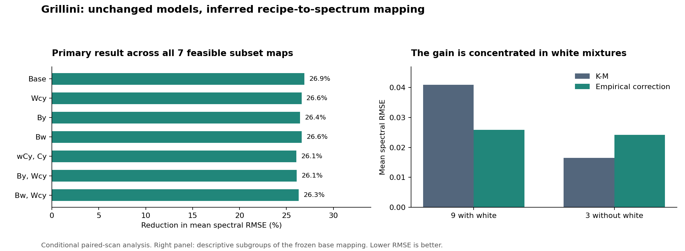

# Frozen models on the reconstructed Grillini dataset

**The empirical correction reduces the primary mean spectral RMSE by 26.9%,
and the advantage survives every feasible selected-palette mapping within the
tested paired-scan family.** Across the looser mapping stress test it remains
26.1-26.9%. This is meaningful evidence for the empirical method under inferred
labels. It does not establish author-confirmed identities or general paint accuracy.

The benefit is concentrated in mixtures containing white. All three held-out
Y/C/B mixtures without white become worse. Color-error improvements are much
smaller than spectral improvements, and one plausible map reverses the primary
mean color advantage. No model, measured preset or default is promoted.



## Fixed method and independent checkpoints

The [plan](PLAN.md) was written before these fits or scores. The source recovery
was committed at `352312f`, retaining the exact mapping SHA-256
`9e31ac91fcaa334b8bc56e9d3ae501d7ebe79de932ca066dba84ba276f9d6a22`.
Every dependency hash, optimizer setting and recipe split matches the original
[external experiment](../oil_external/PLAN.md). Only the separate loader applies
the frozen inferred permutation. Original source files and older experiments
are unchanged. No Claude result or implementation was consulted.

The palette is Naples Yellow, Carmine, Ultramarine Blue and Kremer White,
specified as dry pigment mass before linseed oil addition. It is not Old Holland
tube-paint mass. Spectra are interpolated within measured support to 440-740 nm
at 10 nm spacing. Four pure endpoints and nine white tints are always calibration
anchors; nine chromatic pairs augment the training pool. Each scored chromatic
ratio and its white addition are excluded together. Twelve ternaries never enter
fitting. There are 21 scored rows, 12 groups and 10 fits per map before reuse of
identical calibration inputs.

The 93-parameter opaque K-M fit and subsequent bounded 24-control empirical
correction are imported unchanged. Every corrected-data model is newly fitted
on calibration inputs; old coefficients are not reused. All 38 distinct fits
were frozen, then verified, before evaluation. Calibration data are shared among
maps only when recipe names, concentrations and measured spectra agree exactly.

## Primary and secondary spectral results

RMSE is measured in reflectance units on a 0-1 scale. The improvement percentage
compares means of per-sample RMSE, not squared error or full-visible color error.

| Assessment | K-M mean RMSE | Empirical mean RMSE | Reduction | Rows improved / worse |
| --- | --- | --- | --- | --- |
| 12 ternaries (primary) | 0.034801 | 0.025435 | 26.91% | 8 / 4 |
| 9 excluded pairs | 0.034693 | 0.024655 | 28.93% | 8 / 1 |
| All 21 assessments | 0.034755 | 0.025101 | 27.78% | 16 / 5 |

For the primary twelve rows, p95 RMSE falls from
0.062664 to 0.041013,
and the maximum falls from 0.085531 to
0.047881. When all chromatic parent pairs are
available for calibration, the same twelve ternaries have mean RMSE
0.033037 for K-M and
0.025559 for the correction. Grouped exclusion
is the prespecified primary comparison; the parent-available result is secondary.

The earlier header-paired external result was near zero improvement on these
ternaries and worse overall. Its numerical scores are preserved as a source
diagnostic, but should not be used to reject model generalization: those fits
associated recipes with substantially different inferred spectra.

## Mapping sensitivity

Before fitting, every orientation combination of audited mutable pairs touching
the selected palette was checked for a complete 175-sample witness. Other pairs
could compensate, subject to the seven published means and best/worst counts.
Each witness was directly re-evaluated, including pure identities and permutation
integrity. All 25 feasibility cases resolved: one at 2e-6, eight at 5e-6 and
sixteen at 1e-5. No timeout was classified as infeasible.

| Mean-MSE tolerance | Feasible subset maps | K-M primary RMSE range | Empirical primary RMSE range | Reduction range |
| --- | --- | --- | --- | --- |
| 2e-06 | 1 | 0.034801-0.034801 | 0.025435-0.025435 | 26.91-26.91% |
| 5e-06 | 4 | 0.032747-0.035188 | 0.024032-0.025882 | 26.45-26.91% |
| 1e-05 | 7 | 0.032691-0.035673 | 0.024032-0.026378 | 26.06-26.91% |

These ranges cover all distinct selected-palette mappings in the **restricted
paired-scan hypothesis**, using the completed per-pair ambiguity audit. They are
not unrestricted bounds over all possible labels. The seven full-palette pures
and panel structure remain assumptions; the tolerances are diagnostic choices,
not measured uncertainty bounds or probabilities.

| Map | Changed selected recipes | Feasible tolerances | Primary RMSE reduction | Primary DE00 change |
| --- | --- | --- | --- | --- |
| base | (frozen base) | 2e-06, 5e-06, 1e-05 | 26.91% | -0.1072 |
| variant-01 | Wcy | 5e-06, 1e-05 | 26.61% | -0.0138 |
| variant-02 | By | 5e-06, 1e-05 | 26.45% | -0.0072 |
| variant-03 | Bw | 5e-06, 1e-05 | 26.63% | -0.1070 |
| variant-04 | wCy, Cy | 1e-05 | 26.06% | -0.0030 |
| variant-05 | By, Wcy | 1e-05 | 26.10% | +0.0848 |
| variant-06 | Bw, Wcy | 1e-05 | 26.31% | -0.0142 |

Negative DE00 change means improvement. A row naming one changed selected recipe
can contain compensating changes outside this palette. Only complete feasible
witnesses were admitted; no isolated guessed swap was scored. The selected
34-sample projection is sufficient for these fits and scores, so full mappings
with the same projection share a result.

## Where the model still fails

The following subgroups were inspected after evaluation to explain the primary
result; they are descriptive, not additional prespecified success criteria.

| Ternary subgroup | K-M mean RMSE | Empirical mean RMSE | Reduction (+) / increase (-) | Rows improved / total |
| --- | --- | --- | --- | --- |
| 9 ternaries containing white | 0.040879 | 0.025851 | +36.76% | 8 / 9 |
| 3 Y/C/B ternaries without white | 0.016568 | 0.024189 | -45.99% | 0 / 3 |

All three no-white ternaries (`Bcy`, `bCy`, `bcY`) worsen under every feasible
subset map. The empirical correction's evidence is stronger for interpolation
among white-containing mixtures than for mixing three chromatic pigments. The
largest spectral regression in the base mapping is `bCy`, whose RMSE nearly
triples. The base map has these five spectral regressions:

| Recipe | K-M RMSE | Empirical RMSE |
| --- | --- | --- |
| bWc | 0.024179 | 0.024314 |
| Bcy | 0.024801 | 0.028143 |
| CY | 0.028428 | 0.040217 |
| bCy | 0.008515 | 0.025442 |
| bcY | 0.016389 | 0.018981 |

Mean primary windowed DE00 moves only from
6.392 to 6.285:
six samples improve and six worsen. Across mappings, its empirical-minus-K-M
difference ranges from -0.1072 to +0.0848;
the mean color advantage therefore is not robust at the looser tolerance.
Primary p95 windowed DE00 falls from 11.581 to
10.555 in the base map, but absolute errors
remain substantial. These values use D65/2-degree colorimetry truncated to
440-740 nm with a matching white; they are not full-visible DE00 and should not
be compared numerically with the Old Holland scores.

## Per-group base-map results

| Held-out recipes | K-M mean RMSE | Empirical mean RMSE | Mean DE00 change |
| --- | --- | --- | --- |
| Bc, Bwc | 0.026080 | 0.020642 | -2.481 |
| bWc, BC | 0.026243 | 0.021088 | -1.656 |
| bwC, bC | 0.033781 | 0.016509 | -2.168 |
| By, Bwy | 0.022893 | 0.016626 | +2.594 |
| bWy, BY | 0.032133 | 0.025146 | -1.460 |
| Bcy | 0.024801 | 0.028143 | +0.842 |
| Wcy, CY | 0.056979 | 0.044049 | +1.252 |
| bCy | 0.008515 | 0.025442 | +1.686 |
| wCy, Cy | 0.047122 | 0.022507 | +0.165 |
| bwY, bY | 0.043667 | 0.030673 | -1.818 |
| bcY | 0.016389 | 0.018981 | +2.234 |
| wcY, cY | 0.051173 | 0.030036 | +0.295 |

Full per-row metrics for all seven maps are in [errors.csv](errors.csv).

## Verification and remaining limits

- All 114 K-M starts converged, using 20-34 evaluations; none hit a bound.
- All 38 empirical fits converged in 9-14 evaluations, with 0-1 active bound controls.
- Independent scalar predictions differ by at most 2.84e-15; pure endpoints differ by at most 1.11e-16.
- Every distinct calibration set was refitted after replacing excluded targets. All coefficients were exactly unchanged.
- Predictions for all 34 recipes under every fitted model are finite and strictly within (0,1). Frozen bundles remained byte-identical during verification and evaluation.
- Original source, fitter, settings and partition hashes match the prior experiment. No extrapolation or spectral clipping was introduced.

The frozen coefficient bundle is retained under ignored
`target/measured-oils/grillini-reconstructed/frozen-models.json`, SHA-256
`8090dd57ce49b584fcae15cdb85eafbe942a4181c97f53b27a95d22265bc1ced`. Provenance, environment versions and optimizer
records are in [summary.json](summary.json); checks are in
[verification.json](verification.json). The [variants](variants.json) preserve
complete feasible witnesses and explicit infeasible pattern results.

The mapping was inferred using aggregate statistics that include these samples.
Consequently, held-out optical fitting does **not** make the entire reconstruction
and evaluation pipeline independent of the assessment observations. Sensitivity
shows stability within the tested ambiguity, not freedom from reconstruction
bias. The study remains small, batch identity is unknown, calibration anchors
are not independently assessed, and the paper's confidence intervals remain
unreproduced. This is evidence for continued research, not a physical-accuracy
certification or permission to ship a measured preset.

The useful next scientific question is why the correction helps white-containing
mixtures while harming all three no-white ternaries. Diagnose that split using
frozen predictions before proposing one constrained revision; do not tune this
study further and relabel its scores as fresh validation.

## Reproduction

Use the cached, checksum-verified source ZIP described in
[source recovery](../oil_source_recovery/REPRODUCE.md), and the scientific Python
environment recorded in the manifest. Run each phase in order:

```powershell
.\target\measured-oils\venv\Scripts\python.exe experiments/oil_reconstructed/run.py prepare
.\target\measured-oils\venv\Scripts\python.exe experiments/oil_reconstructed/run.py fit
.\target\measured-oils\venv\Scripts\python.exe experiments/oil_reconstructed/run.py verify
.\target\measured-oils\venv\Scripts\python.exe experiments/oil_reconstructed/run.py evaluate
.\target\measured-oils\venv\Scripts\python.exe experiments/oil_reconstructed/report.py
```

Preparation and fitting refuse to overwrite existing frozen outputs. For a fresh
rerun pass the same fresh `--out target/measured-oils/<new-study>` to all four
phases. Verification/evaluation check frozen input hashes. Solver witnesses and
elapsed times may differ across versions; evaluate the recorded witnesses to
reproduce this exact label sensitivity set. Outputs from a fresh run replace this
experiment's generated result files, but never alter the original experiments.
The report renderer reads only saved scores; it never fits or changes labels.

Primary source: Grillini, Thomas and George,
[Comparison of Imaging Models for Spectral Unmixing in Oil Painting (2021)](https://doi.org/10.3390/s21072471).
