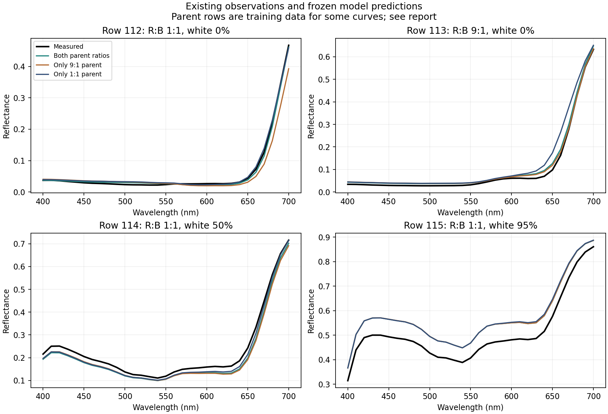
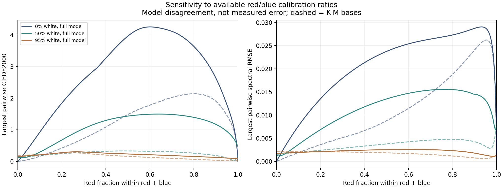

# Red/blue failure diagnosis

The red/blue parent failure and its white-tint regressions do not have one simple
explanation. The fixed interaction shape amplifies a correction learned from a
red-heavy parent towards 1:1. At 50% white, the red/blue and white-pair terms pull
in different directions. At 95% white, the red/blue term is almost absent and the
white-pair correction accounts for the additional color regression. These are
attributions inside the fitted model, not identified physical mechanisms.

No model was fitted or changed in this diagnosis. The [plan](PLAN.md) compares
three saved models: both parent ratios available, only R:B=9:1 available, and
only R:B=1:1 available. Their K-M bases differ as well as their corrections.
All observations were previously exposed. Component removal is an explanatory
counterfactual, not a selected replacement model or an independent validation.

## Actual measurement coverage

The full 286-row Old Holland archive has only four recipes containing both our
selected red and blue and no other paint except white:

| Source row | R:B ratio | White fraction of total paint mass |
|---|---|---|
| 112 | 1:1 | 0% |
| 113 | 9:1 | 0% |
| 114 | 1:1 | 50% |
| 115 | 1:1 | 95% |

There are no additional blue-heavy red/blue ratios or exact duplicate normalized
recipes in that subset. Recipes containing another paint cannot be relabelled as
red/blue measurements. The archive therefore cannot supply more observations of
this exact trajectory by expanding from our four-paint subset to all eight paints.

## Fixed ratio shape

The empirical red/blue correction has a spectral curve multiplied by
`4*cR*cB`. Let `t=R/(R+B)` and `w=W/(R+B+W)`. Its multiplier is
`4*(1-w)^2*t*(1-t)`. Consequently:

- At 9:1 without white the multiplier is 0.36; at 1:1 it is 1.0. The latter
  multiplies the same learned spectral curve by about 2.78 times as much.
- The correction multiplier is symmetric in t and 1-t. The K-M base and final
  prediction need not be symmetric, but this correction cannot learn a separate
  ratio-dependent spectral shape for blue-heavy and red-heavy recipes.
- At 1:1 with 50% white the multiplier is 0.25; with 95% white it is 0.0025.
  The latter is 400 times smaller than the unwhitened parent multiplier.

Those factors operate in logit space, not directly in reflectance or DE00.
They establish a structural constraint, not the cause of a measured discrepancy.

## Component attribution in the failing fold

This table uses the fold that excluded rows 112,114,115 and learned red/blue
interaction from the 9:1 parent. All three rows below are excluded observations.
Lower DE00 is better, with the original 400-700 nm truncated-D65 convention.

| Sample | K-M only | Add RB term only | Add RW/BW terms only | Full empirical |
|---|---:|---:|---:|---:|
| 1:1, no white (112) | 8.814 | 9.561 | 8.814 | 9.561 |
| 1:1, 50% white (114) | 2.962 | 4.583 | 1.746 | 3.198 |
| 1:1, 95% white (115) | 2.894 | 2.883 | 3.126 | 3.115 |

At 50% white, the RB term worsens the color error while the white-pair terms
improve it; together they still regress slightly. At 95% white, the RB term
slightly improves the base while the white-pair terms worsen it. Tuning only
red/blue interaction therefore would not address all three failures. The
underlying K-M error remains material in every case. DE00 changes are nonlinear
and cannot be summed to attribute percentages to individual components.

Even when both parents enter calibration, row 112 retains DE00 5.899 and row 113
2.230. These are training errors. More coverage helps the 1:1 parent but does not
make this constrained, regularized model reproduce it exactly; missing ratios
alone are not an established explanation.



The figure includes training observations for some curves; it is not a held-out
leaderboard. Full values and fit/assessment roles for all twelve model/sample
combinations are in [observed-components.csv](observed-components.csv).

## Sensitivity between existing fits

All three models were sampled at 1,001 red fractions and three white levels,
giving 3,003 recipes per model. The maximum pairwise color disagreements are:

| White mass fraction | Peak empirical disagreement | Red fraction at peak | Peak K-M-base disagreement |
|---|---:|---:|---:|
| 0% | 4.252 DE00 | 0.601 | 2.136 DE00 |
| 50% | 1.496 DE00 | 0.639 | 0.328 DE00 |
| 95% | 0.302 DE00 | 0.266 | 0.271 DE00 |

Peaks in the empirical and K-M columns can occur at different ratios. These
numbers quantify dependence on calibration coverage; they are not prediction
errors, confidence intervals or uncertainty calibration. Agreement at 95% white
does not establish accuracy: the observed 95%-white swatch still disagrees with
all three models. Finite bounded output likewise does not establish realism.



Independent scalar decoding agrees within 4.2e-15 reflectance on all 9,009 model/
recipe combinations. Unwhitened pure endpoints remain exact; whitened endpoints
are mixtures and are not constrained to agree across fits. Recombination of all
logit components and analytic pair weights was checked. Previously recorded
assessment statistics agree within 5.4e-15. Upstream artifacts and source hashes
are unchanged; [summary.json](summary.json) records the checks and provenance.

## Next evidence: existing public measurements

The user selected public measurements rather than physical acquisition. The
[public-source audit](../oil_public_data/REPORT.md) identifies a separate,
measured oil-paint dataset with recorded concentrations for testing method
transfer. Those materials must be calibrated separately and not merged into
the Old Holland coefficients. The new test is recorded in
[the external-palette study](../oil_external/REPORT.md).

The [proposed physical matrix](proposed-measurements.csv) remains only an optional
future acquisition specification: five red/blue ratios at three white levels,
with independently prepared repeats. No physical swatches or measurements were
obtained, and physical acquisition is not the selected next step.

To reproduce this diagnosis using the existing frozen artifacts:

```powershell
& target/measured-oils/venv/Scripts/python.exe experiments/oil_red_blue/diagnose.py
```

Dense predicted spectra and trajectory values stay in ignored
`target/measured-oils/red-blue-diagnosis/`. The script contains no fitting call.
