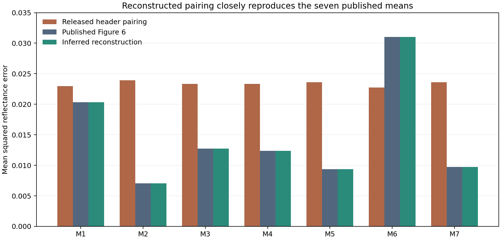

# Grillini dataset: a complete inferred ordering and near reproduction

**A different pairing of recipes and measured spectra closely reproduces the
paper's seven forward-model means and exactly reproduces its best/worst-model
counts.** The complete 175-row candidate is in [mapping.csv](mapping.csv).
This is an inferred reconstruction, with quantified ambiguity, rather than a
corrected release supplied by the authors.

The investigation was independent of Claude's result. The reconstruction is now preserved in this versioned experiment. Production
code, the original importer, source measurements, and earlier frozen oil
experiments are unchanged. Raw source files remain in the ignored cache.

## What explains the discrepancy

The numerical spectra correspond much more closely to a spatial scan of the
swatch panels than to the recipe-header order in the released workbooks. The
recovered candidate uses paired columns and blocks, with direction changes and a
column-wise section in the third panel. The two workbooks having identical
headers therefore did not establish that their numerical columns were aligned.

The inferred pure spectra are:

| Paint | Recipe-header position | Recovered spectrum position | Header currently attached to that spectrum |
|---|---:|---:|---|
| Vermilion V | 0 | 10 | voB |
| Gold Ochre O | 4 | 40 | vBc |
| Ultramarine B | 14 | 24 | VW |
| Kremer White W | 33 | 31 | oW |
| Carmine C | 64 | 100 | vcY |
| Naples Yellow Y | 110 | 97 | owY |
| Viridian Green G | 174 | 120 | Vwg |

Positions are zero-based spectrum indices, excluding the wavelength column.
White at position 31 has reflectance about 0.600 near 550 nm; the column carrying
the released W header has about 0.112. The blue/white family provides another
useful consistency check: positions 24, 46, 48, 30, and 31 form the candidate
B, Bw, BW, bW, W sequence.

My earlier search mistakenly fixed position 0 as pure vermilion because it
looked red. The stronger candidate places pure V at position 10 and position 0
at a white tint. That unsupported anchor excluded relevant reconstructions.

The original acquisition/export code was not recovered. The spatial pattern is
an inference about the ordering; the precise software operation that produced
the mismatch is not established.

## Preprocessing can be checked without knowing mixture order

The successful reconstruction uses the 166 bands from 437.29 to 963.91 nm, the
released rounded mass fractions, and a mean over the 168 non-pure mixtures.
The best/worst histogram includes all 175 samples, assigning exact pure ties to
the first model, M1.

There is an algebraic way to check the mean's inputs. M4 predicts the arithmetic
average of the M1 and M2 predictions. Consequently:

`MSE1 + MSE2 - 2*MSE4 = 0.5 * mean((prediction1 - prediction2)^2)`

The measured mixture spectra cancel. The right side depends on the pure
spectra, recipe weights, wavelength interval, and averaging population, but not
the unknown permutation of measured mixtures.

| Quantity | Value |
|---|---:|
| Combination of the three published means | 0.00264796313 |
| Computed from recovered pures, rounded fractions, trimmed bands, 168 mixtures | 0.00264777398 |
| Difference | 0.00000018916 |
| Difference using exact nominal fractions instead | 0.00000431501 |
| Difference when averaging all 175 instead | -0.00010610011 |

Among the 108 C/Y/G pure-index combinations tested within the inferred block
layout, the selected combination is also the closest on this invariant. The
next closest differs by 0.00007836918, over 400 times the selected discrepancy.
This supports the pure identities and preprocessing independently of mixture
alignment. It is conditional on the candidate family tested, not a global proof.

## Numerical reconstruction

The published means below were recovered from the PDF's vector bars using vector
axis tick marks. They remain graph-derived values, not original numeric output.

| Model | Published Figure 6 | Reconstructed | Absolute difference |
|---|---:|---:|---:|
| M1 | 0.020345929 | 0.020344093 | 0.000001836 |
| M2 | 0.007043293 | 0.007043676 | 0.000000383 |
| M3 | 0.012745069 | 0.012745699 | 0.000000630 |
| M4 | 0.012370630 | 0.012369998 | 0.000000632 |
| M5 | 0.009368381 | 0.009368790 | 0.000000409 |
| M6 | 0.031037911 | 0.031037235 | 0.000000676 |
| M7 | 0.009743853 | 0.009745231 | 0.000001379 |

The largest relative discrepancy is approximately **0.0142%**. Independent
scalar evaluations agree with the vectorized model formulas within 1.2e-16.



The Figure 6b counts also match exactly:

| Model | Times best, published and reconstructed | Times worst, published and reconstructed |
|---|---:|---:|
| M1 | 7 | 7 |
| M2 | 154 | 0 |
| M3 | 2 | 0 |
| M4 | 0 | 0 |
| M5 | 0 | 0 |
| M6 | 0 | 168 |
| M7 | 12 | 0 |

These counts initially exposed an incorrect blue/green pairing in the third
panel. Re-reading that section column-wise fixed the discrepancy. The final
ambiguity search subsequently preserved the counts as explicit constraints.

## What is and is not established

The spatial grouping, spectral shapes, tint families, algebraic invariant, and
published results provide converging evidence for an ordering mismatch. This
is substantially stronger than choosing a permutation solely because one model
improves.

However, published mean errors were used in choosing pair directions; the final
search also used the model-selection counts. Their agreement is a reconstruction
check, not wholly independent validation. The reported confidence-interval widths
have not been reproduced, and the inspected paper does not specify their exact
calculation convention. No new oil-model fit or held-out accuracy claim was made.

Uniqueness was tested by forcing each of the 81 mutable pair directions to differ
while preserving the seven pure identities, paired-scan structure, published
counts, and the stated mean-error tolerance. All feasibility checks completed
without unresolved solver cases.

| Allowed absolute difference from every published mean | Mutable pairs that can change | Samples affected | Affected recipes in our Y/C/B/W subset |
|---|---:|---:|---|
| 0.000002 | 0 | 0 | None |
| 0.000005 | 15 | 30 | Bw, By, Wcy |
| 0.000010 | 24 | 48 | Bw, By, Wcy, wCy, Cy |

These are declared diagnostic tolerances, not estimated measurement-error bounds.
The candidate is unique in this restricted family at the tightest tolerance;
that does not prove unrestricted uniqueness or all individual paint identities.
The CSV flags samples affected at the two looser tolerances.

The previous external-palette result cannot be treated as a reliable test of
model generalization because it used the released header pairing. A defensible
next model evaluation should freeze this reconstruction first and test sensitivity
to the alternative mappings, especially the affected calibration and held-out
recipes. This report does not promote an inferred palette into the product.

## Files and reproduction

- [mapping.csv](mapping.csv): all 175 recipe-to-spectrum assignments and ambiguity flags.
- [mapping.json](mapping.json): frozen mapping, index convention, source hash, and status.
- [verification.json](verification.json): all means, counts, checks, hashes, and limitations.
- [comparison.csv](comparison.csv): numerical comparison with the published bars.
- [pair-ambiguity-audit.json](pair-ambiguity-audit.json): feasibility results and example alternatives.

The reconstruction code is saved alongside the report. Run it using the existing
scientific Python environment, from the repository root:

```powershell
.\target\measured-oils\venv\Scripts\python.exe experiments/oil_source_recovery/verify_reconstruction.py
```

That command checks the frozen candidate without searching or changing labels.
To rerun the reconstruction and ambiguity searches:

```powershell
.\target\measured-oils\venv\Scripts\python.exe experiments/oil_source_recovery/solve_pair_flips_column.py
.\target\measured-oils\venv\Scripts\python.exe experiments/oil_source_recovery/check_reconstruction_ambiguity.py
.\target\measured-oils\venv\Scripts\python.exe experiments/oil_source_recovery/audit_pair_ambiguity.py
```

The source XLSX files are read from the cached original archive through the
unchanged importer. The mapping is never written back into the source archive.
`extract_reference.py` independently reads the published vector means, interval
widths and counts with pdfplumber; its generated reference JSON is included.
The publisher and Europe PMC archives were independently fetched and are
byte-identical, with SHA256:

`6d8cec6fb4fff5d4c24d18d1783422da8ef955d3e7ba7263179a84ed6c9b683e`

Primary sources: [Grillini, Thomas and George, 2021](https://doi.org/10.3390/s21072471),
[author-hosted PDF](https://jbthomas.org/Journals/2021bSensors.pdf),
[publisher supplement](https://mdpi-res.com/d_attachment/sensors/sensors-21-02471/article_deploy/sensors-21-02471-s001.zip).
The Figure 2 photograph used for the geometry study is from that paper and is
retained in the ignored source cache for reproducibility. See [REPRODUCE.md](REPRODUCE.md) for paths and dependencies.
