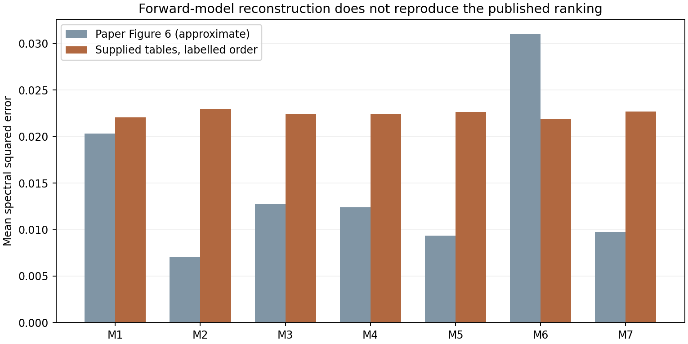

# Source-to-paper trace: discrepancy confirmed, correction not established

**The supplied spreadsheet pairing does not reproduce the paper's forward-model
comparison, and the documented preprocessing choices do not explain the gap.**
This audit narrows the problem but does not identify a justified data correction.
Keep the external-palette result provisional. The source files, importer and
previous fitted models remain unchanged; no new model was fitted.

## What is confirmed

The selected [Grillini et al. paper](https://doi.org/10.3390/s21072471) and its
[author-hosted PDF](https://jbthomas.org/Journals/2021bSensors.pdf) describe the
175-sample powder-pigment dataset. The comparison at issue is **Figure 6**, the
forward prediction using given concentrations. Figures 7 and 8 instead involve
estimating concentrations; their smaller reconstruction errors are not the
appropriate reproduction target here.

The supplement's single-sheet workbooks have matching sample headers. The
concentration table identifies pure W in column AH, and the reflectance table
has the same W header in AI because wavelength occupies the first column.
At 548.99 nm, that reflectance is 0.11205. Both the XML reader and independent
openpyxl reader agree exactly on all labels and numerical cells. The visible
header/column offset was handled correctly. There is no hidden alternative
sheet, label table, formula-derived value or external workbook link to explain it.

The paper photograph contains a visibly light patch at the position consistent
with W in a row-major reading of the headers. That is qualitative supporting
evidence only: the photograph is not a calibrated reflectance measurement, and
it does not supply the scan-to-column mapping needed to repair anything.

The workbook metadata records modifications on 23 and 24 March 2021. Metadata
is not proof of sample correctness. The 2020
[CEUR precursor](https://ceur-ws.org/Vol-2688/paper7.pdf) uses different sets of
24 and 111 tube-paint swatches; it cannot silently supply endmembers or labels
for this 175-sample study. A separate
[AIC precursor](https://www.jbthomas.org/Conferences/2020aAIC.pdf) does describe
the 175-sample set, but the inspected public text does not resolve the column map.

## Seven-model reconstruction

All seven equations were implemented with the paper's fixed tau=0.5 where
applicable. Independent scalar calculations agree within 1.2e-16, and relevant
power-mean inequalities pass. This checks equation implementation; it does not
prove material identities. Endmembers are the spectra in the columns whose
headers indicate pure pigments.

The Figure 6 values below are **approximate readings of vector bar widths**
from the PDF, calibrated against the axis ticks. They are not an original
numeric results table; displayed precision is limited accordingly.

| Model | Paper Figure 6, approximate MSE | Supplied tables, reconstructed MSE |
|---|---:|---:|
| M1 additive | 0.02035 | 0.02206 |
| M2 geometric/subtractive | 0.00704 | 0.02295 |
| M3 Yule-Nielsen | 0.01275 | 0.02241 |
| M4 additive-subtractive | 0.01237 | 0.02238 |
| M5 subtractive-additive | 0.00937 | 0.02265 |
| M6 LIP additive | 0.03104 | 0.02185 |
| M7 LIP subtractive | 0.00974 | 0.02268 |

The reconstructed column uses the given rounded fractions, all 175 samples and
the stated ten-band trim per edge. M2 is slightly worse than M1; the paper has
it substantially better. M6's relative position also disagrees. This is much
larger than the precision of reading bars from the figure.



## Bounded checks, with unsuccessful cases retained

The [plan](PLAN.md) limits the ordering hypotheses; no free permutation search
or color-based relabelling was performed. A preliminary canvas-column-major
interpretation maps W to another dark spectrum and was not pursued as a fix.
The remaining declared checks combine:

- Supplied order, zero-based decimal identifiers sorted as strings, or
  one-based decimal identifiers sorted as strings.
- All 186 native bands or the stated 166-band edge-trimmed interval.
- Stored 0.33/0.67 fractions or the nominal exact label ratios.
- All 175 samples or just the 168 mixtures, excluding the seven pure samples
  from the metric only.

All **24 combinations** are in [cases.csv](cases.csv). None reproduces even the
paper's direction of M2 being better than M1. None resolves the low-W observation
under the two decimal-order hypotheses. Those hypothetical pairings are rejected
as explanations and have not been applied to the source or the models.

Keeping the supplied ordering, M2's MSE ranges from **0.02109 to 0.02391** across
the eight preprocessing/population cases, versus approximately 0.00704 in the
paper. Its ratio to M1 stays between 1.0396 and 1.0405. Rounding, edge trimming,
and whether pure samples enter the average therefore do not explain this gap.

There is no attempt to select the lowest-error case or to optimize against the
published bars. The calculations establish that these specific alternatives do
not reconcile the evidence; they do not exhaust every possible data-processing
difference.

## Provenance and access limits

The verified source is the public supplement retrieved through the
[Europe PMC supplementary-files endpoint](https://www.ebi.ac.uk/europepmc/webservices/rest/PMC8038140/supplementaryFiles),
with inner ZIP SHA-256
`6d8cec6fb4fff5d4c24d18d1783422da8ef955d3e7ba7263179a84ed6c9b683e`.
The PDF used for the graph has SHA-256
`cb49f755727a8b437f54dc55042b81b4b311b0e24848eacd3faf56cb34080a4e`.

A publisher page and CDN copy could not be retrieved in this run (429/403), and
an NCBI OA metadata endpoint returned 404. Thus no second-copy byte-equivalence
claim is made. A related Cai et al. paper's text was inspected, but its spectra
figure was not retrieved reliably, so no numerical evidence was inferred from
that figure. No public correction or authoritative sample remapping was found
in the sources inspected. This is not proof that none exists elsewhere.

## Consequence

The failure currently belongs to the combined **source + preparation + model**
pipeline. We cannot responsibly assign it solely to either a defective dataset
or a defective mixing model. In particular, we have not proved a column-order
error, and must not generate a corrected table by guessing paint colors.

The remaining decisive evidence is the canonical sample-to-spectrum mapping and
the exact endmember/preprocessing inputs used for Figure 6, or an authoritative
updated supplement. The [unsent technical query](SOURCE-QUERY.md) states the
precise discrepancy and identifiers. No author was contacted.

Do not use the external study as a validated pass/fail benchmark until that
evidence is available. Retain its poor as-supplied scores and the Old Holland
findings separately. No runtime, renderer, paper implementation or default
change follows from this audit.

## Reproduction

The existing scientific environment runs the model-equation audit:

```powershell
& target/measured-oils/venv/Scripts/python.exe experiments/oil_source_trace/trace.py
```

`extract_figure.py` uses pdfplumber with the exact local PDF to regenerate
[figure6-values.json](figure6-values.json). It was run with the bundled document
Python runtime. The pre-existing [reader check](../oil_public_data/independent-reader-check.json),
[summary](summary.json), [all cases](cases.csv) and
[hypothesized pure assignments](pure-identities.csv) retain the evidence.
