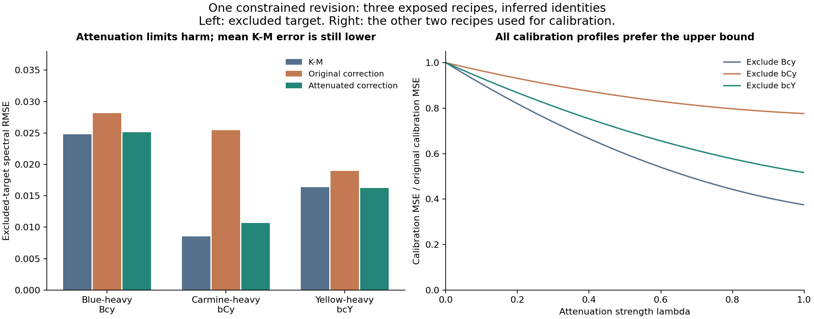

# Ternary attenuation: less harm, but no advantage over K-M

**The single revision improves on the original empirical correction but fails to
beat the frozen K-M baseline on the primary mean error.** For the three excluded
chromatic ternaries, mean spectral RMSE is 0.017338 with attenuation, 0.024189 with
the original correction, and 0.016568 with K-M. Attenuation reduces the original
correction's error by 28.3%, but remains 4.65% worse than K-M.

This conclusion holds across all seven tested inferred mappings: the revision
improves on the original correction by 28.1-30.8%, but remains 4.4-5.4% worse than
K-M. Every fit chooses the maximum allowed attenuation.
The evidence supports limiting a harmful residual correction, not learning more
accurate three-pigment paint behavior. **Do not promote this revision to the
runtime or treat the result as independent validation.**



## Fixed rule and sequence

The [plan](PLAN.md) and implementation were frozen before any revision fit or
assessment. The earlier [diagnosis](../oil_white_split/REPORT.md) motivated this
one candidate. All K-M coefficients and empirical pair curves stayed frozen in
the original bundle:

`8090dd57ce49b584fcae15cdb85eafbe942a4181c97f53b27a95d22265bc1ced`

For normalized total paint fractions, the rule is:

```
h = 27 * cY * cC * cB
0 <= lambda <= 1
new_shift = (1 - lambda*h)*chromatic_pair_shift + white_pair_shift
prediction = sigmoid(logit(KM_prediction) + new_shift)
```

The factor 27 normalizes the gate at equal thirds; it was not normalized to the
three observed recipes. The gate is smooth and bounded. It vanishes whenever a
chromatic pigment is absent, preserving every binary mixture and the current
white-containing ternaries. In mixtures containing all four paints it attenuates
only the chromatic terms; there are no such measured assessment samples here.
Numerical boundedness on those recipes does not establish their accuracy.

The three observed chromatic ternaries are all 2:1:1, giving h=27/32. At the fitted
lambda=1, they retain **15.625%** of the original chromatic logit correction.
This is not a 15.625% linear interpolation of reflectance. The fixed bound was
not widened after observing results, and no alternative gate was tested.

For each mapping, the three ternaries share the original 22-row binary/pure
calibration model. Each new scalar fit sees only two ternary targets and is scored
on the excluded third. This rotates through three exclusions across seven
mappings: 21 fits, but only three physical recipe labels. Identical primary
models across some mappings also share identical fit outcomes.

The scalar objective is mean squared spectral error on the two calibration
samples over the existing 31 bands at 440-740 nm. Bounded scalar minimization and
both endpoints are compared. A 1001-point calibration-only profile checks the
chosen objective. All scalar coefficients were frozen, verified, then evaluated.
No K-M or pair-curve fitting entry point is enabled in this experiment.

## Primary excluded-target results

| Frozen model | Mean RMSE | p95 RMSE | Maximum RMSE | Mean windowed DE00 |
| --- | --- | --- | --- | --- |
| K-M | 0.016568 | 0.023960 | 0.024801 | 4.6527 |
| Original empirical correction | 0.024189 | 0.027873 | 0.028143 | 6.2400 |
| Attenuated correction | 0.017338 | 0.024220 | 0.025106 | 4.8358 |

| Excluded recipe | Ternaries used for lambda | K-M RMSE | Original RMSE | Attenuated RMSE |
| --- | --- | --- | --- | --- |
| Bcy | bCy, bcY | 0.024801 | 0.028143 | 0.025106 |
| bCy | Bcy, bcY | 0.008515 | 0.025442 | 0.010660 |
| bcY | Bcy, bCy | 0.016389 | 0.018981 | 0.016250 |

All three excluded samples improve over the original correction under every
mapping. In the base map only the yellow-heavy sample improves slightly over
K-M in spectral RMSE; blue-heavy and carmine-heavy remain worse. All three base-map
windowed color errors remain worse than K-M. The mean color advantage over K-M
is absent under every mapping too.

Windowed DE00 uses the existing D65/2-degree 440-740 nm convention with a matching
truncated white. It is not full-visible color error. Percentile statistics over
three samples are descriptive, not population estimates.

## The parameter hits its limit in every fit

All 21 optimizations succeeded and selected lambda=1. Each bounded optimizer used
37 objective evaluations, plus the explicitly checked endpoints and diagnostic
profile. All 1000 successive steps in every sampled calibration profile reduce
the objective as attenuation increases. No intermediate optimum was selected.

| Excluded recipe | Lambda | Original calibration MSE | Attenuated calibration MSE |
| --- | --- | --- | --- |
| Bcy | 1.0 | 0.00050379 | 0.00018884 |
| bCy | 1.0 | 0.00057616 | 0.00044717 |
| bcY | 1.0 | 0.00071967 | 0.00037196 |

These are losses on the **two calibration ternaries**, separate from the excluded
errors above. The consistent boundary solution says the calibration prefers to
suppress more of the learned correction within the allowed rule. It does not
identify a subtle strength or prove that the chosen gate captures paint physics.

All observed ternaries have the same gate value, so this dataset cannot establish
the gate's composition dependence. It primarily tests a shared shrinkage of the
correction at one composition pattern. K-M remains the stronger primary reference
after that shrinkage; adjusting the gate again to eliminate the remaining gap
would be another exposed-data revision, not fresh evidence.

## Mapping sensitivity

The seven projections are the same frozen feasible alternatives used previously.
No label was selected or changed to favor this revision.

| Diagnostic mean-MSE tolerance | Mappings | RMSE reduction vs original | RMSE increase vs K-M |
| --- | --- | --- | --- |
| 2e-06 | 1 | 28.32-28.32% | 4.65-4.65% |
| 5e-06 | 4 | 28.07-28.63% | 4.44-4.65% |
| 1e-05 | 7 | 28.07-30.78% | 4.44-5.42% |

| Mapping | Changed selected recipes | K-M mean RMSE | Original mean RMSE | Attenuated mean RMSE | Rows beating K-M / 3 |
| --- | --- | --- | --- | --- | --- |
| base | (base) | 0.016568 | 0.024189 | 0.017338 | 1 |
| variant-01 | Wcy | 0.016568 | 0.024189 | 0.017338 | 1 |
| variant-02 | By | 0.017193 | 0.025157 | 0.017955 | 1 |
| variant-03 | Bw | 0.016679 | 0.024238 | 0.017435 | 1 |
| variant-04 | wCy, Cy | 0.016606 | 0.025293 | 0.017507 | 0 |
| variant-05 | By, Wcy | 0.017193 | 0.025157 | 0.017955 | 1 |
| variant-06 | Bw, Wcy | 0.016679 | 0.024238 | 0.017435 | 1 |

The uncertainty range is conditional on the paired-scan hypothesis and fixed
pure identities. These are not probability bounds over unrestricted labelings.

## The previously successful mixtures are preserved

All nine white ternaries and nine pair assessments remain **bit-identical** to
the original empirical decoder under every fitted strength and mapping: 126
unchanged model/observation assessments. Their own previous grouped K-M and
empirical models are retained. Only the three chromatic ternaries receive the
new excluded-target scalar predictions.

| Assessment | K-M mean RMSE | Original mean RMSE | Attenuated mean RMSE |
| --- | --- | --- | --- |
| 9 white ternaries (unchanged) | 0.040879 | 0.025851 | 0.025851 |
| 9 pairs (unchanged) | 0.034693 | 0.024655 | 0.024655 |
| 12 ternaries (composite) | 0.034801 | 0.025435 | 0.023722 |
| 21 rows (composite) | 0.034755 | 0.025101 | 0.024122 |

The twelve- and twenty-one-row totals combine the old grouped assessment with
the new scalar exclusion protocol. They improve as expected when the three bad
predictions improve, but the new model has additional ternary calibration data.
These composite totals must not be presented as an unchanged-budget rerun of the
original benchmark or used to conceal the primary failure to beat K-M.

## Verification

- All 21 fits were repeated after perturbing the excluded target. Lambda and
  calibration objective remained exactly unchanged.
- All 147 original assessment records reproduced exactly (maximum difference 0).
- Independent scalar decoding agrees within 3.33e-16; pure endpoints within 1.11e-16.
- Lambda zero preserves original decoder bits. Each unique primary model was
  checked on 906 unaffected face/edge recipes, also with bit-identical predictions.
- Each unique primary model was checked on 1029 recipes for finite bounded
  spectra at lambda 0, .5 and 1. Representative tiny third-pigment fractions
  down to 1e-12 satisfy the declared continuous-change bound.
- At equal thirds and lambda=1, the decoder reproduces K-M. This is a mathematical
  check on an unmeasured recipe, not a claim of real-paint accuracy there.
- Source, mapping, original coefficients, implementation and protocol hashes
  remain unchanged. Both frozen bundles stayed byte-identical through scoring.

The new scalar bundle SHA-256 is:

`431e986d3b7df8b829905fa3b5d8f51fde087a1e127f0dadbfa344ab32abb256`

It and the calibration profiles are kept under ignored
`target/measured-oils/ternary-attenuation/`. Detailed derived outputs are in
[summary.json](summary.json), [errors.csv](errors.csv) and
[verification.json](verification.json).

## Decision and limits

Retain the diagnosis and this negative comparison with K-M as research evidence.
The experiment supports the concern that additive binary residual corrections
should not be trusted automatically in three-chromatic-pigment interiors. It
does not justify this particular gate as a better optical model or a new default.

Before another correction is proposed, seek evidence from additional three-pigment
compositions in existing public measurements. Broader ratios and pigment sets
would test whether the failure pattern generalizes and provide information that
these three identically shaped recipes cannot supply. Keep any new study separate
from this completed experiment and from the paper-faithful implementation.

All three targets already influenced the research direction through diagnosis.
The exclusion protocol prevents direct fitting to each reported target, but does
not undo that exposure. The underlying source map also used aggregate published
scores. This remains exploratory under inferred labels, with no independent
physical validation, significance claim, product promotion or renderer change.

## Reproduction

Use the existing checksum-verified source cache and scientific environment from
the [source reconstruction](../oil_source_recovery/REPRODUCE.md). Run in order:

```powershell
.\target\measured-oils\venv\Scripts\python.exe experiments/oil_ternary_attenuation/run.py prepare
.\target\measured-oils\venv\Scripts\python.exe experiments/oil_ternary_attenuation/run.py fit
.\target\measured-oils\venv\Scripts\python.exe experiments/oil_ternary_attenuation/run.py verify
.\target\measured-oils\venv\Scripts\python.exe experiments/oil_ternary_attenuation/run.py evaluate
.\target\measured-oils\venv\Scripts\python.exe experiments/oil_ternary_attenuation/report.py
```

Prepare and fit refuse to overwrite frozen output. Use one fresh `--out` path
under target/ for all four run phases to repeat the experiment. The report script
uses the saved versioned scores and the original default calibration profile
cache. Original experiments and coefficients are never overwritten.
