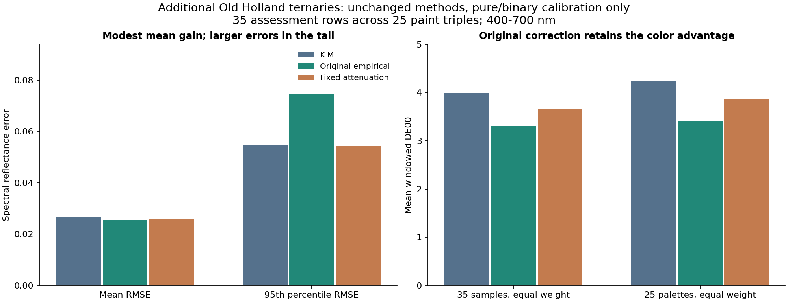
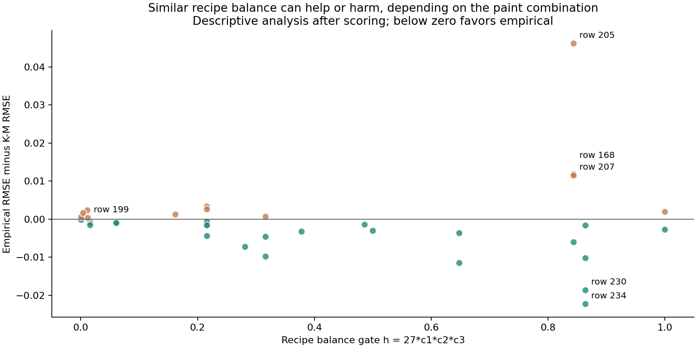

# Broader ternary test: modest empirical gains and substantial tail risk

**The original empirical correction improves mean spectral RMSE by 3.83% and
mean windowed color error by 17.40% over K-M on the 35 additional ternaries.**
It improves spectral RMSE on 23 of 35 samples and color error on 29 of 35.
This broader evidence changes the interpretation of the earlier three Grillini
failures: three-chromatic-pigment mixtures do not generally require suppressing
the empirical correction.

The improvement is uneven. Empirical p95 spectral RMSE is 35.5% worse than K-M,
and the largest spectral regression more than doubles one sample's error.
Fixed attenuation reduces the high-error tail but gives up gains elsewhere:
its mean RMSE is 0.47% worse and mean DE00 10.66% worse than the original correction.
Retain the original correction as a research candidate and investigate specific
failures; this does not justify a universal attenuation default or product release.



## Frozen cohort and fair comparison

The [plan](PLAN.md) executes the [previously prepared cohort](../oil_ternary_sources/next-cohort.json)
from commit `5f86146`. All 35 no-white target rows and 25 palettes were selected
before fitting, by recipe coverage. The known Old Holland targets 172,174,176
are excluded from this score. No rows or difficult palettes were dropped.

For each triple, calibration uses only the prescribed pure and binary samples
from those three paints plus Mixed White, between 25 and 39 rows. Each palette
has four pure endpoints and all six pair types; some binary pairs have only one
recipe. These are tube-paint fractions, not chemically pure pigment or volume
fractions. The first three coordinates are generic paint slots and are not always
yellow/red/blue. Mixed White remains fourth and sets the scattering gauge.

The K-M and bounded empirical fitters, objective, priors, bounds, starts and
stopping settings are unchanged. Each palette gets new coefficients from its own
calibration samples. K-M is the exact base belonging to its empirical model.
All 25 model fits converged and were frozen and verified before assessment.

The secondary comparator imports the exact archived attenuation decoder with
lambda fixed at 1. Its chromatic logit correction is multiplied by
`1 - 27*c1*c2*c3`; white-pair terms are unchanged. No strength or new gate was
learned from these 35 targets. All three methods therefore have the same
calibration-data budget in this comparison.

The data use native 31-band spectra at 400-700 nm. No spectral interpolation,
extrapolation, relabeling or cross-source coefficient transfer was used. DE00
uses the existing D65/2-degree integration over that window and its matching white;
it is not full-visible colorimetry and must not be pooled numerically with the
Grillini 440-740 nm scores.

## Primary 35-sample results

| Method | Mean RMSE | Median RMSE | p95 RMSE | Max RMSE | Mean windowed DE00 |
| --- | --- | --- | --- | --- | --- |
| K-M | 0.026552 | 0.021861 | 0.054923 | 0.104356 | 3.9962 |
| Original empirical | 0.025535 | 0.017423 | 0.074424 | 0.104666 | 3.3008 |
| Fixed attenuation | 0.025656 | 0.020517 | 0.054434 | 0.104662 | 3.6525 |

| Comparison | Mean RMSE reduction | RMSE rows better / worse / tied | Mean DE00 reduction | DE00 rows better / worse / tied |
| --- | --- | --- | --- | --- |
| Empirical vs K-M | +3.83% | 23 / 12 / 0 | +17.40% | 29 / 6 / 0 |
| Attenuation vs K-M | +3.37% | 22 / 11 / 2 | +8.60% | 28 / 5 / 2 |
| Attenuation vs empirical | -0.47% | 13 / 22 / 0 | -10.66% | 7 / 28 / 0 |

Positive reductions mean improvement; negative reductions mean regression.
The primary average is a mean of per-sample RMSE values, not the square root of
one pooled MSE. The worst absolute spectral error remains about 0.1047 RMSE under
both corrected methods, so a modest average improvement is not evidence of
uniform physical accuracy.

## Equal weighting across paint triples

Palettes have one to three target recipes. Averaging their mean errors equally
checks whether the conclusion depends on the few palettes with more samples.

| Method | Equal-palette mean RMSE | Equal-palette mean DE00 |
| --- | --- | --- |
| K-M | 0.023665 | 4.2429 |
| Original empirical | 0.022195 | 3.4034 |
| Fixed attenuation | 0.022494 | 3.8546 |

With equal palette weights, the original correction reduces mean spectral RMSE
by 6.21% and mean color error by 19.79% relative to K-M. Sixteen palettes improve
and nine worsen spectrally; 23 improve and two worsen in mean color error. The
fixed attenuation is 1.35% worse in mean spectral RMSE and 13.26% worse in mean
color error than the original correction under this weighting too.

This companion analysis supports the same average ranking. It is not a significance
test: calibration swatches and paint identities are shared among palettes.

## Failures and attenuation tradeoff

The five largest empirical spectral regressions are:

| Source row | Three paints | Gate h | K-M RMSE | Empirical RMSE | Attenuated RMSE |
| --- | --- | --- | --- | --- | --- |
| 205 | Cadmium Yellow; Scarlet Lake; Alizarine Lake | 0.8438 | 0.036898 | 0.083059 | 0.042866 |
| 168 | Lemon Yellow; Scarlet Lake; Alizarine Lake | 0.8438 | 0.034481 | 0.046289 | 0.036184 |
| 207 | Cadmium Yellow; Scarlet Lake; Cobalt Blue | 0.8438 | 0.024025 | 0.035464 | 0.024853 |
| 188 | Lemon Yellow; Alizarine Lake; Ultramarine Blue | 0.2160 | 0.004653 | 0.007970 | 0.007229 |
| 211 | Cadmium Yellow; Scarlet Lake; Viridian Green | 0.2160 | 0.008710 | 0.011276 | 0.009201 |

Row 205, Cadmium Yellow / Scarlet Lake / Alizarine Lake at 1:2:1, is the largest
correction-induced regression: RMSE rises from 0.03690 to 0.08306. Attenuation
reduces it to 0.04287, but does not beat K-M. This palette has at least two samples
for every binary pair, so the failure cannot simply be assigned to the presence
of a one-sample pair without further evidence.

Conversely, row 234 (Scarlet Lake / Alizarine Lake / Viridian Green at 2:2:1)
improves from 0.03426 to 0.01194 with the empirical correction. Attenuation loses
much of that benefit, returning RMSE to 0.03055. The gates are almost the same
for these opposite cases: 0.84375 and 0.864. A rule based only on recipe balance
cannot distinguish their pigment-dependent outcomes.



This scatter plot and the selected examples are descriptive after scoring;
they were not used to choose a threshold, omit samples or tune the method.

There is also a separate base-model failure. Row 199, Lemon Yellow /
Scarlet Lake / Viridian Green at 95:3.75:1.25, has RMSE
0.104356 for K-M,
0.104666 for empirical and
0.104662 for attenuation. Its small gate means
attenuation barely changes the prediction. A second recipe from that palette,
row 197, is also poor. Suppressing an empirical correction cannot resolve an
error already present in the K-M base. This observation alone does not identify
whether the remaining cause is optical-model inadequacy, calibration conditioning,
sample preparation or source metadata.

## All palette results

Column numbers follow the source archive: 1 Lemon Yellow, 2 Cadmium Yellow,
3 Scarlet Lake, 4 Alizarine Lake, 5 Cobalt Blue, 6 Ultramarine Blue, 7 Viridian
Green. Mixed White (8) is present in every calibration palette. Full names and
exact row partitions are preserved in [palette-results.csv](palette-results.csv)
and the frozen cohort. All values below are mean target spectral RMSE.

| Paint columns | Target rows | Calibration rows | Minimum pair support | K-M | Empirical | Attenuated |
| --- | --- | --- | --- | --- | --- | --- |
| 1-2-3 | 264 | 28 | 1 | 0.029297 | 0.022004 | 0.023923 |
| 1-3-4 | 168,169,170 | 32 | 1 | 0.041801 | 0.044957 | 0.041684 |
| 1-3-6 | 191,193,195 | 39 | 5 | 0.017407 | 0.016542 | 0.016562 |
| 1-3-7 | 197,199 | 33 | 1 | 0.086933 | 0.087695 | 0.087582 |
| 1-4-5 | 178 | 27 | 1 | 0.037162 | 0.039072 | 0.037162 |
| 1-4-6 | 188 | 34 | 1 | 0.004653 | 0.007970 | 0.007229 |
| 1-4-7 | 180 | 28 | 1 | 0.010168 | 0.004093 | 0.009046 |
| 1-5-7 | 184,186 | 25 | 1 | 0.031453 | 0.029338 | 0.031059 |
| 1-6-7 | 201,203 | 32 | 1 | 0.016411 | 0.015212 | 0.016004 |
| 2-3-4 | 205 | 30 | 2 | 0.036898 | 0.083059 | 0.042866 |
| 2-3-5 | 207 | 27 | 2 | 0.024025 | 0.035464 | 0.024853 |
| 2-3-6 | 209 | 33 | 2 | 0.012217 | 0.007786 | 0.008210 |
| 2-3-7 | 211 | 31 | 2 | 0.008710 | 0.011276 | 0.009201 |
| 2-4-5 | 213 | 29 | 1 | 0.020866 | 0.021491 | 0.021283 |
| 2-4-6 | 215 | 32 | 2 | 0.011329 | 0.008247 | 0.009111 |
| 2-4-7 | 218,220,222 | 30 | 1 | 0.031725 | 0.031138 | 0.031598 |
| 2-5-7 | 224 | 27 | 1 | 0.023914 | 0.014060 | 0.016872 |
| 2-6-7 | 226,228 | 30 | 2 | 0.021051 | 0.021326 | 0.021279 |
| 3-4-5 | 230 | 30 | 1 | 0.034185 | 0.015485 | 0.031461 |
| 3-4-6 | 232 | 38 | 2 | 0.015324 | 0.003786 | 0.010664 |
| 3-4-7 | 234 | 34 | 1 | 0.034264 | 0.011940 | 0.030546 |
| 3-5-7 | 236 | 31 | 1 | 0.007402 | 0.003712 | 0.004919 |
| 3-6-7 | 238 | 39 | 3 | 0.014324 | 0.004058 | 0.012671 |
| 4-5-7 | 240 | 29 | 1 | 0.015925 | 0.014282 | 0.014624 |
| 4-6-7 | 242 | 34 | 1 | 0.004177 | 0.000892 | 0.001952 |

[errors.csv](errors.csv) retains every target's recipe, gate and metrics.
[calibration.csv](calibration.csv) contains explicitly separated training errors;
none is included in the 35-row assessment score.

## Verification

- All 75 K-M starts converged in 8-13 evaluations, with no bound hits.
- All 25 empirical fits converged in 7-10 evaluations, with zero or one active bound control.
- Each palette was refitted after replacing every excluded target spectrum.
  All K-M and empirical coefficients remained exactly unchanged.
- Independent scalar comparisons agree within 4.69e-15 for K-M,
  4.93e-15 for empirical, and 3.33e-16 for attenuation.
- Pure endpoints agree within 1.67e-16. Attenuation preserves original
  predictions bit-for-bit where any chromatic pigment is absent, including all
  calibration rows; 300 additional face recipes per palette also pass.
- Lambda zero recovers original decoder bits. All methods remain finite and
  strictly within (0,1) on available palette recipes and 517 additional recipes
  per palette. This verifies numerical validity, not physical accuracy there.
- Exact cohort coverage, all calibration supports, train/test disjointness,
  original dependency hashes and frozen-bundle integrity passed.

The frozen model bundle is stored under ignored
`target/measured-oils/ternary-transfer/frozen-models.json`, SHA-256:

`ddc0e552df366ed4c0e00bdfeb581ca03f48f3ab1f71501808bc2ec778b94fbb`

Detailed provenance and optimizer records are in [summary.json](summary.json),
with checks in [verification.json](verification.json). Runtime, renderer, default
palette and the paper implementation are unchanged.

## What this changes

The earlier conclusion should be narrowed: the binary-to-ternary transfer failed
on the three tested Grillini mixtures, but that failure does not generalize to
all chromatic ternaries. The unchanged correction often helps on this broader
Old Holland selection, especially in the color metric. Universal suppression
throws away useful corrections as well as harmful ones.

The next useful diagnosis is specific: separate row 205's correction-induced
failure from the large K-M errors in rows 197/199. Inspect their calibration
support, spectra and source metadata with frozen predictions before proposing
another change. Do not pick a balance threshold or pigment-specific exception
from this plot and report its performance on these same rows as fresh validation.

This is a broader same-source challenge outside the prior four-paint selection,
not a wholly independent external dataset. The Old Holland source and earlier
targets already informed method selection. Most new paint triples have one
target, physical repeat/batch identity is unavailable here, and concentration
support varies. The average gains and tail regressions are both retained;
neither alone establishes a production-ready measured-paint model.

## Reproduction

Use the checksum-verified original archive and scientific Python environment
recorded in the manifest. Run each phase in order:

```powershell
.\target\measured-oils\venv\Scripts\python.exe experiments/oil_ternary_transfer/run.py prepare
.\target\measured-oils\venv\Scripts\python.exe experiments/oil_ternary_transfer/run.py fit
.\target\measured-oils\venv\Scripts\python.exe experiments/oil_ternary_transfer/run.py verify
.\target\measured-oils\venv\Scripts\python.exe experiments/oil_ternary_transfer/run.py evaluate
.\target\measured-oils\venv\Scripts\python.exe experiments/oil_ternary_transfer/report.py
```

Prepare and fit refuse to overwrite frozen outputs. For a fresh run use the same
new `--out` path under target/ for every run phase. The report script reads saved
scores only. Fresh optimizer elapsed times may differ; stored coefficients and
scores remain fixed through verification and evaluation. No extra measurements
or coefficient artifacts were bundled into the product.
