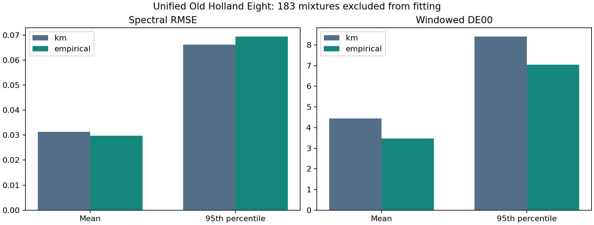

# Unified Old Holland Eight: fitted and packaged

One consistent eight-paint model is now fitted, assessed and available as local
runtime packages. The empirical candidate reduces mean spectral RMSE by
**5.04%** and mean windowed color error by **22.01%**
against its own shared K-M base on all **183 mixtures excluded from fitting**.
It improves color on 148 of 183 rows and spectra
on 101 of 183. Spectral p95 and maximum still worsen.
This is a usable experimental painting model, not a physically certified preset.



## Fit and assessment

The [plan](PLAN.md) was saved before fitting. The unchanged source supplies
eight pures, 95 binaries and 183 mixtures of three to seven paints. All 28 pair
types are present in calibration, with 1-9 observations per pair. Only the 103
pure/binary rows calibrate either stage. There are no measured eight-ingredient
recipes; their runtime evaluation remains an unvalidated extension of the model.

The base fits 217 log-relative scattering parameters (7 paints x 31 bands),
with measured pure K/S and Mixed White S=1. All three starts converge, with no
active bounds. The frozen base then supports 112 bounded empirical controls
(28 pairs x 4 wavelength controls); that stage converges in ten evaluations,
with one bound control. Optimizer records are retained in [summary.json](summary.json).

No four-paint optical fits were combined. Every paint now has one set of K/S
coefficients used for every recipe. The old objectives, starting points, bounds
and stopping criteria were generalized by dimension only; regularizers retain
their mean-square normalization at the new parameter counts. No attenuation,
target tuning or failed-row exclusion was introduced.

| Model | Mean RMSE | Median RMSE | p95 RMSE | Maximum RMSE | Mean windowed DE00 | p95 DE00 | Max DE00 |
| --- | --- | --- | --- | --- | --- | --- | --- |
| km | 0.031278 | 0.028436 | 0.066226 | 0.126010 | 4.438 | 8.405 | 11.670 |
| empirical | 0.029703 | 0.022086 | 0.069399 | 0.129690 | 3.461 | 7.036 | 9.910 |

Native spectra cover 400-700 nm at 10 nm. DE00 uses the same truncated D65/2-degree
XYZ/Lab calculation and matching white as previous Old Holland studies, without
RGB clipping. Source conditions and earlier assessments informed method selection,
so these scores are exploratory same-source evidence, not independent validation.

| Assessment group | Count | K-M RMSE | Empirical RMSE | K-M DE00 | Empirical DE00 |
| --- | --- | --- | --- | --- | --- |
| no white | 56 | 0.018805 | 0.017586 | 4.204 | 3.360 |
| with white | 127 | 0.036778 | 0.035047 | 4.542 | 3.506 |
| 3 paints | 101 | 0.032090 | 0.030438 | 3.796 | 2.981 |
| 4 paints | 53 | 0.027680 | 0.027275 | 4.618 | 3.671 |
| 5 paints | 18 | 0.036576 | 0.032012 | 6.623 | 4.877 |
| 6 paints | 6 | 0.023456 | 0.021764 | 5.539 | 4.354 |
| 7 paints | 5 | 0.043333 | 0.041813 | 6.317 | 4.774 |

All row-level metrics, including calibration rows clearly labeled separately,
are in [errors.csv](errors.csv). The five largest remaining color errors are:

| Source row | Paint count | Empirical RMSE | Empirical DE00 |
| --- | --- | --- | --- |
| 259 | 5 | 0.042458 | 9.910 |
| 271 | 4 | 0.015045 | 9.784 |
| 216 | 4 | 0.015560 | 7.962 |
| 137 | 4 | 0.076644 | 7.892 |
| 286 | 6 | 0.045947 | 7.880 |

## Comparison on the established 35-target cohort

| Method | Mean spectral RMSE | Mean windowed DE00 |
| --- | --- | --- |
| Previous palette-specific K-M | 0.026552 | 3.9962 |
| Previous palette-specific correction | 0.025535 | 3.3008 |
| Unified eight-paint K-M | 0.020249 | 3.7129 |
| Unified eight-paint correction | 0.020844 | 3.1175 |

The unified corrected model improves these two means by 18.37%
and 5.55% relative to the archived correction. However,
its base now sees the complete 103-row binary calibration graph rather than one
four-paint subset. This is not an equal-data-budget algorithm comparison. The
unified plain K-M base has lower mean spectral error than its correction on these
35 rows, while the correction has lower color error. Both packages are retained.

## Usable local packages

Files are under `target/measured-oils/unified-eight/`:

| Model | Filename | Bytes | File SHA-256 |
| --- | --- | --- | --- |
| km | `old-holland-eight-km.opp` | 5,464 | `99e16aac59fbbbb2b522766c5ca9210b481294a3189eaeefacb8fb71aae72b74` |
| empirical | `old-holland-eight-empirical.opp` | 6,367 | `9d21533abbe7a4d3a947ac96f322e3b804f1b08910579a903a0cdb1d69eb4001` |

OPP3 preserves the native 31-band optical curves, eight paint identities, mass
convention, explicit model kind, pair controls and windowed display projection.
The display projection follows the existing neutral-normalized RGB convention
over the measured window, then the existing gamut map. It is a limited-window
preview, not a full-visible measurement. No missing spectral tails are invented.

Load either package with `PaletteN::<8,31>::from_bytes` in Ochrell or
`PaletteMixerN::<8,false,31>::from_palette_bytes` in the native renderer. Recipes
retain all eight components. The empirical model travels inside its package;
loading it does not silently fall back to plain K-M. Existing package identities
and four-paint acceleration remain compatible. No default is changed.

The source-derived packages and previews remain local ignored research artifacts.
The repository contains original implementation, provenance and error reports.
No author was contacted and no redistribution decision was changed.

## Verification and actual painting

Before fitting, the generalized code reproduced the old four-paint K/S and pair
coefficients exactly; its directional Jacobian check agreed within 1.1e-12.
Replacing all 183 excluded spectra and refitting changed no coefficient.
Independent scalar decoding agrees within 3.4e-16 reflectance; pure endpoints
remain exact to 1.2e-16. Dense all-eight recipes are finite and bounded.

Both exported packages were independently loaded and evaluated by Rust on 1,318
recorded/dense/pure recipes. Spectra agree with Python within 3.4e-16 and linear
RGB within 2.3e-16. Package and recipe serialization preserve exact bytes and
future mixtures. See [preflight.json](preflight.json), [verification.json](verification.json),
[package-verification.json](package-verification.json) and
[renderer-verification.json](renderer-verification.json).

The native `old_holland_eight` example loads the actual empirical OPP3, paints
94 strokes using matched targets and explicit recipes (including an all-eight
load), and checks all canvas planes after saving/reopening each job. Its final run records:

```text
closest_found_to_black=[0.13642117, 0.13142478, 0.14618383]; recipe=[0.0, 0.0, 0.10302221, 0.416333, 0.0, 0.4806448, 0.0, 0.0]; error_ok100=25.294241326900423
target-matched: 256x320, 94 strokes, 112.858 ms paint, 58179 bytes bundle, all canvas planes replay bit-identical
explicit-recipes: 256x320, 94 strokes, 122.965 ms paint, 58179 bytes bundle, all canvas planes replay bit-identical
```

Timings are local smoke observations, not comparative benchmarks. The black
match is only the best recipe found, not a certified gamut boundary. Native
paintings, replay bundles, plane hashes and swatch sheets are retained under
the local output directory. Screen appearance also depends on the display.

## Reproduction

Use the existing source archive and scientific environment. For a new fit,
choose a fresh `--out` for every phase; frozen files are never overwritten.

```powershell
.\target\measured-oils\venv\Scripts\python.exe experiments/oil_unified_eight/run.py prepare
.\target\measured-oils\venv\Scripts\python.exe experiments/oil_unified_eight/run.py fit
.\target\measured-oils\venv\Scripts\python.exe experiments/oil_unified_eight/run.py verify
.\target\measured-oils\venv\Scripts\python.exe experiments/oil_unified_eight/run.py evaluate
.\target\measured-oils\venv\Scripts\python.exe experiments/oil_unified_eight/package.py export
```

Run `measured_palette_probe` for both packages using `recipes.f64` and write
`km-predictions.f64` / `empirical-predictions.f64`, then run `package.py verify`.
In the sibling renderer, run `cargo run --release --offline -p oil-palette
--example old_holland_eight -- <empirical.opp> <output-directory>`. The final
report script reads scores, checks and previews without fitting.

Frozen fit SHA-256: `c96f11c194b38a007849c5db427fbe492f3f67958df5b7bdd61a5b465bb932fc`.
Source: Asadi Shahmirzadi, Babaei and Seidel, *A Multispectral Dataset of Oil and
Watercolor Paints* (2020); [dataset page](https://www.azadehasadi.net/paintdatasets.html).
This is a modern Old Holland selection, not a reconstruction of a specific
historical Monet painting or paint batch.
