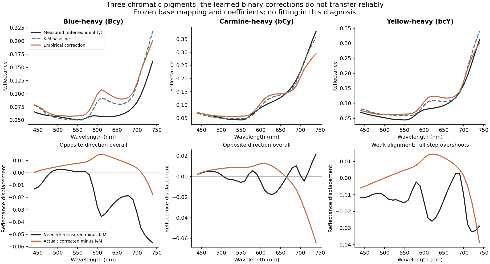
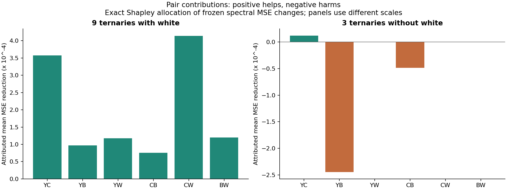

# Why the frozen correction helps white mixtures and harms chromatic ternaries

**The failure is the transfer of separately learned pair corrections into a
three-chromatic-pigment mixture.** All calibration mixtures contain at most two
materials. Their correction terms are learned in isolation; a ternary prediction
then adds three such terms. That extra assumption is not tested by calibration.
The physical K-M base already performs relatively well on the three no-white
ternaries, and the added residual corrections move two in the wrong overall
spectral direction and overshoot the third.

This is a diagnosis of model behavior, not proof of a particular physical paint
mechanism. All seven feasible selected-palette mappings support the same
direction/overshoot classification. Source identities remain inferred, and these
are previously exposed observations. No model was fitted or changed.

## 1. It is not a general inability to mix without white

The prior grouped assessment improved eight of nine held-out two-chromatic-pigment
mixtures. In the full 22-row calibration fit used for the three Y/C/B ternaries,
all nine chromatic binary calibration mixtures also improve. The breakdown
appears when **three chromatic pigments act together**, not whenever white is
absent.

The calibration pool has four pure samples and eighteen binary mixtures: three
ratios for each of six pigment pairs. Each binary observation activates one pair
correction; pures activate none. There is no ternary calibration observation.
After the K-M base is frozen, the empirical data loss and separable regularizer
contain no cross-pair terms. The off-block feature Gram entries are exactly zero.
Thus each empirical pair curve learns how to repair its own binary residuals,
with no observation showing how those repairs interact with another pigment.

The held-out Y/C/B samples use 2:1:1 recipes. Every internal pair ratio (1:1,
2:1 or 1:2) is represented in that full calibration fit. This is not a missing
binary ratio. It is missing **third-pigment context**. Stored binary concentrations
are rounded .33/.67, while ternary proportions give exact nominal ratios; the
unchanged fitter retains those released fractions.

For pigment fractions `c`, a pair contributes
`4*c_i*c_j * h_ij(wavelength)` to the logit of the K-M reflectance. The fitted
spectral curve `h_ij` has no dependence on the identity of a third pigment.
Every measured ternary activates three pairs with weights .5, .5 and .25, whose
sum is 1.25. Binary calibration activates one pair with weight at most 1.
This is outside the calibration feature combinations even though the recipes
are ordinary mixtures. However, white-containing ternaries have the same total
weight 1.25, so that scalar total alone does not explain which mixtures fail.

## 2. Wrong direction in two mixtures, overshoot in one

Let `d = corrected - K-M` and `needed = measured - K-M`. The exact spectral-MSE
change is `mean(d*d) - 2*mean(d*needed)`. The diagnostic projection
`alpha = dot(d,needed)/dot(d,d)` separates the two contributions:

- Negative alpha: the frozen reflectance displacement points away from the
  measured residual overall. Any positive step along that displacement increases
  squared error.
- Alpha between 0 and .5: some alignment exists, but the full displacement is
  large enough to increase squared error.
- Alpha above .5: the full displacement reduces squared error.

This is an explanatory calculation in reflectance space using exposed measured
targets. It is not a fitted parameter, logit-scaling prescription or proposed
production decoder.

| Mixture | K-M RMSE | Full RMSE | Base alpha | Alpha across 7 maps | Diagnosis |
| --- | --- | --- | --- | --- | --- |
| Blue-heavy (Bcy) | 0.024801 | 0.028143 | -0.624 | -0.721 to -0.570 | Wrong direction |
| Carmine-heavy (bCy) | 0.008515 | 0.025442 | -0.259 | -0.264 to -0.211 | Wrong direction |
| Yellow-heavy (bcY) | 0.016389 | 0.018981 | +0.153 | +0.012 to +0.184 | Overshoot |

The carmine-heavy mixture is the clearest failure: K-M RMSE is about 0.00851,
while the correction displacement itself has RMS 0.01945 and points away from
the required change overall. The final RMSE becomes 0.02544. There is substantial
spectral-shape mismatch, not merely a uniformly excessive correction amplitude.



The 600-740 nm interval accounts for most of the net MSE increase in all three
base-map failures. Contributions are summed squared-error changes divided by
all 31 bands, so they add exactly to each sample's total MSE change.

| Mixture | Total MSE increase | 600-740 nm contribution | Share of net increase |
| --- | --- | --- | --- |
| Bcy | 0.00017693 | 0.00014639 | 82.7% |
| bCy | 0.00057480 | 0.00054661 | 95.1% |
| bcY | 0.00009167 | 0.00006967 | 76.0% |

## 3. There is no single pair that can simply be deleted

Pair terms add in logit space; reflectance, RMSE and color errors are nonlinear.
We therefore enumerated all subsets of active terms and calculated exact Shapley
allocations of the **MSE reduction**. They sum to the measured change and include
interactions caused by the nonlinear decoder. They are model attributions, not
fractions of a physical cause.



For the three no-white ternaries taken together, Y/B is the largest harmful
attribution under every mapping. But its role reverses by sample: it harms the
blue-heavy and yellow-heavy mixtures while helping the carmine-heavy mixture in
combination with other terms. In that carmine-heavy mixture the Y/C and C/B terms
cause the larger harm. Removing Y/B globally would therefore not fix the pattern.

These base-map removals show the distinction directly. Lower RMSE is better;
none of these counterfactuals is fitted or selected as a replacement.

| Mixture | K-M | All pairs | Without YC | Without YB | Without CB |
| --- | --- | --- | --- | --- | --- |
| Bcy | 0.024801 | 0.028143 | 0.032330 | 0.019945 | 0.030936 |
| bCy | 0.008515 | 0.025442 | 0.014055 | 0.030258 | 0.017906 |
| bcY | 0.016389 | 0.018981 | 0.026970 | 0.017894 | 0.018241 |

## 4. Why the white-containing mixtures benefit

White-containing ternaries activate one chromatic pair and two white pairs.
The chromatic-pair weight is only .25 or .5, versus a combined 1.25 across
chromatic pairs in a Y/C/B ternary. The white-pair curves supply additional,
separately calibrated corrections. Their K-M baseline also has substantially
more error to correct: mean RMSE 0.04088 versus 0.01657 for the no-white ternaries.

| Frozen components included | Mean RMSE on 9 white ternaries |
| --- | --- |
| None (K-M) | 0.040879 |
| Chromatic-pair terms only | 0.032287 |
| White-pair terms only | 0.032259 |
| All terms | 0.025851 |

Both groups of terms help on average, and their combination helps more. On the
base mapping, white-pair terms account for 55.1% of
the summed MSE reduction under the exact allocation; chromatic-pair terms account
for the rest. This is not simply a successful white term masking uniformly bad
chromatic terms. The chromatic correction itself behaves better in those
white-containing contexts. The aggregate benefit of both groups persists across
all seven mappings. Individual mixtures can still regress.

## 5. The binary fits support a correction, not its unrestricted transfer

The following are **training errors**, shown only to diagnose coverage and fit.
They use the full calibration model shared by the three chromatic ternaries;
they are not the grouped holdout scores from the previous report.

| Pair | Calibration recipes | Mean K-M RMSE | Mean corrected RMSE | Improved / 3 |
| --- | --- | --- | --- | --- |
| YC | Cy, CY, cY | 0.042820 | 0.024873 | 3 |
| YB | By, BY, bY | 0.024334 | 0.014250 | 3 |
| CB | Bc, BC, bC | 0.021974 | 0.012639 | 3 |
| YW | Wy, WY, wY | 0.074174 | 0.082282 | 1 |
| CW | Wc, WC, wC | 0.036581 | 0.018870 | 3 |
| BW | Bw, BW, bW | 0.022345 | 0.017689 | 3 |

All nine chromatic binary calibration rows improve, so the ternary failure is
not explained by the correction simply failing its observed chromatic pairs.
Binary calibration is still imperfect. In particular, the Y/W curve trades a
large improvement on `Wy` against regressions on `WY` and `wY`. The earlier
optimizer audit found no K-M bound hits and only zero or one bounded empirical
control per fit; optimizer nonconvergence is not the observed explanation.

The supported conclusion is narrower than "real paint has a three-way chemical
interaction." A residual learned from one optical-model error need not transfer
as an additive physical property. Other explanations, including remaining source
alignment uncertainty, film/binder differences or limitations of the K-M base,
are not identified by these calculations. We have isolated the unsupported model
assumption and its numerical failure, not the physical root cause.

## Proposed next experiment, not performed

Test one bounded, shared attenuation of the empirical correction when all three
chromatic pigments are present, keeping the K-M base and learned pair curves
frozen. It should preserve binary mixtures and the current white-containing
ternaries exactly. Its parameter is **unidentifiable from the present binary-only
calibration**: such a term has no effect on any calibration sample. It therefore
requires explicitly adding ternary calibration information, not another optimizer
run over the same 22 rows.

With the existing public subset, a small exploratory test could fit that single
parameter on two Y/C/B ternaries and assess the excluded third, rotating through
all three exclusions. Freeze the attenuation function, bound, objective and splits
before scores; retain the original K-M and unmodified correction as comparisons.
Do not silently count fitted ternaries as held-out observations. This would be
an exposed-data, three-fold diagnostic, not new independent validation, and
attenuation can only limit harm rather than learn the correct missing spectral
shape. Keep it separate from the paper-faithful implementation.

## Reproducibility and limits

The [plan](PLAN.md) specifies these analyses. [observations.csv](observations.csv)
contains all 147 grouped observations and the component counterfactuals;
[components.csv](components.csv) contains pair weights and exact allocations;
[coverage.csv](coverage.csv) records ratio support;
[calibration.csv](calibration.csv) keeps training errors explicitly separate;
[spectral-regions.csv](spectral-regions.csv) records wavelength contributions.
Source-derived spectra remain under ignored
`target/measured-oils/white-split-diagnosis/spectra.npz`.

All 147 prior assessment records reproduce within 7.11e-14.
Independent scalar predictions agree within 2.79e-15, pair
recombination within 1.11e-16, and exact MSE allocation
within 8.67e-19. Pure endpoints are preserved, absent-pair
removals do nothing, and component predictions are finite and bounded. Fitting
entry points are disabled in the diagnostic process. The coefficient bundle,
original dependencies, inputs and mapping hashes remain unchanged.

```powershell
.\target\measured-oils\venv\Scripts\python.exe experiments/oil_white_split/diagnose.py
.\target\measured-oils\venv\Scripts\python.exe experiments/oil_white_split/report.py
```

The source ordering was reconstructed using aggregate published scores, so optical
holdout alone does not remove reconstruction bias. Seven alternative projections
cover the previously declared paired-scan family, not all possible identities.
There are only three no-white ternaries. Color metrics use the prior 440-740 nm
window and matching D65 white, not full-visible colorimetry. No additional real
measurements, new validation dataset, runtime changes or model revision were made.
