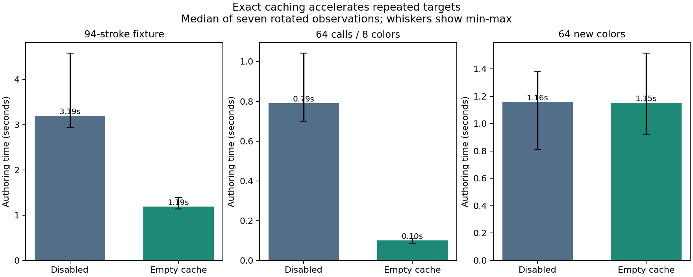

# Exact target caching cuts fixture authoring time by 2.68x

The existing 94-stroke fixture makes **285 target searches for 111 distinct
exact RGB triples**. The new empty cache reuses 174 results (61.05% of requests),
reducing median authoring time from **3.195 s to
1.191 s**. The complete authored job
is byte-identical to the pre-change job; cached and uncached paintings agree
exactly in every canvas plane and blurred height. No optical model was changed.



## What changed

Each renderer PaletteMixerN owns a bounded FIFO cache, enabled by default with
1024 entries. All three validated RGB f32 bit patterns form the key. Adjacent
colors, signed-zero bit patterns and other distinct inputs are not quantized.
The immutable palette/decoder instance owns the answers, so different optical
coefficients or prepared decoders never share entries implicitly.

The cache stores the entire original TargetMatch, including recipe, achieved
display color, both error values and original solver evaluation count. A hit's
evaluation field describes the search that originally produced that answer;
actual new searches are reported by cache misses. FIFO eviction only causes a
future repeat search; it does not change the resulting recipe.

The existing match_target and encode paths share this cache, including RGB
import's derived streak targets. Painting and direct decoding never touch it.
All 1-16-paint direct mixers and the existing prepared-four mixer use the same
cache implementation. Cache contents/counters are not saved in OPP/OPJ files;
reload starts empty. Existing saved formats and default paint model are unchanged.

## Where repeats occur

Before changing production code, an independent trace reproduced the exact
production OPJ2 bytes. Its target list is unchanged after implementation.

| Role | Requests | Distinct targets within role |
| --- | --- | --- |
| main | 94 | 36 |
| streak-dark | 94 | 36 |
| streak-light | 94 | 36 |
| secondary | 2 | 2 |
| ground | 1 | 1 |

Distinct counts within roles are not additive if the same target appears in
multiple roles. [target-reuse.csv](target-reuse.csv) preserves exact keys and all
request roles. No source paint spectra or fitted coefficients are in that file.

## Cold and repeated authoring

Seven observations after a discarded warmup, rotating disabled/cold/warm order
within each workload. Disabled and cold both begin empty; disabled retains
nothing. Units are milliseconds; parentheses show min-max across observations.

| Workload | Disabled | Cold cache | Median speedup | Cold hits / requests |
| --- | --- | --- | --- | --- |
| 94-stroke fixture | 3194.706 (2935.724-4582.531) | 1190.725 (1138.900-1387.413) | 2.68x | 174/285 |
| 64 calls / 8 colors | 790.959 (699.578-1043.058) | 100.680 (86.584-107.683) | 7.86x | 56/64 |
| 64 new colors | 1158.814 (809.617-1384.005) | 1152.077 (923.327-1516.409) | 1.01x | 0/64 |

The unique-color workload avoided zero searches. Its small timing difference
is within the broad shared-host variation; this is not evidence of a speedup
for previously unseen colors. The repeated workload visits eight targets eight
times; its gain reflects deliberate reuse, not arbitrary unique RGB input.

## Warm behavior and its cost

Warm mode first matches every requested target, then times the next authoring
pass. Priming is recorded separately and is not included in the warm-pass time.

| Workload | Warm authoring ms | Priming median ms | Median priming + authoring ms |
| --- | --- | --- | --- |
| 94-stroke fixture | 0.1624 | 1355.233 | 1355.385 |
| 64 calls / 8 colors | 0.0026 | 101.773 | 101.776 |
| 64 new colors | 0.0050 | 1040.331 | 1040.336 |

The fixture's warm pass is 0.1624 ms,
but priming took 1.355 s. Warm gains
apply when that same palette instance has already matched the exact targets.
They do not remove first-use matching costs or help an indefinitely changing
stream of novel colors. Priming every input beforehand simply relocates work.

The cache is not a disk-persistent warm start. There is no speedup claimed for
painting itself: that path consumes already-authored material recipes.

## Exactness and verification

- Four new focused tests cover full report bits, adjacent targets, invalid
  inputs, palette/model/decoder/load isolation, eviction/clear/disable behavior
  and shared concurrent callers.
- A new end-to-end test compares cached and disabled RGB import: report bits,
  complete saved job bytes, five canvas planes and blurred height all agree;
  painting does not change cache counters and saved reload starts empty.
- The oil-mix/oil-palette release suites pass **17 unit/integration tests and
  one documentation test**, including existing 8/10/16-material cases.
- Scoped all-target Clippy passes with warnings denied.
- All **63 measured benchmark runs** produce the identical expected output
  bytes within each workload. The fixed fixture also matches both the saved
  pre-change job and the prior balanced-package workflow's job.
- All three cache modes paint/reload at 384x480 with identical five-plane hashes
  and blurred heights. All measured hit/miss counts match the traced requests.
- The measured package SHA remains unchanged. The 107-family accuracy evidence
  and balanced coefficients were not modified or refitted.

Pre-change/current fixture OPJ2 SHA-256:
`a36eeab8454da02b4b25e34d836e37057a8881a814f4fe292922e06cfe8925e2`.

See [checks.csv](checks.csv), [timings.csv](timings.csv), and
[summary.json](summary.json) for every timing, result hash, counter and source hash.

## API and limits

The cache is already enabled for new renderer palette mixers. Use
`mixer.target_cache_stats()` to inspect it;
`mixer.with_target_cache_capacity(n)` to configure/reset it (zero disables);
and `mixer.clear_target_cache()` with exclusive mutable access to clear it.

Send + Sync is preserved. Lookup and insertion take short mutex locks; expensive
solving occurs outside them. Concurrent misses for the same key may both solve.
The benchmark uses one caller and does not measure contended throughput. Cache
capacity bounds retained entries; different identical-palette instances keep
separate caches and may repeat work independently.

This is an exact memoization optimization, not a forward LUT or a new inverse
approximation. It removes repeated work without changing the palette's color
range, physical accuracy, matching solver or persistent material state.

## Reproduction

From the sibling renderer checkout:

```powershell
cargo test --release --offline -p oil-mix -p oil-palette
cargo clippy --offline -p oil-mix -p oil-palette --all-targets -- -D warnings
cargo run --release --offline -p oil-palette --example authoring_cache -- ../ochrell/target/measured-oils/balanced-eight/old-holland-eight-balanced-empirical.opp ../ochrell/target/measured-oils/authoring-cache/after ../ochrell/target/measured-oils/authoring-cache/before/uncached-fixture.opj
```

The pre-change OPJ2 argument is optional for a fresh checkout. It is required
for reproducing this archived before/after check. Run this report script from
Ochrell after the benchmark. The [plan](PLAN.md) states the workloads and checks.
Use a fresh output directory to preserve existing timing runs when repeating.

Runtime: rustc 1.91.1 (ed61e7d7e 2025-11-07); native Windows release build, single caller,
no affinity pinning. Scheduling/clock variation is visible in the retained
observations. The cache-disabled comparator uses the same unchanged solver and
includes inexpensive counter/lock bookkeeping; the saved pre-change job confirms
output equivalence, not a stable timing comparison across separate sessions.
