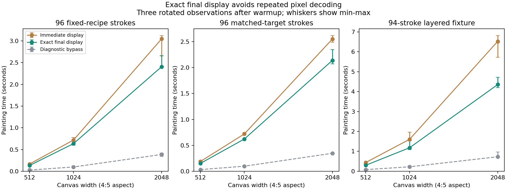
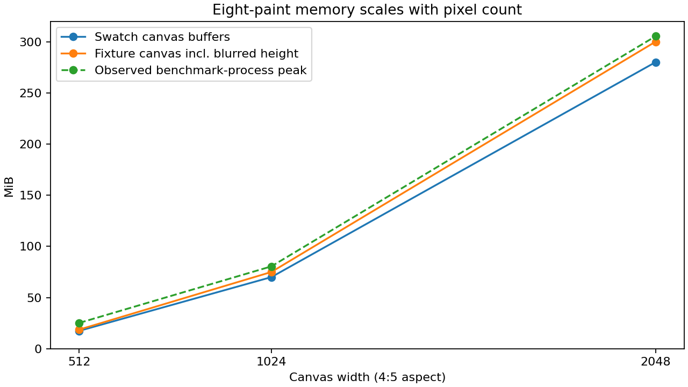

# Realistic canvas profiling and exact final-display acceleration

**Recipe-to-color decoding dominates these eight-paint scenes.** Replacing only
the display evaluation with a diagnostic bypass removes approximately
81.5-88.9% of wall time. The remaining work includes brush/material
simulation, allocation, RGB writes, blur and drying. This is a controlled timing
subtraction, not an instruction-level profiler or a working display mode.

The resulting optimization is an explicit **paint_final(width)** API. It runs
the unchanged material simulation, then calls the unchanged direct decoder once
per painted pixel. The 2048x2560 layered fixture improves from **6.525 s to
4.354 s (1.50x)**, with all final bits identical. Existing paint(width,
after_layer) retains its per-layer preview behavior. No LUT, optical approximation,
refit, recipe reduction, additional canvas plane or saved-format change is used.

## Same scenes at larger sizes

Load the three existing balanced-package OPJ2 jobs, with identical models,
recipes, geometry and seeds. All matching happened when those jobs were authored.
Widths are 512, 1024 and 2048 with the original 4:5 aspect. One warmup precedes
three measured repetitions; direct/bypass/deferred order rotates each round.
Times below are seconds, median (min-max), from the paired accelerated run.

| Scene | Canvas | Immediate display | Exact final display | Speedup | Diagnostic bypass median |
| --- | --- | --- | --- | --- | --- |
| fixed-recipes | 512x640 | 0.165 (0.160-0.173) | 0.132 (0.130-0.132) | 1.26x | 0.027 |
| matched-targets | 512x640 | 0.188 (0.174-0.188) | 0.151 (0.136-0.205) | 1.24x | 0.032 |
| renderer-fixture | 512x640 | 0.434 (0.375-0.442) | 0.297 (0.292-0.331) | 1.46x | 0.080 |
| fixed-recipes | 1024x1280 | 0.719 (0.714-0.775) | 0.636 (0.601-0.701) | 1.13x | 0.098 |
| matched-targets | 1024x1280 | 0.720 (0.715-0.735) | 0.623 (0.616-0.626) | 1.16x | 0.098 |
| renderer-fixture | 1024x1280 | 1.606 (1.520-1.958) | 1.182 (1.082-1.567) | 1.36x | 0.223 |
| fixed-recipes | 2048x2560 | 3.047 (2.651-3.123) | 2.406 (2.383-2.661) | 1.27x | 0.386 |
| matched-targets | 2048x2560 | 2.554 (2.491-2.619) | 2.141 (2.075-2.349) | 1.19x | 0.347 |
| renderer-fixture | 2048x2560 | 6.525 (5.725-6.815) | 4.354 (4.207-4.717) | 1.50x | 0.727 |



The separate pre-change profile is retained in [timings.csv](timings.csv), with
phase=baseline. Speedups above use same-run paired comparisons; historical runs
show host/clock variation and must not be mixed into a claimed improvement.
Initialization is included; loading/matching, hashing and replay validation are
outside the timers. The harness times blur separately in direct/bypass runs;
the public final-only API is measured end-to-end and does not expose blur timing.

## Why the exact optimization works

The brush reads recipe, height, wetness and coverage planes to transport paint.
It does not read RGB. Previously each successful deposit also decoded its new
material state, even if another deposit later replaced that displayed color.
Every such deposit adds positive alpha to coverage, so positive final coverage
identifies every pixel whose display must be refreshed.

For the 2048 fixture, immediate rendering makes
4,589,859 display calls including the ground; final-only
rendering makes 3,025,683. It avoids
1,564,176 intermediate decodes while retaining the exact
final recipe and spectral evaluation. Counts follow directly from the verified
deposit statistics and positive-coverage pixel counts; no per-pixel timer or
atomic instrumentation is included in performance runs.

Swatches revisit pixels less frequently than the layered fixture, so their gains
are smaller. This strategy does not eliminate decoding cost for the final image.
It is useful exact acceleration, not a claim that large-canvas performance is
solved or that an approximate forward accelerator cannot help further.

## Memory

Buffer capacities are measured from the returned canvas: 56 bytes/pixel for
eight material floats, RGB, height, wetness and coverage, plus 4 bytes/pixel
when blurred height exists. The final-only path uses the same capacities.

| Canvas | Swatch buffers MiB | Fixture buffers MiB | Source-estimated fixture blur peak buffers MiB | Observed process peak MiB |
| --- | --- | --- | --- | --- |
| 512x640 | 17.50 | 18.75 | 20.00 | 25.25 |
| 1024x1280 | 70.00 | 75.00 | 76.13 | 80.49 |
| 2048x2560 | 280.00 | 300.00 | 301.16 | 305.31 |



The blur estimate includes temporary Gaussian/resize buffers from oil-image's
source, conservatively retaining the old small image during shadowing. It is
not a whole-process estimate. At small sigma, the Gaussian allocates full-size
temporary planes; at larger sigma the existing implementation downsamples first.
The unchanged bristle buffers, model/matcher, metadata and allocator overhead
are outside canvas accounting.

Observed process peaks come from Windows PeakWorkingSet64 sampled every 100 ms
in a separate native benchmark process per width. They include all three scenes,
verification/hash work and allocator behavior, not an isolated paint allocation.
Both phases and every observation are retained in [process-memory.csv](process-memory.csv).
No inference is made about WASM memory limits, mobile devices or other hosts.

## Correctness and compatibility

- The direct profiling harness matches the public paint API at all nine
  scene/size combinations. Its source mirrors the same public brush/blur calls.
- Bypass preserves every non-RGB plane and all transport statistics. It is only
  diagnostic and cannot be selected as a persisted/display decoder.
- Across 135 measured runs and 45 warmups, every valid final image and all
  material/height/wetness/coverage/blurred-height hashes match the pre-change
  direct baseline. Stroke counts, deposits and alpha bits agree as well.
- Unit/integration checks cover unchanged layer previews, blank/untouched ground,
  saved replay, limits and prepared-four plus direct 8/10/16-paint paths.
  Twelve unit/integration tests and one documentation test pass in the scoped
  oil-kernel/oil-paint/oil-palette release suites. Scoped all-target Clippy passes.
- All 31 existing native golden case hashes match engine
  2.0.0-dev.3, including default Ochrell, RGB and Mixbox kernel/lighting
  cases and the existing planning cases. No golden or version was rewritten.
  Other hosts/browsers were not rerun; empirical optical cross-platform bit
  identity remains outside this local result.
- Saved package/job bytes, the frozen balanced model and the 107-family accuracy
  evidence remain unchanged. These are engineering checks, not new paint accuracy
  measurements.

See [checks.csv](checks.csv) and [summary.json](summary.json) for all hashes,
counters, source versions and the native golden comparison record.

## Use and next decision

For code-driven final renders:

```rust
let (canvas, stats) = job.paint_final(2048)?;
```

Keep job.paint(width, callback) when intermediate layer previews are needed.
The final-only method is explicit and requires no model migration or LUT file.
Existing jobs can be loaded and rendered by either API with identical final
output. The low-level material-only stroke function documents that hosts must
refresh RGB before exposing an image.

This is the selected first forward-work optimization because it avoids work
without introducing an approximation error budget. An eight-to-sixteen-paint
LUT still needs a representation that avoids dense simplex growth. If more
painting throughput is required, profile the remaining direct final decode and
compare a bounded-error accelerator against this frozen exact path. No such LUT
is claimed or generated by this step.

## Reproduction

From oilpaint-renderer, build the canvas_scaling example in release mode; then
run this repository's experiments/palette_canvas_scaling/run.ps1 -Phase accelerated.
The runner launches hidden native processes, writes their logs and samples
process memory. Original baseline sources are preserved under ignored target/;
do not overwrite that phase when reproducing a new run.

```powershell
cargo build --release --offline -p oil-palette --example canvas_scaling
cargo test --release --offline -p oil-kernel -p oil-paint -p oil-palette
cargo clippy --offline -p oil-kernel -p oil-paint -p oil-palette --all-targets -- -D warnings
```

The native xhost executable generates the report compared to the existing
golden/2.0.0-dev.3.json; this report script audits all CSVs and hashes. It expects
the local saved jobs from the balanced package study. Raw measured packages and
self-contained OPJ files remain under ignored target/.

Runtime: rustc 1.91.1 (ed61e7d7e 2025-11-07), native Windows release build, one calling thread,
no affinity pinning. Results are for these three fixtures and sizes, not a
general interactive-latency guarantee.
