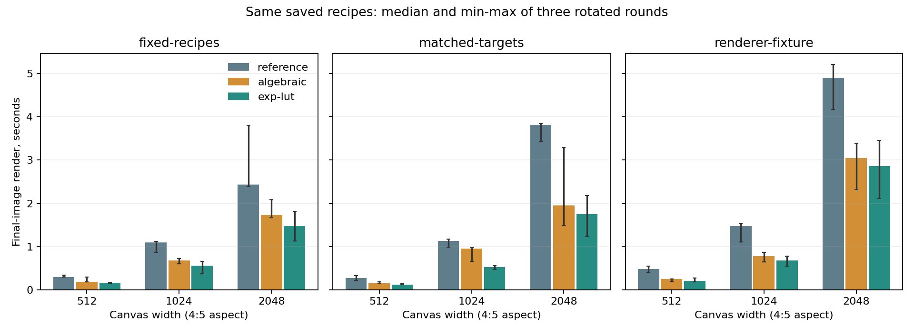

# Optional faster forward evaluation

**Keep both tested accelerators as explicit choices.** The algebraic version
removes redundant logarithms; the compact lookup then trades a small bounded
interpolation error for additional speed. The balanced Old Holland Eight model,
every material amount and the reference default remain unchanged.

On the 2048x2560, 94-stroke fixture, median final-image rendering is **4.901 s
reference, 3.050 s algebraic and 2.857 s lookup**: 1.72x reference-to-lookup.
The added lookup gain over algebraic is only 1.07x for this large fixture,
and 1.12-1.81x for the other measured scene/size combinations. Samples vary
substantially, so these are exploratory host timings, not confidence intervals
or a universal speed guarantee. No second table resolution was tried.

## What changed

The reference correction computes `sigmoid(log(r)-log1p(-r)+shift)` at every band.
The equivalent real-arithmetic expression is:

`r / (r + (1-r)*exp(-shift))`

`AlgebraicV1` uses that expression with the renderer's existing deterministic
exponential and precomputes the four Bernstein basis values per wavelength.
It preserves the same normalization, K/S accumulation, pair sum, K-M inverse,
projection, gamut mapping and pure/zero-shift branches. Floating-point evaluation
order differs, so bit identity with reference is not promised.

`ExpLutV1` interpolates 513 f64 samples of the exponential on [-1.6,1.6]. With
normalized amounts and controls bounded by 0.8, absolute shift is at most
`1.6*(1-1/N)`, hence at most 1.5 for N<=16. Queries outside the table interval
fall back to the algebraic exponential. This table represents one scalar
function; it neither collapses material dimensions nor samples recipe space.

For step h=3.2/512, the real-arithmetic relative exponential interpolation error
is at most `exp(h)*h*h/8`. Convex interpolation overestimates exp, and the
corrected reflectance error is at most one quarter of that bound: approximately
1.22835641e-06. This derivation excludes
floating-point roundoff and does not alone bound gamut-mapped color error.

## Frozen recipe screen

[PLAN.md](PLAN.md) records the thresholds before evaluation. Both phases use
the same 62,608 recipes: eight pures, all 28 pair ramps with tiny edge fractions,
white tints, 192 nearly pure probes, 771 dark-family tints, 16,385 dense mixtures
and 16,384 sparse-face probes. Sparse probes use cyclic contiguous subsets,
not an exhaustive enumeration of all faces. The screen spans the recipe domain;
it is not additional experimental paint data.

Maximum absolute differences against the same frozen reference:

| Metric | Algebraic | Exp lookup |
| --- | ---: | ---: |
| reflectance | 2.22044605e-16 | 1.22069907e-06 |
| raw_linear | 4.4408921e-16 | 1.43607384e-06 |
| display_channel | 1.7930102e-16 | 4.41074371e-06 |
| oklab100 | 0 | 6.92734761e-05 |

Displayed OKLab distance is multiplied by 100; it is not CIEDE2000. All pure
endpoints remain bit-identical. Algebraic displayed triples are bit-identical
for 62,604/62,608 probes; the four differences are at near-zero rounding scale.
Lookup triples are bit-identical for 2,686 probes. [decode-errors.csv](decode-errors.csv)
retains family counts and mean/p95/max in both phases; p95 is the lower order
statistic `sorted[floor((n-1)*0.95)]`.

Declared algebraic limits are 2e-12 spectrum/raw-linear RGB and 0.001 displayed
OKLab*100. Lookup limits are 1e-5 spectrum, 2e-5 raw-linear RGB, 1e-4 displayed
channel and 0.01 displayed OKLab*100. Every screen passed without relaxing them.

The paired lookup-phase decode medians are 1307.212 ns
reference, 672.569 ns algebraic and
551.533 ns lookup. The lookup is
1.22x algebraic
(18.0% less time),
passing the declared 10% time-reduction gate. These include display conversion
on a fixed 4,096-recipe corpus: one warmup and five rotating measured rounds of
100,000 calls. [decode-timings.csv](decode-timings.csv) also retains the earlier
algebraic-only phase; do not mix timing phases to claim a gain. Preparing all
three benchmark evaluators together took 0.0572 ms in the lookup phase, one
observation rather than a stable preparation benchmark.

## Full paintings

All modes load the same previously authored OPJ2 jobs and use `paint_final`.
No target search occurs during rendering. Initialization, simulation, final
display and blur are timed; loading, hashing, error measurement and replay
checks are outside the timer. Each mode gets one warmup and three rotating
measured rounds. Times are seconds, median (min-max).

| Scene | Canvas | Reference | Algebraic | Exp lookup | Reference/lookup | Algebraic/lookup |
| --- | --- | --- | --- | --- | ---: | ---: |
| fixed-recipes | 512x640 | 0.293 (0.290-0.341) | 0.184 (0.179-0.295) | 0.157 (0.153-0.158) | 1.87x | 1.17x |
| matched-targets | 512x640 | 0.271 (0.220-0.323) | 0.154 (0.146-0.180) | 0.123 (0.119-0.140) | 2.21x | 1.26x |
| renderer-fixture | 512x640 | 0.485 (0.402-0.545) | 0.249 (0.192-0.254) | 0.211 (0.182-0.272) | 2.30x | 1.18x |
| fixed-recipes | 1024x1280 | 1.091 (0.860-1.117) | 0.674 (0.603-0.721) | 0.558 (0.375-0.654) | 1.95x | 1.21x |
| matched-targets | 1024x1280 | 1.128 (0.987-1.170) | 0.947 (0.659-0.977) | 0.523 (0.471-0.558) | 2.16x | 1.81x |
| renderer-fixture | 1024x1280 | 1.478 (1.107-1.531) | 0.775 (0.650-0.868) | 0.677 (0.547-0.778) | 2.18x | 1.15x |
| fixed-recipes | 2048x2560 | 2.438 (2.389-3.790) | 1.727 (1.669-2.087) | 1.474 (1.127-1.810) | 1.65x | 1.17x |
| matched-targets | 2048x2560 | 3.814 (3.433-3.849) | 1.952 (1.490-3.291) | 1.749 (1.234-2.185) | 2.18x | 1.12x |
| renderer-fixture | 2048x2560 | 4.901 (4.169-5.207) | 3.050 (2.313-3.392) | 2.857 (2.116-3.454) | 1.72x | 1.07x |



Every pixel is checked for displayed error. The worst lookup displayed channel
difference is 4.42564487e-06; the worst OKLab*100 distance is
7.11947903e-05. Approximately 4,096 material states per scene/size also
receive spectral and raw-linear checks. All thresholds pass. At 2048x2560 the
lookup changes the fixture's quantized 8-bit RGB at 1045
of 5242880 pixels; tiny differences can cross a rounding boundary.
These files are not byte-identical images. Numerical differences from this
accelerator are very small; no controlled perceptual study was performed.

[paint-errors.csv](paint-errors.csv) records all scene/size/mode results.
[plane-checks.csv](plane-checks.csv) records 162 plane hashes. Material, height,
wetness, coverage and blurred height match the earlier pre-change baseline
exactly for every mode. Reference RGB also matches that baseline. Every timed
output matches an independently reloaded job under its selected decoder, and
transport statistics match reference. Switching back to reference restores
the original job bytes; accelerated jobs differ only in decoder tag/checksum.

## Memory and saved behavior

The lookup occupies **4,104 bytes per mixer**, with **992 bytes** of prepared
basis for 31 bands (2,592 for 81). The evaluator also owns a cloned immutable
optical model and normal object/allocation overhead; 4 KiB is not its complete
allocation. `forward_auxiliary_bytes()` counts basis plus table, excluding that
clone. Production reference mixers instantiate neither evaluator nor table;
the standalone reference microbenchmark evaluator does prepare an unused basis.

No canvas plane is added. The eight-paint 2048x2560 fixture retains 300 MiB of
canvas buffers. This validation harness additionally retains reference RGB
while comparing candidates; it is not a production process-memory measurement.

Use `job.with_forward_decoder(ForwardDecoder::ExpLutV1)?` or `AlgebraicV1`.
Both work with the existing immediate or final-only paint API. Target search
and streak-recipe authoring continue to use reference optics, so the selected
display method does not alter authored amounts. Achieved-color reports use the
selected decoder, and switching mode clears the target cache.

OPJ2 records versioned tags 0=reference, 1=algebraic-v1, 2=exp-lut-v1; preparation
is reconstructed on load and its table section remains empty. Unknown tags
are rejected. Old tag-0 jobs, OPP/OPR identities, OPJ1 and existing defaults retain
their meaning. Prepared-four OPL1 mixers reject these alternate choices.
The global engine version stays 2.0.0-dev.3: existing inputs retain their outputs,
while approximate behavior requires a new explicit decoder tag. All 31 existing
native golden cases pass. New decoder cross-host parity has not been established.

## Verification and reproduction

Renderer tests passed: 26 unit/integration cases plus one doctest across oil-mix,
oil-paint and oil-palette. New tests cover 1/4/8/10/16 materials and both 31/81
bands, extreme K/S, zero absorption, control bounds, pure/tiny/pair/dense mixtures,
table edges/fallback, invalid amounts, cache invalidation, unchanged target and
streak recipes, actual achieved colors, malformed tags and selected saved replay.
Scoped all-target Clippy passes with warnings denied.

From the sibling renderer (substitute the local package and output paths):

```text
cargo test --release --offline -p oil-mix -p oil-paint -p oil-palette
cargo clippy --offline -p oil-mix -p oil-paint -p oil-palette --all-targets -- -D warnings
cargo run --release --offline -p oil-mix --example forward_math -- <balanced.opp> <output>/algebraic algebraic
cargo run --release --offline -p oil-mix --example forward_math -- <balanced.opp> <output>/lookup lookup
cargo build --release --offline -p oil-palette --example forward_paint
cargo run --release --offline -p oil-xhost --bin xhost -- --out <output>/native-golden-check.json
```

From Ochrell, run `experiments/palette_forward_math/run-paint.ps1`, then this
`report.py` with the existing scientific Python environment. No matching or
fitting is rerun. [summary.json](summary.json) pins source, recipe, package and
saved-job hashes, timings, limits and preparation metadata. The package SHA-256
is `643c6960282398b19f5e7eb4b8a788c104164fd1bc0adf83ddc7de8080088db7`. Raw recipes, models, saved jobs and preview PNGs remain under
ignored `target/measured-oils/forward-math/`; committed results contain numerical
summaries, hashes and the timing chart.

This pass establishes an engineering option for evaluating the existing fitted
model faster. It makes no improvement claim against physical paint measurements
and does not change the previously reported calibration tradeoffs. Prefer the
lookup for opt-in fast final rendering when its approximation is acceptable;
retain algebraic for a rounding-scale alternative and reference for audit.
