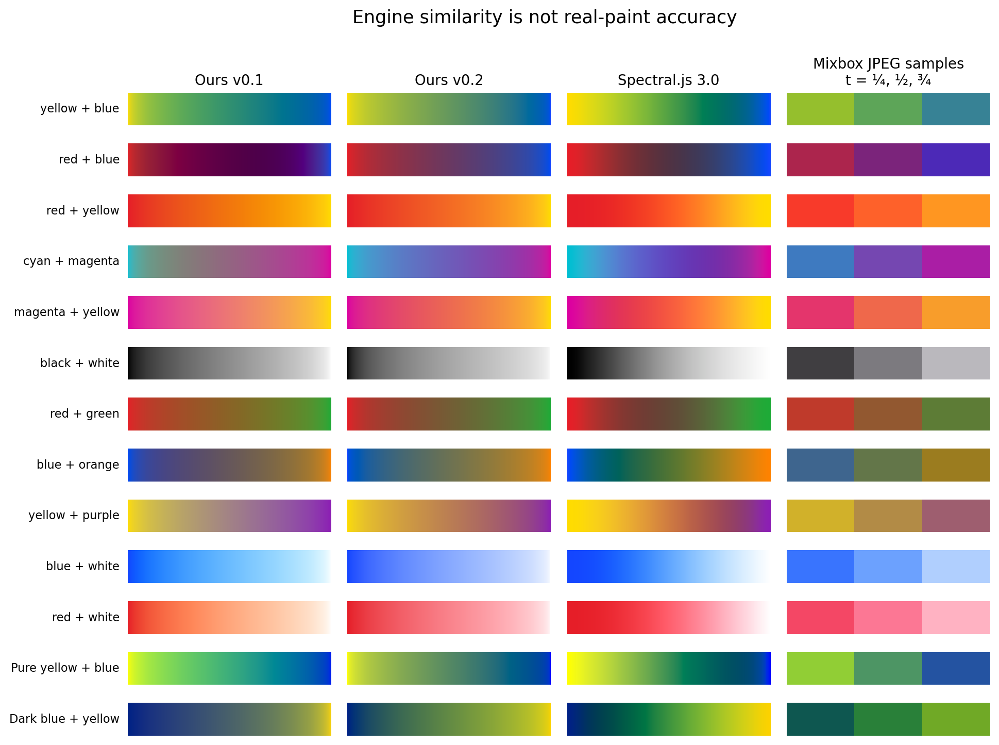
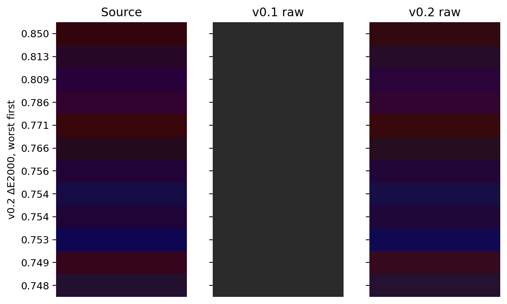

# Supplementary material, version 0.2

The main paper presents the revised model; the original study is retained in `legacy/paper.md` and `legacy/paper.pdf`.

## Full external comparison

Mixbox panels show only the three observed t values (¼, ½, ¾), not a reconstructed continuous gradient. Spectral.js and our curves have 401 samples. See `results/revision/external/summary.json` for mean/median/P95/P99/max differences. These are engine-similarity measurements, not real-paint errors. The original captures, spectral API invocation, version/checksum and analysis scripts are preserved under `comparisons/external-baseline`. Captured Mixbox results are not SDK reference values. The earlier baseline archive SHA-256 was `f35aba45b435b43d5ce348d1ba739ce267070c5d8900f7f910a84a7bb0974172`.

## Worst uncorrected reconstruction cases

The new floor-limited dark cases are retained rather than hidden by residual correction. Exact samples and both errors are in `results/revision/worst_reconstruction.csv`. CIEDE2000 is calculated after gamut mapping; linear pre-map values are available in the reconstruction dataset.

## Recorded datasets

| File under results/revision | Meaning |
|---|---|
| `generation.json`, `data/optical_basis.csv` (root-relative) | Fit convergence and generated spectra |
| `reconstruction.csv` | Source, corrected paths and raw outputs on the same inputs |
| `reconstruction_grid.csv` | 16³ grid including cube faces; verifies 8-bit round trips and records amplified float32 boundary error |
| `mixtures.csv` | Random inputs/t, both versions, reference, unmapped output and precision control |
| `canonical.csv` | All 13 pairs at 1,001 t samples, five baselines/models plus reference and residual ablation |
| `smoothness.csv` | Inputs and per-trajectory maximum first/second differences |
| `perturbations.csv` | Input-sensitivity diagnostics, fully determined by Rust seed and preceding sample sequence |
| `tints.csv` | Source, midpoint colors, minimum luminance step and maximum new ΔEOK step |
| `holdout_inputs.csv`, `holdout_outputs.csv` | Independent 2,048-pair color-family test |
| `performance.csv`, `memory.csv` | Raw timing repetitions and type sizes |
| `resolution_*.csv` | Discretization errors with the fitted spectra held fixed |
| `first_candidates.json`, `refitted_palette.json` | Failed constant-S / finite-palette alternatives |
| `basis_sweep.csv`, `optics_sweep.csv`, `candidate_validation.json` | Basis and optical-strength ablations |
| `summary.json`, `environment.json` | Generated summaries and runtime configuration |

`performance_before_encoder_simplification.csv` is an exploratory timing checkpoint, not a controlled cross-run speedup experiment. It is retained for the decision history and is not used in the main performance claims. Full-state float32 checking is against independent Python at the same sampling grid; the promoted decoder isolates only decoder arithmetic, not encoder quantization.

## Additional derivation

For a neutral reconstructed reflectance r, q=(1−r)²/(2r), hence 1/(1+q)=2r/(1+r²). Since Y=r, the neutral-luminance and per-band normalization terms agree. Their geometric mean therefore gives S=η/(1+q), K=ηq/(1+q), so K+S=η. A neutral input's optical strength is bounded without changing its K/S. This property motivates the prior; it does not follow that a chromatic real paint must obey the corresponding wavelength-wise formula.

At a channel-order boundary, the sorted-channel recipe changes indices only where the associated channel difference vanishes or the limiting secondary remains the same. Thus the reconstructed spectrum is continuous. All subsequent optical denominators are positive. The gamut mapping and sRGB transfer remain continuous, although first derivatives and perceptual speeds may change. Finite grids supplement this structural argument; they do not prove bounded perceptual velocity everywhere.

## Reproduction and licensing

`python3 tools/reproduce.py` generates the current paper. `tools/reproduce_legacy.py` generates the archived original study. Runtime Rust has no dependencies. Python package versions are pinned in `requirements.txt`; random algorithms and seed values are recorded. Model settings come from root `config.toml`, while historical candidate sweeps retain their declared protocol values. A change of default parameters constitutes a new experiment; it does not rewrite the selection history.

Original source is MIT OR Apache-2.0; CIE-derived numerical data retain CC BY-SA 4.0 attribution. External observations and package notices are identified separately. No proprietary coefficient extraction or model-output fitting was performed.
